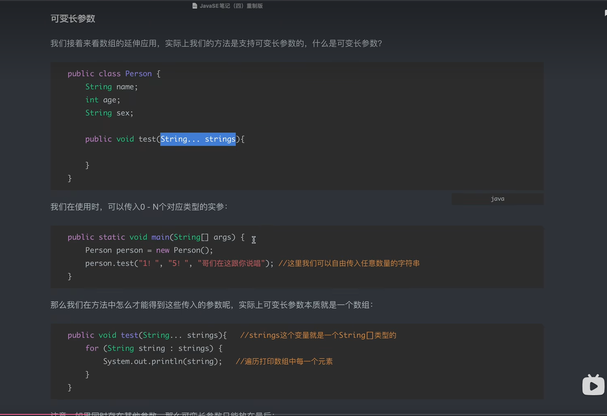

# JavaSE

## 第一天

### 变量，常量

**变量**

**int=1；**


**关键词 final**

final表示常量可以让变量变成常量

final可以让变量只被赋值一次


### 基本数据类型

### 整型类型


byte 字节型（8个bit，也就是一个字节） 范围：-128-+127

short 短整型 （16个bit 2个字节） 范围 -32768 - +32767

int 整型（32个bit，也就是4个字节）最常用类型：-2147483648 - +2147483647

long 长整型（64个bit，8个字节）


### 浮点型


float 单精度浮点型 （32bit 4字节）

double 双精度浮点型 （64bit 8字节）


**浮点数的存储结构**


### 隐式转换规则


byte=>short=>int=>long=>float=>double


### 字符类型

char字符型（16个bit，2字符）


### 布尔类型

Boolean true & false


### 运算符优先级


### 强制转换

short b = (short)a


### 运算符

& | ^ ~

&运算


| 运算


### 位移运算符


### 运算符


### 访问权限控制


## JavaApi 

**equals**


toString clone


### 抽象类


方法前加上abstract


接口


### 包装类


###可变长参数

##




**字符串常用方法**

1.equals()方法：常用于比较两个字符串是否相等，返回值类型是boolean，参数是Object类

```java
public class test {
	public static void main(String[] args) {
		String n1 = "saf";
		String n2 = "saf";
		System.out.println(n1.equals(n2)); // true
	}


```


```java
字符串的搜索

1.indexOf()方法:使用indexOf方法可以从字符串的首部进行搜索，当前字符串中指定子字符串的下标位置，返回值为int类型，如果存在，则返回子字符串的下标位置。如果不存在，则返回-1。

"Hello".indexOf("l"); // 2
2.lastIndexOf()方法：lastIndexOf()方法是从字符串的尾部进行搜索，返回值与indexOf()方法一致

"Hello".lastIndexOf("l"); // 3
3.startsWith()方法：用于判断字符串是否以指定字符串开头，返回值为boolean类型

"Hello".startsWith("He"); // true
4.endWith()方法：用于判断字符串是否以指定字符串结尾，返回值为boolean类型

"Hello".endsWith("lo"); // true
5.contains()方法：用于查找当前字符串中是否存在指定子字符串，返回值为boolean类型

"Hello".contains("lo"); // true
截取子字符串

1.substring()方法:使用substring()方法可以从当前字符串中，截取指定下标区间的子字符串，参数是int，返回值是String类型

"大漠孤烟直".substring(2); // 孤烟直
"大漠孤烟直".substring(0,2); // 大漠
去除首尾空白字符串

1.trim()方法：trim()方法可以移除字符串首尾空白字符，空白字符包括空格，\t,\n,\r.无参数，返回值类型是 String。

"  \tHello\r\n ".trim(); // 返回 "Hello"
 替换字符串

1.replace()方法：根据字符或字符串替换

String s = "hello";
s.replace('l', 'w'); // "hewwo"，所有字符'l'被替换为'w'
s.replace("ll", "~~"); // "he~~o"，所有子串"ll"被替换为"~~"
2.replaceAll()方法:通过正则表达式，把匹配的子字符串统一替换

String s = "A,,B;C ,D";
s.replaceAll("[\\,\\;\\s]+", ","); // "A,B,C,D"
分割字符串

1.split()方法:通过正则表达式传入值，参数值为字符串类型，返回值类型是字符串数组

String s = "A,B,C,D";
String[] ss = s.split("\\,"); // {"A", "B", "C", "D"}
拼接字符串

1.join()方法:拼接字符串使用静态方法join()，他用指定的字符串连接字符串数组

String[] arr = {"A", "B", "C"};
String s = String.join("***", arr); // "A***B***C"
格式化字符串

1.format()方法:fomat()静态方法，可以传入其他参数，替换占位符，然后生成新的字符串。参数是字符串和动态参数，返回值是字符串类型

String s = "Hi %s, your score is %d!";
System.out.println(s.format("Alice", 80)); // 字符串对象调用
System.out.println(String.format("Hi %s, your score is %.2f!", "Bob", 59.5)); // 字符串类调用
 类型转换

1valueOf()方法：是静态方法，可以把任意基本类型或引用类型转换为字符串，这是一个重载方法，编译器会根据参数自动选择合适的方法。返回值是String类型

String.valueOf(123); // "123"
String.valueOf(45.67); // "45.67"
String.valueOf(true); // "true"
String.valueOf(new Object()); // 类似java.lang.Object@636be97c
2.parseInt()方法：把字符串转为int类型，参数是String类型，返回值是int类型

int n1 = Integer.parseInt("123"); // 123
int n2 = Integer.parseInt("ff", 16); // 按十六进制转换，255
3.parseBoolean()方法：把字符串转为boolean类型，参数是int类型，返回值是boolean类型

boolean b1 = Boolean.parseBoolean("true"); // true
boolean b2 = Boolean.parseBoolean("FALSE"); // fals
————————————————

```


成员内部类

