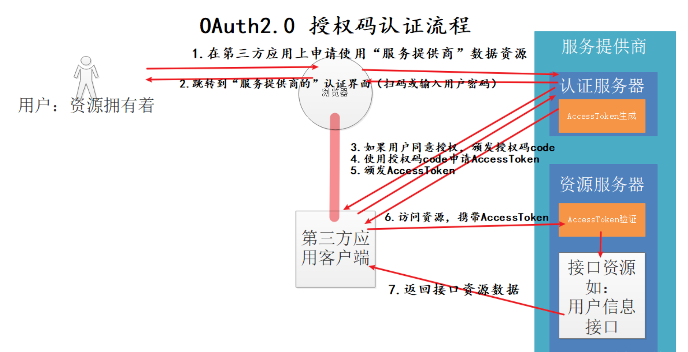
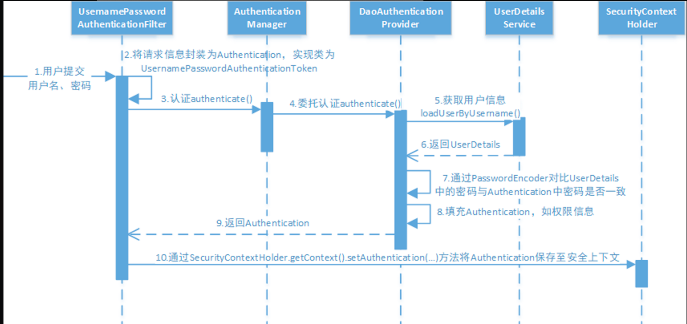
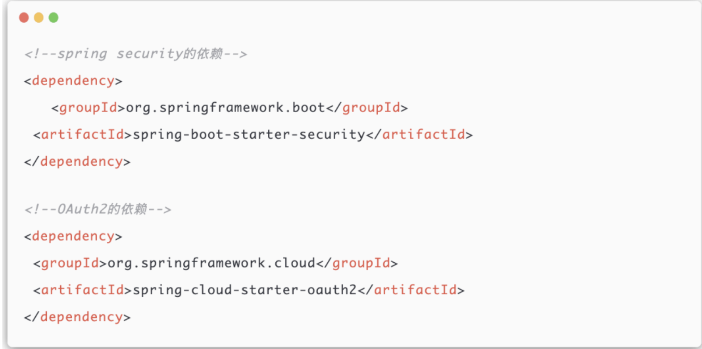
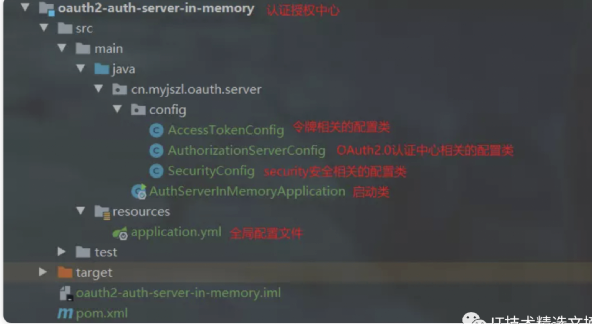
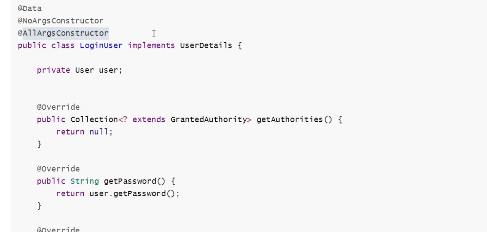
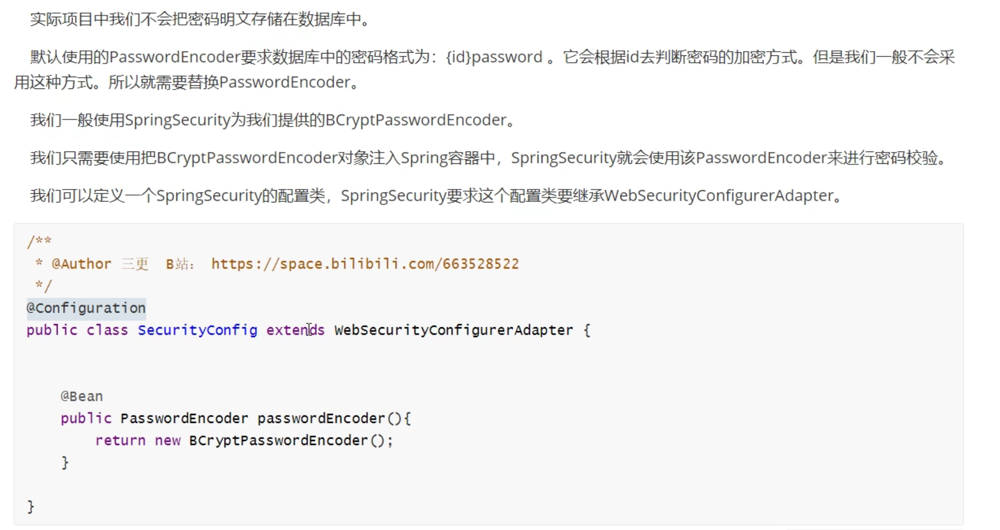

#                            Spring Security


## OAuth2四种授权模式

-  授权码模式（authorization code）
-  简化模式（implicit）
-  密码模式（resource owner password credentials）
-  客户端模式（client credentials）


### 授权码模式




### 密码模式

密码模式：

-  用户将用户名密码交给第三方客户端应用
-  客户端将用户名密码发送给认证服务器，认证服务器验证后颁发AccessToken
-  客户端请求资源接口携带AccessToken，服务端对AccessToken进行校验。
-  校验通过，才能获得接口正确的数据结果响应。

密码模式与授权码模式最大的区别在于：

-  授权码模式申请授权码的过程是用户直接与认证服务器进行交互，然后授权结果由认证服务器告知第三方客户端，也就是不会向第三方客户端暴露服务提供商的用户密码信息。
-  密码模式，是用户将用户密码信息交给第三方客户端，然后由第三方向服务提供商进行认证和资源请求。绝大多数的服务提供商都会选择使用授权码模式，避免自己的用户密码暴漏给第三方。所以密码模式只适用于服务提供商对第三方厂商（第三方应用）高度信任的情况下才能使用，或者这个“第三方应用”实际就是服务提供商自己的应用。

其他两种模式的应用很少


## 快速开始



Spring security cloud所需依赖

```xml
<dependency>
    <groupId>org.springframework.cloud</groupId>
    <artifactId>spring-cloud-starter-security</artifactId>
</dependency>
<dependency>
    <groupId>org.springframework.cloud</groupId>
    <artifactId>spring-cloud-starter-oauth2</artifactId>
</dependency>
```


Spring security  boot 所需依赖




一个简洁的所需配置



### 密码模式

示例代码

```java
//配置用户信息服务
@Bean
public UserDetailsService userDetailsService() {
    //这里配置用户信息,这里暂时使用这种方式将用户存储在内存中
    InMemoryUserDetailsManager manager = new InMemoryUserDetailsManager();
            manager.createUser(User.withUsername("zhangsan").password("123").authorities("p1").build());
    manager.createUser(User.withUsername("lisi").password("456").authorities("p2").build());
    return manager;
}

    @Bean
    public PasswordEncoder passwordEncoder() {
        //密码为明文方式
        return NoOpPasswordEncoder.getInstance();
    }

    //配置安全拦截机制
    @Override
    protected void configure(HttpSecurity http) throws Exception {
        http
                .authorizeRequests()
                .antMatchers("/r/**").authenticated()// 访问/r开始的请求需要认证通过
                .anyRequest().permitAll()//其它请求全部放行
                .and()
                .formLogin().successForwardUrl("/login-success");//登录成功跳转到/login-success
                http.logout().logoutUrl("/logout");//退出地址
    }
```


<div style="color:red;font-size:18px">以上是登陆时，示例的一个demo当我们接入实际业务时，往往要重写UserDetailsService类此时在service重写继承并重写</div>

例子


```java
@Service
// 继承UserDetailsService
public class MyUserDetailService implements UserDetailsService {

    private PasswordEncoder passwordEncoder;

    public void setPasswordEncoder(PasswordEncoder passwordEncoder) {
        this.passwordEncoder = passwordEncoder;
    }

    //模拟数据库，不真实连接
    @Override
    public UserDetails loadUserByUsername(String username) throws UsernameNotFoundException {
      // 从这里进行查询数据库和密码比对校验工作
        if(!username.equals("大忽悠"))
        {
            throw new UsernameNotFoundException(username);
        }
      
        //对密码进行加密
        String encode = passwordEncoder.encode("123456");
        //授予超级管理员的角色和访问hello请求的权限
        List<GrantedAuthority> grantedAuthorities
                = AuthorityUtils.commaSeparatedStringToAuthorityList("ROLE_superAdmin,hello");
        //返回myUserDetails对象
        return new MyUserDetails(username,encode,grantedAuthorities);
    }
}
```


例子2：

```java
package com.xuecheng.ucenter.service.impl;

import com.alibaba.fastjson.JSON;
import com.baomidou.mybatisplus.core.conditions.query.LambdaQueryWrapper;
import com.xuecheng.ucenter.mapper.XcUserMapper;
import com.xuecheng.ucenter.model.dto.AuthParamsDto;
import com.xuecheng.ucenter.model.dto.XcUserExt;
import com.xuecheng.ucenter.model.po.XcUser;
import com.xuecheng.ucenter.service.AuthService;
import lombok.extern.slf4j.Slf4j;
import org.springframework.beans.factory.annotation.Autowired;
import org.springframework.context.ApplicationContext;
import org.springframework.security.core.userdetails.User;
import org.springframework.security.core.userdetails.UserDetails;
import org.springframework.security.core.userdetails.UserDetailsService;
import org.springframework.security.core.userdetails.UsernameNotFoundException;
import org.springframework.stereotype.Component;

/**
 * @author Mr.M
 * @version 1.0
 * @description TODO
 * @date 2023/2/24 10:37
 */
@Slf4j
@Component
public class UserServiceImpl implements UserDetailsService {
    @Autowired
    XcUserMapper xcUserMapper;

    @Autowired
    ApplicationContext applicationContext;
a


    //传入的请求认证的参数就是AuthParamsDto
    @Override
    public UserDetails loadUserByUsername(String s) throws UsernameNotFoundException {
        //将传入的json转成AuthParamsDto对象
        AuthParamsDto authParamsDto = null;
        try {
            authParamsDto = JSON.parseObject(s, AuthParamsDto.class);
        } catch (Exception e) {
            throw new RuntimeException("请求认证参数不符合要求");
        }

  
        //认证类型，有password，wx。。。
        String authType = authParamsDto.getAuthType();
    // private String authType; // 认证的类型   password:用户名密码模式类型    sms:短信模式类型

        //根据认证类型从spring容器取出指定的bean
        String beanName = authType+"_authservice";
        AuthService authService = applicationContext.getBean(beanName, AuthService.class);
        //调用统一execute方法完成认证
        XcUserExt xcUserExt = authService.execute(authParamsDto);
        //封装xcUserExt用户信息为UserDetails
        UserDetails userPrincipal = getUserPrincipal(xcUserExt);

        return userPrincipal;
    }

    /**
     * @description 查询用户信息
     * @param xcUser  用户id，主键
     * @return com.xuecheng.ucenter.model.po.XcUser 用户信息
     * @author Mr.M
     * @date 2022/9/29 12:19
     */
    public UserDetails getUserPrincipal(XcUserExt xcUser){
        String password = xcUser.getPassword();
        //权限
        String[] authorities=  {"test"};
        xcUser.setPassword(null);
        //将用户信息转json
        String userJson = JSON.toJSONString(xcUser);
      // 和例子1相同都是返回 UserDetails对象
        UserDetails userDetails =      User.withUsername(userJson).password(password).authorities(authorities).build();
        return  userDetails;
    }


}

```


<div style="color:red">loadUserByUsername 返回的是一个UserDetails对象，所以需要实现这个类</div>




### 使用Spring Security进行密码加密与存储





例子

```java
package com.xuecheng.auth.config; // 包名

import org.springframework.beans.factory.annotation.Autowired; // Spring 自动装配注解
import org.springframework.context.annotation.Bean; // 表示一个方法提供了一个要注册为Bean的实例
import org.springframework.security.authentication.AuthenticationManager; // Spring Security认证管理器
import org.springframework.security.config.annotation.authentication.builders.AuthenticationManagerBuilder; // 用于构建认证管理器
import org.springframework.security.config.annotation.method.configuration.EnableGlobalMethodSecurity; // 开启方法级别的安全配置
import org.springframework.security.config.annotation.web.builders.HttpSecurity; // HTTP安全配置
import org.springframework.security.config.annotation.web.configuration.EnableWebSecurity; // 开启Web安全配置
import org.springframework.security.config.annotation.web.configuration.WebSecurityConfigurerAdapter; // Web安全配置适配器
import org.springframework.security.core.userdetails.User; // 用户详细信息类
import org.springframework.security.core.userdetails.UserDetailsService; // 用户详细信息服务
import org.springframework.security.crypto.bcrypt.BCryptPasswordEncoder; // 使用BCrypt强哈希方法加密密码
import org.springframework.security.crypto.password.NoOpPasswordEncoder; // 不进行密码加密处理
import org.springframework.security.crypto.password.PasswordEncoder; // 密码编码器接口
import org.springframework.security.provisioning.InMemoryUserDetailsManager; // 内存中的用户详细信息管理器

/**
 * @author Mr.M
 * @version 1.0
 * @description 安全管理配置类
 * @date 2022/9/26 20:53
 */
@EnableWebSecurity // 表示启用Spring Security的Web安全支持
@EnableGlobalMethodSecurity(securedEnabled = true, prePostEnabled = true) // 允许进入方法前进行安全性检查
public class WebSecurityConfig extends WebSecurityConfigurerAdapter { // 继承WebSecurityConfigurerAdapter类以自定义安全和认证配置

    @Bean
    public AuthenticationManager authenticationManagerBean() throws Exception {
        return super.authenticationManagerBean(); // 配置并返回一个AuthenticationManager实例
    }

    @Bean
    public PasswordEncoder passwordEncoder() {
        return new BCryptPasswordEncoder(); // 使用BCryptPasswordEncoder进行密码编码
    }

    @Autowired
    DaoAuthenticationProviderCustom daoAuthenticationProviderCustom; // 注入自定义的认证提供者

    @Override
    protected void configure(AuthenticationManagerBuilder auth) throws Exception {
        auth.authenticationProvider(daoAuthenticationProviderCustom); // 使用自定义的认证提供者来完成认证
    }

    @Override
    protected void configure(HttpSecurity http) throws Exception {
        http
                .authorizeRequests()
                .antMatchers("/r/**").authenticated() // 配置/r/**路径下的请求需要认证
                .anyRequest().permitAll() // 其他请求放行
                .and()
                .formLogin().successForwardUrl("/login-success"); // 表单登录配置，登录成功后跳转到/login-success路径
    }

    public static void main(String[] args) {
        String password = "111111"; // 定义一个密码
        PasswordEncoder passwordEncoder = new BCryptPasswordEncoder(); // 创建密码编码器实例
        for (int i = 0; i < 5; i++) {
            String encode = passwordEncoder.encode(password); // 对密码进行编码
            System.out.println(encode); // 打印编码后的密码
            boolean matches = passwordEncoder.matches(password, encode); // 校验编码后的密码与原密码是否匹配
            System.out.println(matches); // 打印校验结果
        }

        boolean matches = passwordEncoder.matches("1234", "$2a$10$fb2RlvFwr9HsRu9vH1OxCu/YiMRw6wy5UI6u3s0A.0bVSuR1UqdHK"); // 校验一个错误密码
        System.out.println(matches); // 打印校验错误密码的结果
    }
}

```


### 认证服务器(授权码模式)


```java
@Configuration // 表示这是一个配置类
@EnableAuthorizationServer // 开启 OAuth 2.0 授权服务器功能
public class OAuth2AuthorizationServer extends AuthorizationServerConfigurerAdapter {

    @Resource
    PasswordEncoder passwordEncoder; // 注入密码编码器，用于客户端密码的加密

    // 这个方法用于配置客户端的详细信息
    @Override
    public void configure(ClientDetailsServiceConfigurer clients) throws Exception {
        clients.inMemory() // 使用内存存储客户端信息
                .withClient("client1") // 配置一个名为 client1 的客户端
                .secret(passwordEncoder.encode("123456")) // 设置客户端的密码，此处使用 passwordEncoder 进行加密
                .redirectUris("https://blog.csdn.net/m0_53157173?spm=1000.2115.3001.5343") // 配置回调地址，选填。
                .authorizedGrantTypes("authorization_code") // 设置授权类型为授权码模式
                .scopes("all"); // 设置授权范围为全部
    }

    // 这个方法用于配置授权服务器本身的安全性和权限
    @Override
    public void configure(AuthorizationServerSecurityConfigurer oauthServer) throws Exception {
        oauthServer
                .tokenKeyAccess("permitAll()") // 允许所有人请求令牌
                .checkTokenAccess("permitAll()") // 允许所有人检查令牌
                .allowFormAuthenticationForClients(); // 允许客户端使用表单进行身份验证
    }

}

```

-  @EnableAuthorizationServer注解表示开启认证服务器功能。
-  这里的配置实际上和我们在QQ互联上的注册信息，client就是APP ID，secret就是APP Key，回调地址就是我们在QQ互联配置的应用回调地址。
-  指定使用授权码模式，进行认证
-  scopes是一组权限的集合，表示可以申请的权限范围，该权限可以被验证，


### 获取授权码(授权码模式)

```shell
http://localhost:8080/oauth/authorize?client_id=client1&redirect_uri=https://blog.csdn.net/m0_53157173&response_type=code&scope=all
```

-  /oauth/authorize为获取授权码的地址，由Spring Security OAuth项目提供
-  client_id即我们认证服务器中配置的client
-  redirect_uri即回调地址，授权码的发送地址该地址为第三方客户端应用的地址。要和我们之前配置的回调地址对上。
-  response_type=code表示希望获取的响应内容为授权码
-  scope表示申请的权限范围