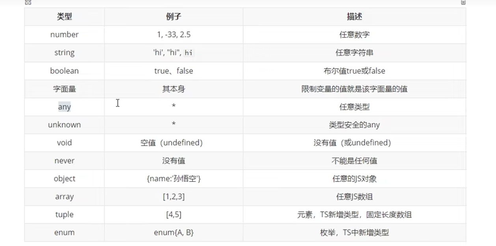

# TypeScript

<a name=""></a>

<a href=""></a>

## 1.Ts的类型声明

> **<a href="#a2">图表</a>**
>
> 1.***let a***: **值的类型**   布尔值，数字字符串等，**声明了就是唯一类型，直接输入值会隐式转换**
>
> 
>
> 2.***let as***: string | number **逻辑或**可以表示这个值既可以是string也可以是 number可以有多个，或者是具体值
>
> 
>
> 3.***let b:*** **any 代表可以是任意类型的值，不建议使用**，可以任意赋值给其他变量 **注意：如果变量不声明类型会默认any**
>
> 
>
> 4.***let c:****unknown 代表未知类型的值**，**也可以代表任意类型的值不能直接赋值相当于一个安全的any**
>
> 
>
> 5.***let d:*** **void 用来表示空**，以函数为例，**就表示没有返回值的函数**，如果给返回值就会报错
>
> 
>
> 6.***let e:*** **never** **表示永远不会返回结果**
>
> 
>
> 7.***let f:*** object 表示一个js对象，一般不使用，因为万物皆对象，**一般使用 let f:{} 或为其指定值，**
>
> **例let f：{name："string"}这样就给其赋值必须带有name为string类型的对象 ，在指定类型之后，后面的赋值不许与声明的类型一模一样包括值，但是也可以让属性可选例如：let f： {name：string，age：number},也可以多选例如 f: {name:string,[propName:string]:any}<a href="#a1">代码示例</a>**
>
> 
>
> 8.***let g:***(a:number,b:number)=>number **设置函数的结构声明**。语法：（形参：类型，形参：类型）=>返回值
>
> 
>
> 9.***let h:*** string[]**表示字符串数组，数组内只能声明字符串** 或f:number[]数字数组,或h:Array<number>
>
> 10. ***let j:***[string,number] **元组（tuple），就是固定的数组长度，并且值要与类型相对应**
>
>     
>
> 11. ***let l:***{name:string,gender:0|1} **枚举（enum）** <a href="#meiju">代码示例</a>
>
> 
>
> 12. ***let q***：string & number **&表示同时**例如这段表示q即使数组也是字符串，一般用法是：
>
>     **let q:{name:string}&{age:number}**===**q={name:'123',age:18}**  q对象既要有name也要有age
>
>     
>
> 13.**类型的别名**  用法 type mytype = 1|2|3|4  <a href="#aa3">代码示例</a>
>
>     


#### 示例与图片

****

**断言**

```ts
// 因为unknown不能任意赋值但是可以使用断言
let a :unknown
a = "1234"
let b :string
b = a as string
// 或
b = <string> a
```

**<a name="a1">对象详细</a>**

```tsx
let a: {name:string}
let b: {name:string,age:number}
let c: {name:string,age?:number}

let e: {name:string,[propName:string]:any}
// [propName:string]:any 表示任意类型的属性
//[propName:string]可以有多个属性名
// any 可以有多个属性值

a={name:'123'} // 正常
// a={name:'1234',age:'567'} //报错多了age
// b = {name:'123'} // 报错缺少age

c = {name:'123'} // 不报错缺少。age因为加了引号可有可无

// 必须要带name否则报错，因为是这样定义的
e = {name:'123',age:'456',sex:"789"} // 可以定义多个属性和值

```


**<a name="meiju">枚举</a>**

```tsx
// 声明一个枚举
enum Gebder{
   Male = 0,
   Female = 1
}


let i:{name:string,gender:Gebder}
i = {
   name:"阿李",
   gender:Gebder.Female
}
console.log(i.gender) // 1;

// 将可能的情况列出
```


**<a name="aa3">type</a>**

```tsx
type Mytype = 'as'|string|1|true

let k :Mytype
k = 1 // true
k=''  // true
k=false //false
k=true // true
k = [] // false

```


**<a name="a2">图例</a>**



------


## 2.Ts编译选项


```powershell
tsc xxx.ts -w  单个文件开启监视转换
```


**开启所有文件监视**

1.创建文件 `tsconfig.json`（tsconfig.json是ts编译器的配置文件，ts编译器可以根据它的信息来对代码进行编译）

2.`终端输入：tsc`或 `tsc -w`


#### tsconfig.json

```json
{
  // include 用来指定哪些ts文件需要被编译
  "include": [
    // ** 表示任意目录 
    // * 表示任意文件 
    "src/**/*" // 表示src下的任意目录任意文件都会被编译
  ],
  // exclude不希望被编译的文件，被排除的文件
  "exclude": [
    // 表示src下hello文件内容不希望被编译
    
    "src/hello/**/*"
  ],

  // "extends" 定义被继承的配置文件

  // "files": [] 指定被编译的文件列表，通常用于文件较少

  // 编译器选项
"compilerOptions": {
  // target 用来指定ts被编译为es的版本
  //target”选项的参数必须为 'es3', 'es5', 'es6', 'es2015', 'es2016', 
  //'es2017', 'es2018', 'es2019', 'es2020', 'es2021', 'es2022', 'esnext'。

"target": "ES2015",
// module 指定要使用的模块化规范
// module”选项的参数必须为 'none', 'commonjs', 'amd', 'system', 'umd', 'es6',
// 'es2015', 'es2020', 'es2022', 'esnext', 'node16', 'nodenext'

"module": "ES2015",
// lib 用来指定项目中要使用的库,一般不需要设置除非不在浏览器运行
// "lib": []

// outDir用来指定编译后文件所在目录
"outDir": "./dist",

// outFile 所有全局作用域中代码会合并为一个文件
//如果要使用该选项模块化必须是outFile 旁仅支持 "amd" 和 "system" 模块
// "outFile": "./dist/app.js",
 
// allowJs是否对js文件进行编译，默认值是false
"allowJs": true,

// checkJs检测js代码是否符合规范，默认值是false
"checkJs": true,

// removeComments 是否移除注释默认值是false
"removeComments": false,

// noEmit不生成编译后的文件
"noEmit": false,

// noEmitOnError 当有错误时不生成编译文件，默认false
"noEmitOnError": true,


// strict 所有严格检测的总开关，开发建议设置为true，当前选项为true时该代码以下都可以不写
"strict": false,


// alwaysStrict 用来设置编译后的文件是否使用严格模式 默认false
"alwaysStrict": false,

// 不允许隐式any类型
"noImplicitAny": true,

// 不允许不明确的this
"noImplicitThis": true,

// strictNullChecks 严格检测空值
"strictNullChecks": false
 }

}
```


**打包webpack**

**请先**`cnpm i webpack@^5.20.0 --save-dev`

安装打包：`npm install -D @webpack-cli/generators`

**再**`cnpm i -D html-webpack-plugin`

**webpack开发服务器**：`npm i -D webpack-dev-serve`


## 类（class）

**使用static开头的属性是静态属性（类属性）**，**可以直接通过类去访问**

**使用readonly开头的属性是只读属性，只能读取不能更改**

1. ```tsx
   // 定义一个类
   class Person {
    static name1:string = '小米'
     age:number = 29
       
    name:string
   age:number
       
       // 构造函数会被创建时调用
       constructor(name:string，age:number){
           在实例方法中this指向构造函数
           console.log(this)
       }
       
       // 定义方法
       sayHello（）{
           方法中的this谁i调用指向谁
           console.log("this")
       }
   }
   const per  = new Person()
   
   console.log(Person.name1); // 小米
   
   per.age = 20 // 报错无法赋值，是只读属性
   per.sayHello()
   ```


## 继承（extends）

> **使用继承后子类将会拥有父类的所有的方法和属性**
>
> **通过继承可以将多个类中共有的代码写在一个父类中**
>
> **方法重写：如果子类添加了和父类相同的方法，则子类的方法会覆盖父类的方法，我们称之为方法重写**
>
> **语法：**`class Dog extends Animal` {}


**类的继承**

```jsx

// 定义父类
class Animal {
name:string
age:number
  constructor(name:string,age:number){
    this.name = name
    this.age = age
  }
  sayhello () {
    console.log('嘀嘀嘀');
    
  }
}

// 定义子类继承父类Animal
class Dog extends Animal {
run(){
  // 定义Dog私有的方法
  console.log(`${this.name}在跑`);
  
}
}
// 定义子类继承父类Animal
class  Cat extends Animal {

  // 如果子类添加了和父类相同的方法，则子类的方法会覆盖父类的方法，我们称之为方法重写
  sayhello () {
    console.log('喵喵喵');
  }
}
// 实例化
const dog = new Dog('陶正',18)
const cat = new Cat('mimi',20)

console.log(dog); // Dog{name:'陶正'age:18}
console.log(cat);// cat{name:'mimi'age:20)}
dog.sayhello() // 嘀嘀嘀
dog.run()


```


### _super关键字

> **super就代表当前类的父类**
>
> **子类中写了构造函数，添加一些东西，在子类构造函数中必须使用super对父类进行调用**
>
> **子类可以通过super直接调用父类方法**

```jsx

// 定义父类
class Animal {
name:string
sex:string

  constructor(name:string,sex:string){
    this.name = name
    this.sex=sex
  }
  sayhello () {
    console.log('嘀嘀嘀');
    
  }
}

// 定义子类继承父类Animal
class Dog extends Animal {
age:number
// 如果在子类中写了构造函数，添加一些东西，在子类构造函数中必须使用super对父类进行调用
constructor(name:string,age:number,sex:string){
  // 父类中有几个这里就要写几个
super(name,sex)
this.age = age
}


 sayhello () {
  //在类方法中，super就表示当前父类
    super.sayhello()
    console.log(111);
    
  }
}

// 实例化
const dog = new Dog('陶正',18,'s') //  {name: '陶正', sex: 's', age: 18} 继承了父类的name和sex增加了age
console.log(dog);
dog.sayhello() // 父类sayhello的嘀嘀嘀，同时子类的111也会被调用
```


## 抽象类（abstract）


> **以abstract开头的类是抽象类，抽象类和其他类区别不大只是不能用来创建对象**
>
> **抽象类生来就是用来被继承的类**
>
> **抽象类中可以添加抽象方法，抽象方法使用abstract开头，没有方法体，抽象方法只能定义在抽象类中，子类必须对抽象方法进行重写**

**案例**

```jsx

// 定义父抽象类
abstract class Animal {
name:string


  constructor(name:string){
    this.name = name
    
  }
  // 定义一个抽象类，并且抽象类别没有方法体没有返回值
  abstract sayHello():void
  
}

class Dog extends Animal {
// 在子类中对抽象类进行重写，必须对抽象类进行重写，否则会报错
 sayHello(){
  console.log('www');
  
}

}
class Cat extends Animal {
// 在子类中对抽象类进行重写，必须对抽象类进行重写，否则会报错
  sayHello() {
  console.log('mmm');
    
  }
}

const a = new Dog('xx')
const b = new Cat('zz')
a.sayHello() // www
b.sayHello() // mmm
```


## 接口（interface）

> **interface（接口）用来定义一个类中应该包含哪些属性和方法，同时也可以当成类型声明去使用**
>
> **接口可以在定义类的时候去限制类的结构，接口中所有的属性都不能有实际值，接口只定义对象的结构，而不考虑实际值**
>
> **定义多个同名接口最后会合并为一个接口**


1，4，3，5，0，2

**00代码案例**

```jsx
// 接口用来定义一个类结构
interface myInter{
  // 接口中都是抽象方法
  name:string
  age:number
  // 不能有实际值
  sayHello():void
}
const obj:myInter ={
  name:'123',
  age:112,
  sayHello(){
    console.log(123);
    
  }
}
// 定义类时，可以使用类去实现一个接口，实现接口就是使类满足接口要求
class MyClass implements myInter{
  // 接口主要限制某个类必须符合标准
  name: string;-*********/-*/7
  age: number;
  sayHello(): void {
    throw new Error("Method not implemented.");
  }
  
}
```


## 属性的封装

> **Ts属性修饰符**
>
> 1.**public**：public修饰的属性可以在任意位置访问修改（包括子类），**语法：public name，public age**    public是默认值
>
> 2.**private**：私有属性，只能在类的内部访问修改，可以通过添加方法将内部私有属性暴露出去。
>
> 3. **protected**受包含属性，只能在当前类和当前类的子类中访问

```jsx
class Person{
  // 将name私有化,只能在类的内部访问
 private _name:string

  constructor(name:string){
    this.name = name
  }
  // 除了可以自己定义暴露的方法之外还可以使用ts提供的方法
  // 自己定义 getName(){return this.name} , setName(){return this.name}

  //使用ts提供的方法
// 获取私有属性值
  get name(){
    return this._name
  }


// ts提供的set方法
// 修改私有属性值
  set name(value:string){
if (value === '冯骏'&&'冯俊') {  this._name ='陶正'
}else{
  this._name = `${value}吃好果子`
}
  }
}


const per = new Person('陶正')

console.log(per.name);
// 可以直接访问修改私有属性
per.name = '冯俊'
```


**简化**(更加简便，推荐使用)

```jsx
// 简化写法
// 这个写法不需要再在类中定义可以直接使用与以上结构相同
class A {
  constructor(public name:string ,public age:string){
    this.name = name
     this. age = age
  }
}
```


## 泛型


> **在定义函数或者是类是，如果遇到类型不明确，就可以使用泛型**
>
> **泛型可以同时指定多个**

```tsx
// 泛型
// 不确定a是什么值就可以使用泛型
function fn<A,B>(a:A,b:B):A{
  // 传入的值是number时那么A也就是number
return a
}

// number 10 利用了ts类型的自动推断
fn(10);// 不指定泛型ts可以对类型自动进行推断

//  手动指定了泛型的值为string
fn<string>('hello,word')

// 指定多个泛型
// 可以隐式转换也可以手动写，手动写容错率高
fn<string,number>('123',123)
```


**继承接口**

```jsx
// 继承接口
interface inter{
  length:number
}
//泛型T和接口interface定义了一个函数fn，其中T必须实现接口inter中的length属性，
//该属性的值类型必须是number类型。当函数fn被调用时，传入的参数必须实现接口inter中的length属性，
//这样函数 fn 就能正确获取T对象的length属性并返回其值。在本例中，函数fn被传入了一个字符串'123'，
//字符串实现了length属性（length属性的值为3），因此fn函数能够正确获取字符串的length属性并返回其值，
//最终打印出来的值为3。
function fn<T extends inter>(a:T):number{
  return a.length
}

console.log(fn('123'));

```


**在类中使用泛型**

```tsx
// 在类中使用泛型
class Myclass <T>{
name:T
constructor(name:T){
  this.name = name
}
}

const my = new Myclass<string>('123')
```

