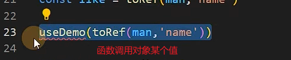

#                         Vue3+vite+pinia

一键生成用户代码片段

```json
{
  "vue template": {
    "prefix": "vue3",
    "body": [
      "<template>",
      "  <div>",
      " ",
      "  </div>",
      "</template>",
      "<script lang='ts'>",
      "import { ref , reactive} from 'vue'",
      "</script>",
      "<style scoped>",
      " ",
      "</style>",
      ""
    ],
    "description": "vue3 template"
  },
}
```


快速启动一个服务

```
cnpm i http-serve -g
```

使用

```
http-server -p 9005
```


## 第一天

创建项目

```shell
 npm init vue@latest
```


### ref全家桶

> ref分为,ref,isRef,shallowRef
>

引入:`import { ref, isRef, shallowRef } from "vue";`

**ref是深层次响应**

### ref代码：

**有Ref包装视图才能更新**

```vue
<template>
  <div>
    {{ Man.name }}

    <button @click="change">修改</button> // 修改change
  </div>
</template>
<script setup lang="ts">
import { ref, isRef, shallowRef } from "vue";
type M = {
  name: string;
};
const Man = ref<M>({ name: "夏普" });
const change = () => {
  Man.value.name = "陶正";

};
</script>
<style scoped></style>

```


### **isRef判断是否是ref类型**

```vue
<template>
  <div>
    {{ Man.name }}

    <button @click="change">修改</button>
  </div>
</template>
<script setup lang="ts">
import { ref, isRef, shallowRef } from "vue";
type M = {
  name: string;
};
const Man = ref<M>({ name: "夏普" });

const change = () => {

    // 判断是否是ref类型
  console.log(isRef(Man)); // true
};
</script>
<style scoped></style>
```


### **shallowRef 监听浅层次响应**

```vue
<template>
  <div>
    {{ Man2.name }}
    <button @click="change">修改</button>
  </div>
</template>
<script setup lang="ts">
import { ref, isRef, shallowRef } from "vue";
type M = {
  name: string;
};
const Man2 = shallowRef({ name: "小曼" });
const change = () => {
  Man2.value = {
    name: "大满2",
  };
};
</script>
<style scoped></style>

```


> ref和shallowref不能一块写，不然ref会影响shallowRef造成视图更新
>
> triggerRef，也能造成shallowre值一起更改

### triggerRef

triggerRef 的作用就是将ref生成的数据强制再页面更新ui；

```vue
<template>
  <div>
    {{ Man.name }}
    {{ Man2.name }}
    <button @click="change">修改</button>
  </div>
</template>
<script setup lang="ts">
import { ref, shallowRef, triggerRef, customRef } from "vue";
type M = {
  name: string;
};
const Man = ref<M>({ name: "夏普" });
const Man2 = shallowRef({ name: "小曼" });
const change = () => {
    Man.value.name = '小红' // ref和shallowRef一起用会导致shallowRef定义的视图一起更新
  Man2.value.name = "阿大";  // shallowRef 定义
  triggerRef(Man2); // 也会导致shallowRef值被更改
  console.log(Man2.value.name); // 被更改
};
</script>
<style scoped></style>

```


### 自定义ref

```vue
<template>
  <div>
    {{ Man.name }}
    {{ Man2.name }}
    <button @click="change">修改</button>
  </div>
</template>
<script setup lang="ts">
import { ref, shallowRef, triggerRef, customRef } from "vue";
type M = {
  name: string;
};
const Man = ref<M>({ name: "夏普" });
const Man2 = shallowRef({ name: "小曼" });
const change = () => {
    Man.value.name = '小红' // 和shallowRef一起用会导致shallowRef定义的视图一起更新
  Man2.value.name = "阿大";  // shallowRef 定义
  triggerRef(Man2); // 也会导致shallowRef值被更改
  console.log(Man2.value.name); // 被更改
};
</script>
<style scoped></style>
```


### 使用ref获取dom对象

```vue
<template>
  <div>
    <!-- {{ Man.name }} -->
    <div ref="dom">customRef</div>
    <div ref="xixi">13</div>
    <button @click="change">修改</button>
  </div>
</template>
<script setup lang="ts">
import { ref, shallowRef, triggerRef, customRef } from "vue";

// 使用ref获取dom元素时const 变量要与ref定义的一致否则是undefined
const dom = ref<HTMLDivElement>();
const xixi = ref<HTMLDivElement>();
function change() {
    // dom.value是不确定vualue有没有值的情况下
  console.log(dom.value?.innerHTML);
  console.log(xixi.value?.innerHTML);
}
</script>
<style scoped></style>

```


### reactive

> ref支持所有类型 ，**reactive支持引用类型** Array objeact Map set

```vue
基本使用
<template>
  <div>
    <div>
      <h3>{{ form.name }}</h3>
      <h3>{{ form.age }}</h3>
    </div>

    <button @click="change">修改</button>
  </div>
</template>
<script setup lang="ts">
import { reactive } from "vue";
let form = reactive({
  name: "小满",
  age: 23,
});
    // 点击后改名
function change() {
  form.name = "冯俊";
  form.age = 21;
}
</script>
<style scoped></style>

```


**reactive proxy 不能直接赋值，否则会破坏响应式对象**

解决方案1：push+解构

```vue
<template>
  <div>
    <div>
      <span v-for="item in form" :key="item">{{ item }}</span>
    </div>

    <button @click="change">修改</button>
  </div>
</template>
<script setup lang="ts">
import { reactive } from "vue";
let form = reactive<string[]>([]);
function change() {
  // form.push("陶正");
  // reactive proxy 不能直接赋值，否则会破坏响应式对象
  setTimeout(() => {
    let res = ["陶正", "taobao"];
     form.push(res)
    // 数组可以使用push加解构
    // form.push(...res);
  },2000);
}
</script>
<style scoped></style>
```


解决方案2：如果要使用点赋值可以将对象变成属性

```vue
<template>
  <div>
    <div>
      <span v-for="item in form.arr" :key="item">{{ item }}</span>
    </div>

    <button @click="change">修改</button>
  </div>
</template>
<script setup lang="ts">
import { reactive } from "vue";
// 将form声明成一个对象，内有一个str类型的arr数组
let form = reactive<{ arr: string[] }>({ arr: [] });
function change() {
  // reactive proxy 不能直接赋值，否则会破坏响应式对象
  setTimeout(() => {
    let res = ["陶正", "taobao", "hhh"];
    // 直接赋值
    form.arr = res;
  }, 2000);
}
</script>
<style scoped></style>

```


### readonly 可以将对象变成只读的

```vue
<template>
  <div>
    <div>
      <span v-for="item in form.arr" :key="item">{{ item }}</span>
    </div>

    <button @click="change">修改</button>
  </div>
</template>
<script setup lang="ts">
// readonly 可以将对象变成只读的
import { reactive, readonly } from "vue";
let obj = reactive({ name: "阿含" });
const erad = readonly(obj);
// erad.name = '123' // 无法为“name”赋值，因为它是只读属性。
// 但是可以直接为obj修改值
obj.name = "123"; // 成功
function change() {}
</script>
<style scoped></style>
                        
```


### shallowReactive

> shallowReactive 就像shallowref一样只能读浅层的即第一层,
>
> //如果和reactive，shallowReactive一起使用则会导致shallowReactive的值一起被更改

```vue
<template>
  <div>
    <div>shallowReactive: {{ obj2.foo.num }}</div>
    <div>{{ obj.name }}</div>
  </div>
  <div>
    <button @click="change">修改</button>
    <button @click="change2">测试</button>
  </div>
</template>
<script setup lang="ts">
// readonly 可以将对象变成只读的
// shallowReactive 就像shallowref一样只能读浅层的即第一层,
//如果和reactive，shallowReactive一起使用则会导致shallowReactive的值一起被更改
import { reactive, shallowReactive } from "vue";
let obj = reactive({ name: "阿强" });
let obj2: any = shallowReactive({
  foo: {
    num: 123,
  },
});

function change() {
  // 单个不会更改
  obj2.foo.num = 3;
}
function change2() {
  // reactive，shallowReactive一起使用shallowReactive的值一起被更改
  obj.name = "阿俊";
  obj2.foo.num = 3;
}
</script>
<style scoped></style>

```


### toRef

> **只能修改响应式数据的值**
>
> **非响应式数据变化视图不变**

```vue
<template>
  <div>
    <h2>
      {{ man }}
      {{ like }}
    </h2>
  </div>
  <div>
    <button @click="change">修改</button>
  </div>
</template>
<script setup lang="ts">
import { toRef, reactive } from "vue";
// toRef可以拿到对象里的一个属性并且随着修改源也会修改
const man = reactive({ name: "小俊", age: 23, like: "Jkgirl" });
// toRef对非响应式对象没有作用
const like = toRef(man, "like");
    
const change = () => {
  like.value = "短发";
  console.log(like);
};
</script>
<style scoped></style>

```


**toRef一般用于函数调用对象某个值，函数更改该值时，其源也会更改**




### toRefs 

可以对reactive对象内，每个对象进行toRef包装

```vue
<template>
  <div>
    <h2>
      {{ man }}
    </h2>
  </div>
  <div>
    <button @click="change">修改</button>
  </div>
</template>
<script setup lang="ts">
import { toRef, reactive } from "vue";
// toRef可以拿到对象里的一个属性并且随着修改源也会修改
const man = reactive({ name: "小俊", age: 23, like: "Jkgirl" });
// toRef对非响应式对象没有作用

// 简单实现toRefs简单实现了对对象每个值进行toRef包装
// 当前需要一个object属性的形参
const toRefs = <T extends object>(object: T) => {
  // 声明一个空对象属性any
  const map: any = {};
  // in传入的obj key=对象名 ，toRef进行包装
  for (let key in object) {
    map[key] = toRef(object, key);
  }
  return map;
};
// 解构
const { name, age, like } = toRefs(man);
function change() {
  console.log(name, age, like); //  每一层都做了toref包装
     console.log(name, age, like); //  每一层都做了toref包装
  name.value = "阿强"; // 有Ref包装视图才能更新
  age.value = 33;
}
```


### toRaw

```vue
<script setup lang="ts">
import { toRef, reactive, toRaw } from "vue";

const man = reactive({ name: "小俊", age: 23, like: "Jkgirl" });

const change = () => {
  toRaw(man); // 去除ref包装变成原始属性
};
</script>
```


## 第二天


#### 计算属性（computed）

```vue
<template>
  <div>
    <input type="text" v-model="fistName" />
    <input type="text" v-model="lastName" />
  </div>
  <br />
  <div>
    <h3>{{ name }}</h3>
  </div>
</template>
<script setup lang="ts">
import { computed, ref } from "vue";
let fistName = ref("");
let lastName = ref("");
const name = computed(() => {
// 计算属性的写法
  return fistName.value + "---------" + lastName.value;
});
</script>
<style scoped></style>

```

效果


### watch


```vue
<template>
  <div>
    case1:<input v-model="message.foo.name" type="text" />
    <hr />
  </div>
</template>
<script setup lang="ts">
import { ref, reactive, watch } from "vue";
// 如果使用reactive不写deep也会开启深度监听
let message = reactive<{ foo: any }>({
  foo: {
    name: "cc",
  },
});
watch(
  message,
  (newVal: unknown, oldVal: unknown) => {
    console.log(newVal, oldVal); // 深度监听为什么新值旧值是一样的？
  }
  // 开启深度监听
  // { deep: true } // 使用 reactive 可以不写
);
</script>
<style scoped></style>

```


> **如果要监听某个单一属性则要将其变为回调函数**


> ```vue
> <template>
>   <div>
>     case1:<input v-model="message.foo.age" type="text" />
>     <hr />
>     case2:<input v-model="message.foo.name" type="text" />
>   </div>
> </template>
> <script setup lang="ts">
> import { ref, reactive, watch } from "vue";
> // 如果使用reactive不写deep也会开启深度监听
> let message = reactive<{ foo: any }>({
>   foo: {
>     name: "cc",
>     age:18
>   },
> });
> 
> 
> // 如果要监听一个属性的单一值需要将其变成一个回调函数
> watch(()=> message.foo.age,(newVal, oldVal) => {
>     console.log(newVal, oldVal); // 新值旧值是一样的
>   },{
>     
>     immediate:true // 默认执行watch一次
> }
> );
> ```


### **watchEffect**

**该属性会默认调用一次，如何再值改变时候监听**

```vue
<template>
  <div>
    case1:<input v-model="message" type="text" />
    <hr />
    <button @click="stop">停止监听</button>
  </div>
</template>
<script setup lang="ts">
import { ref, reactive, watch, watchEffect } from "vue";

let message = ref("123");
let stops = watchEffect((oninvalidate) => {
  console.log(message.value);
  // 数据发送改变时回调函数会先执行oninvalidate再执行其他的任务
  oninvalidate(() => {
    console.log("先执行啦");
  });
});
// 停止监听
const stop = () => stops();
</script>
<style scoped></style>
```


**总结：watch属性**

```vue
<script setup lang="ts">
watch(()=> message.foo.age,(newVal, oldVal) => {
    console.log(newVal, oldVal); // 新值旧值是一样的
  },{
    deep:true //深度监听
    immediate:true // 默认执行watch一次
    flush:'pre' //pre组件更新之前调用，sync tong
}
);
```


### 组件的生命周期

```vue
<script>
import {
  onBeforeMount,
  onMounted,
  onBeforeUpdate,
  onUpdated,
  onBeforeUnmount,
  onUnmounted,
} from "vue";
// beforeCreate vreated setup语法糖模式是没有这两个生命周期的 setup去替代
// 创建
onBeforeMount(() => {
  console.log("组件渲染之前的钩子");
});
onMounted(() => {
  "组件渲染之后的钩子";
});

// 更新的钩子
onBeforeUpdate(() => {
  console.log("组件更新之前钩子");
});

onUpdated(() => {
  console.log("组件更新之后钩子");
});

// 卸载
onBeforeUnmount(() => {
  console.log("组件销毁之前钩子");
});
onUnmounted(() => {
  console.log("组件销毁之后钩子");
});
</script>
```


### 父子组件

**子组件接收值**

```vue
<script>
    // withDefaulte ts独有的方法，如果可以给组件一个默认值
    // defineProps<{title:string,arr:number}> 可以使用泛型接收值
    withDefaulte(defineProps<{title:string,arr:number}>(),{
        // ts特有的定义默认值的方式
        arr:()=>['123']
    })
  
```


**子传父**

**使用defineEmits**

```vue
<script>
    // 第一种方式
const emit = defineEmits(["onclick"]);
function a() {
  emit("onclick", "小飞棍来咯");
}
    // 第二种方式
    
    const emit = defineEmits<{ (e: "onclick", name: string): void }>();
function a() {
  emit("onclick", "小飞棍来咯");
}
    
    
    <父组件 @onclick=‘onclick’> // 接收
        
        
```


### 暴露方法

```vue
<script>
// 暴露方法

defineExpose({
  name: "阿俊",
  open: () => {
    console.log("123");
  },
});
    import AboutView from "./views/AboutView.vue";
// InstanceType 可以从类型中抽取实例，typeof AboutView 导出的属性方法，综合起来，当前组件的实例和方法
const waterFall = ref<InstanceType<typeof AboutView>>();
console.log(waterFall.value?.name);
```


### main.js定义全局组件

```vue
<script>
import CardVue from './components'

import App from "./App.vue";

import "./assets/main.css";
const app = createApp(App);
app.component('Card',CardVue)
```


**全局组件可以组件递归组件**

案例：

```vue
<script>
    // main.js定义全局组件
    import TreeVue from "./views/AboutView.vue";
import App from "./App.vue";

import "./assets/main.css";
const app = createApp(App);

app.component("TreeVue", TreeVue);
app.use(createPinia());

app.mount("#app");

 </script> 
   
   
    
    <template>
 // 递归组件内递归
 //遍历
  <div v-for="(item, index) in data" :key="index">
      // input 绑定checked，无关紧要
    <input type="checkbox" v-model="item.checked" />
    <span>{{ item.name }}</span>
      // 主要： if 判断当数组有长度代表有数组有值进行递归，否则结束

    <TreeVue v-if="item?.children?.length" :data="item?.children"></TreeVue>
  </div>
</template>
<script setup lang="ts">
import { ref, reactive } from "vue";
    
export interface Tree {
  name: string;
  checked: boolean;
  children?: Tree[];
}
// 传入一个tree类型的数组
defineProps<{
  data?: Tree[];
}>();
</script>
```


### provide


###  

可选链操作符

​	

`a.chilidern？.length？.xxx？？[]`

a里有没有chilidern这个属性有的话有没有长度有的 话有没有.xxx，双？？代表有的话返回第一个，没有的话返回第二个

**注意0和false不做处理**


### 动态组件

```vue
<template>
  <div>
    <button @click="btn(1)">组件1</button>
    <button @click="btn(2)">组件2</button>
    <button @click="btn(3)">组件3</button>
  </div>
  <div style="border: 2px; width: 200px; height: 100px">
    <div v-for="(item, index) in data" :key="index"></div>
  </div>
  <!-- // 动态组件 -->
  <component :is="comId"></component>
</template>
<script setup lang="ts">
import { ref, reactive, markRaw, shallowRef } from "vue";
import Avue from "./AVue.vue";
import BVue from "./BVue.vue";
import CVue from "./CVue.vue";
// 对domid切换只做浅包装
let comId = shallowRef(Avue);
// 组件做了reactive代理，包装上了propx会造成性能浪费
// 使用markRaw是会多一个_skip_属性，会跳过propx代理

const data = reactive([
  {
    name: "avue",
    // 进行markRaw进行包装
    com: markRaw(Avue),
  },
  {
    name: "bvue",
    com: markRaw(BVue),
  },
  {
    name: "vvue",
    com: markRaw(CVue),
  },
]);
// 切换动态组件函数
function btn(index: number) {
  if (index === 1) {
    comId.value = markRaw(Avue);
  } else if (index === 2) {
    comId.value = markRaw(BVue);
  } else {
    comId.value = markRaw(CVue);
  }
}
</script>
```


### 动态插槽


### 异步组件

第一张引入方式


第二种方式


## 第三天

### Teleport传送组件


### keep-alive缓存组件

```vue
<template>
    <keep-alive :include=['A']> // 定义要缓存的组件
    <A />
    <B />
    </keep-alive>


<template>
    <keep-alive :exclude=['A']> // 定义要不缓存的组件
    <A />
    <B />
    </keep-alive>
    
    <template>
    <keep-alive :max="10"> // 定义要缓存的10个组件
    <A />
    <B />
    </keep-alive>
```


**开启缓存会增加两个生命周期**


开启后就不会走卸载


### transition


Vue 提供了 transition 的封装组件，在下列情形中，可以给任何元素和组件添加进入/离开过渡:

条件渲染 (使用 v-if)
条件展示 (使用 v-show)
动态组件
组件根节点
自定义 transition 过度效果，你需要对transition组件的name属性自定义。并在css中写入对应的样式

1.过渡的类名
在进入/离开的过渡中，会有 6 个 class 切换。

###过渡 class

在进入/离开的过渡中，会有 6 个 class 切换。

v-enter-from：定义进入过渡的开始状态。在元素被插入之前生效，在元素被插入之后的下一帧移除。

v-enter-active：定义进入过渡生效时的状态。在整个进入过渡的阶段中应用，在元素被插入之前生效，在过渡/动画完成之后移除。这个类可以被用来定义进入过渡的过程时间，延迟和曲线函数。

v-enter-to：定义进入过渡的结束状态。在元素被插入之后下一帧生效 (与此同时 v-enter-from 被移除)，在过渡/动画完成之后移除。

v-leave-from：定义离开过渡的开始状态。在离开过渡被触发时立刻生效，下一帧被移除。

v-leave-active：定义离开过渡生效时的状态。在整个离开过渡的阶段中应用，在离开过渡被触发时立刻生效，在过渡/动画完成之后移除。这个类可以被用来定义离开过渡的过程时间，延迟和曲线函数。

v-leave-to：离开过渡的结束状态。在离开过渡被触发之后下一帧生效 (与此同时 v-leave-from 被移除)，在过渡/动画完成之后移除。

如下

       <button @click='flag = !flag'>切换</button>
       <transition name='fade'>
         <div v-if='flag' class="box"></div>
       </transition>
```CSS
//开始过度
.fade-enter-from{
   background:red;
   width:0px;
   height:0px;
   transform:rotate(360deg)
}
//开始过度了
.fade-enter-active{
  transition: all 2.5s linear;
}
//过度完成
.fade-enter-to{
   background:yellow;
   width:200px;
   height:200px;
}
//离开的过度
.fade-leave-from{
  width:200px;
  height:200px;
  transform:rotate(360deg)
}
//离开中过度
.fade-leave-active{
  transition: all 1s linear;
}
//离开完成
.fade-leave-to{
  width:0px;
   height:0px;
}
```

2.自定义过渡 class 类名
trasnsition props

enter-from-class
enter-active-class
enter-to-class
leave-from-class
leave-active-class
leave-to-class
自定义过度时间 单位毫秒

你也可以分别指定进入和离开的持续时间：

<transition :duration="1000">...</transition>

<transition :duration="{ enter: 500, leave: 800 }">...</transition>
通过自定义class 结合css动画库animate css

安装库 npm install animate.css

引入 import 'animate.css'

使用方法

官方文档 Animate.css | A cross-browser library of CSS animations.

        <transition
            leave-active-class="animate__animated animate__bounceInLeft"
            enter-active-class="animate__animated animate__bounceInRight"
        >
            <div v-if="flag" class="box"></div>
        </transition>
```JS
3.transition 生命周期8个
  @before-enter="beforeEnter" //对应enter-from
  @enter="enter"//对应enter-active
  @after-enter="afterEnter"//对应enter-to
  @enter-cancelled="enterCancelled"//显示过度打断
  @before-leave="beforeLeave"//对应leave-from
  @leave="leave"//对应enter-active
  @after-leave="afterLeave"//对应leave-to
  @leave-cancelled="leaveCancelled"//离开过度打断
当只用 JavaScript 过渡的时候，在 enter 和 leave 钩子中必须使用 done 进行回调

结合gsap 动画库使用 GreenSock

const beforeEnter = (el: Element) => {
    console.log('进入之前from', el);
}
const Enter = (el: Element,done:Function) => {
    console.log('过度曲线');
    setTimeout(()=>{
       done()
    },3000)
}
const AfterEnter = (el: Element) => {
    console.log('to');
}
4.appear
通过这个属性可以设置初始节点过度 就是页面加载完成就开始动画 对应三个状态

appear-active-class=""
appear-from-class=""
appear-to-class=""


```


### 依赖注入

```vue
<script>
// 父组件定义
  import {provide} from "vue";
  
const colorVal = ref<string>("red");
provide("color", colorVal);
    
    
    // 子组件接收
    import { inject } from "vue";
import type { Ref } from "vue";
const color = inject<Ref<string>>("color");
    
```

让子组件不能修改值


### 兄弟组件传参 BUS实现发布订阅者

```vue
<script>
type BusClass = {
  emit: (name: string) => void;
  on: (name: string, callback: Function) => void;
};

type ParamsKey = string | number | symbol;

type List = {
  [key: ParamsKey]: Array<Function>;
};

class Bus implements BusClass {
  list: List;
  constructor() {
    this.list = {};
  }

  // this.list['click'] -> cb -> cb()
  emit(name: string, ...args: Array<any>) {
    const evnentName: Array<Function> = this.list[name];
    evnentName.forEach((fn) => {
      fn.apply(this, args);
    });
  }

  // { click: cb, dbclick: cb, mousemove: cb }
  on(name: string, callback: Function) {
    const fn: Array<Function> = this.list[name] || [];
    fn.push(callback);
    this.list[name] = fn;
      //click:[()->{}]
  }
}

export default { Bus };

// 这段代码可以帮助你完成实际的事件处理，
// 所有的传递和调用都被封装在 bus 类中。当你调用 emit 方法时，它会循环遍历 
// this.list[name] 中的函数，并将它们按顺序依次执行。 
// this.list[name] 是一个包含多个函数的数组，
// 而 name 是字符串或者符号。 当用户调用 on 方法时
// ，它先查看与该名称相关的函数列表是否存在，如果不存在，
// 就将传入的函数 obj 进行存储，并将该函数与相应的名称进行绑定。
// 每次执行时，都会遍历整个函数队列执行函数，然后将结果返回给用户
```


### mitt（子父组件快速传值）

**挂载全局的方式main.js**

 `npm i mitt -S`  

```vue
<script>
    import mitt from 'mitt'
    const Mit = mitt()
    const app = createApp(App);

    
app.config.globalProperties.$Bus = Mit;

    
 declare module "vue" {
  export interface ComponentCustomProperties {
    $Bus: typeof Mit;
  }
}
```


**使用**

```vue
<script>
import { getCurrentInstance,} from "vue";
const instance = getCurrentInstance();
    // 使用emit发送
const emit = () => {
  instance?.proxy?.$Bus.emit("on-xiaoman", "mitt");
};
    
    // 接收
    import { getCurrentInstance } from "vue";
const instance = getCurrentInstance();
instance?.proxy?.$Bus.on("on-xiaoman", (str) => {
  console.log(str);
});
//    监听所有
        // 接收
    import { getCurrentInstance } from "vue";
const instance = getCurrentInstance();
instance?.proxy?.$Bus.on("*", (str) => {
  console.log(str);
});
    
    // 删除 
    instance?.proxy?.$Bus.off('on-xiaomi',Bus)
```


### Tsx

`npm install @vitejs/plugin-vue-jsx -D`

**vite.config.ts 配置**

```vue
<script>
import { defineConfig } from 'vite'
import vue from '@vitejs/plugin-vue'
import vueJsx from '@vitejs/plugin-vue-jsx';
// https://vitejs.dev/config/
export default defineConfig({
  plugins: [vue(),vueJsx()]
})
```


写法：

```tsx
<script>
// 第一种
   export default function () {
  return <div>红红火火恍恍惚惚</div>;
}
    
  //  第二种
import { defineComponent } from "vue";
export default defineComponent({
  data(vm) {
    return {
      age: 23,
    };
  },
  render() {
    return <div>{this.age}</div>;
  },
});
    
    
    
    // 第三种 setup函数模式
    import
    
    
    
    
 
```

3**.使用TSX**

```vue
<script>
TIPS tsx不会自动解包使用ref加.vlaue ! ! !

// tsx支持 v-model 的使用

import { ref } from 'vue'

let v = ref<string>('')

const renderDom = () => {
    return (
        <>
           <input v-model={v.value} type="text" />
           <div>
               {v.value}
           </div>
        </>
    )
}

export default renderDom

    
    
    
    
    
    
// v-show

import { ref } from 'vue'

let flag = ref(false)

const renderDom = () => {
    return (
        <>
           <div v-show={flag.value}>景天</div>
           <div v-show={!flag.value}>雪见</div>
        </>
    )
}

export default renderDom
    
    
    
    
// v-if是不支持的所以需要改变风格

import { ref } from 'vue'

let flag = ref(false)

const renderDom = () => {
    return (
        <>
            {
                flag.value ? <div>景天</div> : <div>雪见</div>
            }
        </>
    )
}

export default renderDom

    
    
    
    
    
    
    
    
    
//v-for也是不支持的需要使用Map

import { ref } from 'vue'

let arr = [1,2,3,4,5]

const renderDom = () => {
    return (
        <>
            {
              arr.map(v=>{
                  return <div>${v}</div>
              })
            }
        </>
    )
}

export default renderDom
    
    
    
    
    
    
    
//v-bind使用直接赋值就可以

import { ref } from 'vue'

let arr = [1, 2, 3, 4, 5]

const renderDom = () => {
    return (
        <>
            <div data-arr={arr}>1</div>
        </>
    )
}

export default renderDom
    
    
    
    
    
    
// v-on绑定事件 所有的事件都按照react风格来
所有事件有on开头
所有事件名称首字母大写

const renderDom = () => {
    return (
        <>
            <button onClick={clickTap}>点击</button>
        </>
    )
}

const clickTap = () => {
    console.log('click');
}

export default renderDom
Props 接受值

import { ref } from 'vue'

type Props = {
    title:string
}

const renderDom = (props:Props) => {
    return (
        <>
            <div>{props.title}</div>
            <button onClick={clickTap}>点击</button>
        </>
    )
}

const clickTap = () => {
    console.log('click');
}

export default renderDom
    
    
    
    
    
//Emit派发
type Props = {
    title: string
}

const renderDom = (props: Props,content:any) => {
    return (
        <>
            <div>{props.title}</div>
            <button onClick={clickTap.bind(this,content)}>点击</button>
        </>
    )
}

const clickTap = (ctx:any) => {

    ctx.emit('on-click',1)

}


//Slot 插槽

const A = (props, { slots }) => (
  <>
    <h1>{ slots.default ? slots.default() : 'foo' }</h1>
    <h2>{ slots.bar?.() }</h2>
  </>
);

const App = {
  setup() {
    const slots = {
      bar: () => <span>B</span>,
    };
    return () => (
      <A v-slots={slots}>
        <div>A</div>
      </A>
    );
  },
};

// or

const App = {
  setup() {
    const slots = {
      default: () => <div>A</div>,
      bar: () => <span>B</span>,
    };
    return () => <A v-slots={slots} />;
  },
};

// or you can use object slots when `enableObjectSlots` is not false.
const App = {
  setup() {
    return () => (
      <>
        <A>
          {{
            default: () => <div>A</div>,
            bar: () => <span>B</span>,
          }}
        </A>
        <B>{() => "foo"}</B>
      </>
    );
  },
```

————————————————


### import插件

```js
npm i -D unplugin-auto-import
```

vite.config，引入

```ts
import AutoImport from "unplugin-auto-import/vite";
export default defineConfig({
  plugins: [
    AutoImport({
      // targets to transform
      include: [
        /\.[tj]sx?$/, // .ts, .tsx, .js, .jsx
        /\.vue$/,
        /\.vue\?vue/, // .vue
        /\.md$/, // .md
      ],

      // global imports to register
      imports: [
        // presets
        "vue",
        "vue-router",
        // custom
        {
          "@vueuse/core": [
            // named imports
            "useMouse", // import { useMouse } from '@vueuse/core',
            // alias
            ["useFetch", "useMyFetch"], // import { useFetch as useMyFetch } from '@vueuse/core',
          ],
          axios: [
            // default imports
            ["default", "axios"], // import { default as axios } from 'axios',
          ],
          "[package-name]": [
            "[import-names]",
            // alias
            ["[from]", "[alias]"],
          ],
        },
      ],
      // Enable auto import by filename for default module exports under directories
      defaultExportByFilename: false,

      // Auto import for module exports under directories
      // by default it only scan one level of modules under the directory
      dirs: [
        // './hooks',
        // './composables' // only root modules
        // './composables/**', // all nested modules
        // ...
      ],

      // Filepath to generate corresponding .d.ts file.
      // Defaults to './auto-imports.d.ts' when `typescript` is installed locally.
      // Set `false` to disable.
      dts: "./auto-imports.d.ts",

      // Cache the result of resolving, across multiple vite builds.
      // A custom path is supported.
      // When set to `true`, the cache will be stored in `node_modules/.cache/unplugin-auto-import.json`.
      cache: false,

      // Auto import inside Vue template
      // see https://github.com/unjs/unimport/pull/15 and https://github.com/unjs/unimport/pull/72
      vueTemplate: false,

      // Custom resolvers, compatible with `unplugin-vue-components`
      // see https://github.com/antfu/unplugin-auto-import/pull/23/
      resolvers: [
        /* ... */
      ],

      // Generate corresponding .eslintrc-auto-import.json file.
      // eslint globals Docs - https://eslint.org/docs/user-guide/configuring/language-options#specifying-globals
      eslintrc: {
        enabled: false, // Default `false`
        filepath: "./.eslintrc-auto-import.json", // Default `./.eslintrc-auto-import.json`
        globalsPropValue: true, // Default `true`, (true | false | 'readonly' | 'readable' | 'writable' | 'writeable')
      },
    }),
  ],
  resolve: {
    alias: {
      "@": fileURLToPath(new URL("./src", import.meta.url)),
    },
  },
});

```


### v-model语法糖


**父组件发送**

```vue

<<template>

<div>
  <div> 
 <button  @click="ishow=!ishow">点击切</button>
      
  {{ ishow }}</div>
    
  <div>信息：{{ texe }}</div>
    
  <!-- v-model语法糖绑定子组件 -->
  <!-- 一个标签上可以有多个v-model -->
<!-- 多v-model用法 -->
    
<SonCom v-model:model="ishow" v-model:text="texe" />
</div>
</template>
<script setup lang="ts">
import { ref, reactive } from "vue";
import SonCom from './SonCom.vue'
    
let ishow = ref<boolean>(true)
let texe = ref<string>('陶正吃屎')

</script>
<style scoped></style>
```

**子组件接收**

```vue
<template>
  <!--  子组件设置 -->
<div style="border: 5px solid black;width: 400px;height: 150px;" v-if="model">
  <button @click="c">关闭</button>
  <div>显示隐藏：{{ text }}</div>
  <input type="text" @input="change">
</div>
</template>

<script setup lang="ts">
import { ref, reactive ,defineEmits} from "vue";
// 子组件defineProps接收
defineProps<{
  // 接收
  model:boolean | string | number,
  text:string
  // 接收自定义修饰符Modifiers是固定写法
  textModifiers?:{
    isBt:boolean
}
    
}>()
// 子组件绑定传送父组件vue2是.sync vue3取消了.sync
const emit = defineEmits(['update:model','update:text'])

function c () {

  emit('update:model',false)
}
// 与父组件绑定，拿到target
function change (e:Event) {
  // 因为target类型拿不到值所以要断言HTMLInputElement
const target = e.target as HTMLInputElement
emit('update:text',target.value)
}

</script>
<style scoped></style>

```


## 第四天

###  directive-[自定义指令](https://so.csdn.net/so/search?q=自定义指令&spm=1001.2101.3001.7020)（属于破坏性更新）

> **Vue3指令的钩子函数**
>
> 1.**created 元素初始化的时候**
>
> 2.**beforeMount 指令绑定到元素后调用 只调用一次**
>
> 3.**mounted 元素插入父级dom调用**
>
> 4.**beforeUpdate 元素被更新之前调用**
>
> 5.**update 这个周期方法被移除 改用updated**
>
> 6.**beforeUnmount 在元素被移除前调用**
>
> 7.**unmounted 指令被移除后调用 只调用一次**


代码：

```vue
<template>
  <button @click="show = !show">开关{{show}} ----- {{title}}</button>
  <Dialog  v-move-directive="{background:'green',flag:show}"></Dialog>
</template>
<script>
     
const vMoveDirective: Directive = {
  created: () => {
    console.log("初始化====>");
  },
  beforeMount(...args: Array<any>) {
    // 在元素上做些操作
    console.log("初始化一次=======>");
  },
  mounted(el: any, dir: DirectiveBinding<Value>) {
    el.style.background = dir.value.background;
    console.log("初始化========>");
  },
  beforeUpdate() {
    console.log("更新之前");
  },
  updated() {
    console.log("更新结束");
  },
  beforeUnmount(...args: Array<any>) {
    console.log(args);
    console.log("======>卸载之前");
  },
  unmounted(...args: Array<any>) {
    console.log(args);
    console.log("======>卸载完成");
  },
};
```


 **指令鉴权案例**

```vue
<template>
<div class="btns">
  <!-- 自定义指令鉴权 -->
  <!--指令内部处理如果有 文本与permission则显示不相符则不显示  -->
  <button v-HasShow = '"shop:edit"'>创建</button>
<button  v-HasShow = '"shop:create"'>编辑</button>
<button  v-HasShow = '"shop:delete"'>删除</button>
</div>

</template>
<script setup lang="ts">
import { ref, reactive } from "vue";
import type { Directive } from "vue";

localStorage.setItem('userId','xiaoman-zs')

const permission = [
  'xiaoman-zs:shop:edit',
  'xiaoman-zs:shop:create',
  'xiaoman-zs:shop:delete'
]

const userId = localStorage.getItem('userId') as string
// el定义为标签，不能是any，bingding看自己需求去定义
const vHasShow:Directive<HTMLElement,string> = (el,bingding)=>{
if(!permission.includes(userId+':'+bingding.value)){
  el.style.display = 'none'
}
  
}


</script>

<style scoped lang="less">
.btns{
  button {
    margin: 10px;
  }
}
</style>
```


### canvas


```js
const canvas = document.createElement('canvas')
const ctx = canvas.getContext('2d')
```


**drawImage详解**


### hooks


**手写bese64hooks**

```js


import { onMounted } from "vue"

type Options = {
el:string
}

// 这段代码将当前页面甚至嵌入iframe（通过参数指定的HTML元素）
// 中的图片转换为base64编码的字符串。首先引入vue的onMounted方法
// ，然后指定一个el的参数，用querySelector方法找到这个元素，同时该HTMLImageElement图片加载完成之后，
// 就可以validate该图片了，最后利用getContext将图片渲染到canvas上，再利用toDataURL将图片转换为base64的字符串，
// 并resolve出去。


export default function (options:Options):Promise<{baseUrl:string}>{
  return new Promise((resolve)=>{
    onMounted(()=>{
      const img:HTMLImageElement = document.querySelector(options.el) as HTMLImageElement
      img.onload = ()=>{
      resolve( {
        baseUrl:base64(img)
      })
      }
    })
    const base64 = (el:HTMLImageElement)=>{
      const canvas = document.createElement('canvas')
      const ctx = canvas.getContext('2d')
      canvas.width=el.width
      canvas.height = el.height
      ctx?.drawImage(el,0,0,canvas.width,canvas.height)
      return canvas.toDataURL('image/png/image/webp')
      }
  })

}

```


 **引入**

```vue
<template>

<div>
  
</div>
</template>
<script setup lang="ts">
import { ref, reactive } from "vue";
import type { Directive } from "vue";
import useBase64 from './hooks'
// 调入并引用
useBase64({
  el:'#img'
}).then(res=>{
  console.log(res.baseUrl);
  
})

</script>

<style scoped lang="less">

</style>

```


### 全局函数和变量

```js
由于Vue3 没有Prototype 属性 使用 app.config.globalProperties 代替 然后去定义变量和函数

Vue2

// 之前 (Vue 2.x)
Vue.prototype.$http = () => {}
Vue3

// 之后 (Vue 3.x)
const app = createApp({})
app.config.globalProperties.$http = () => {}

```


 **env.d.ts**

设置：

```js
type Filter = {
  format<T>(str: T): string;
};// 一个声明类型

// 声明要扩充@vue/runtime-core包的声明.
// 这里扩充"ComponentCustomProperties"接口, 因为他是vue3中实例的属性的类型


export declare module '@vue/runtime-core' {
  export interface ComponentCustomProperties {
      // 对$abc做类型限制
    $abc: Filter
  }
}

```


**main.js定义**

```js
// 定义了一个format函数返回一个字符串
app.config.globalProperties.$abc = {
  format<T>(s: T) {
    return `${s} s`
  }
}
```


**组件内引用**

```js
import { getCurrentInstance } from "vue";
// 固定写法
const app = getCurrentInstance()

console.log(app?.proxy?.$abc.format('123'))
```


### 编写vue3插件


1.定义插件组件

```vue

<template>
  <div v-if="isShow" class="loading">
      <div class="loading-content">Loading...</div>
  </div>
</template>
  
<script setup lang='ts'>
import { ref } from 'vue';
const isShow = ref(false)
// 两个方法分别对应弹窗开和弹窗关
const show = () => {
  isShow.value = true
}
const hide = () => {
  isShow.value = false
}
//对外暴露 当前组件的属性和方法，使index.ts可以拿到组件里的方法
 defineExpose({
  isShow,
  show,
  hide
})

</script>


  
<style scoped lang="less">
.loading {
  position: fixed;
  inset: 0;
  background: rgba(0, 0, 0, 0.8);
  display: flex;
  justify-content: center;
  align-items: center;
  &-content {
      font-size: 30px;
      color: #fff;
  }
}
</style>

```


index.ts组件的核心和暴露

```js
import { createVNode, render } from "vue";
import type { VNode, App } from "vue";
import Loading from "../components/Loading-index.vue";

export default {
  install(app: App) {
    //createVNode vue提供的底层方法 可以给我们组件创建一个虚拟DOM 也就是Vnode
    const vnode: VNode = createVNode(Loading);
    //render 把我们的Vnode 生成真实DOM 并且挂载到指定节点
    render(vnode, document.body);
    // 挂载到全局，使其成为全局可调用
app.config.globalProperties._loading = {
  // 折中方法拿到exposed的show因为插件做了defineExpose对外暴露了这几个方法
  show:vnode.component?.exposed?.show,
  hide:vnode.component?.exposed?.hide
  
}


  },
};

```


因为是全局函数变量则需要在xx.d.ts中挂载

```js
type T = {
  show:()=>void
  hide:()=>void
}

// 声明要扩充@vue/runtime-core包的声明.
// 这里扩充"ComponentCustomProperties"接口, 因为他是vue3中实例的属性的类型
export declare module '@vue/runtime-core' {
  export interface ComponentCustomProperties {
      //_loading 对做类型限制
      _loading:T
  }
}


```


调用则和全局函数一样

```js
import { getCurrentInstance } from 'vue';
// 插件，全局函数方法的导入方法
const instance = getCurrentInstance()
instance?.proxy?._loading.show()
```


### 样式穿透


### css完全新特性

修改子组件

 

全局选择器


动态css


css module 用法


还有一个可以获取css属性名（了解）


### tailWindCss

依赖安装

```shell
npm install -D tailwindcss@latest postcss@latest autoprefixer@latest
```

生成配置文件

```shell
npx tailwindcss init
```

4.修改配置文件 tailwind.config.js

2.6版本 

```js
module.exports = {
  purge: ['./index.html', './src/**/*.{vue,js,ts,jsx,tsx}'],
  theme: {
    extend: {},
  },
  plugins: [],
}
```

3.0版本

```js
module.exports = {
  content: ['./index.html', './src/**/*.{vue,js,ts,jsx,tsx}'],
  theme: {
    extend: {},
  },
  plugins: [],
}
```

5.创建一个index.css引入

```js
@tailwind base;
@tailwind components;
@tailwind utilities;
```


**在main.js中引入index.css**


### Vue开发移动端

vw 视口的最大宽度，1vw等于视口宽度的百分之一

vh 视口的最大高度，1vh等于视口高度的百分之一

1.安装依赖

```shell
npm install postcss-px-to-viewport -D
```


因为vite中已经内联了postcss，所以并不需要额外的创建 postcss.config.js文件

vite.config.ts

```js
import { fileURLToPath, URL } from 'url'

import { defineConfig } from 'vite'
import vue from '@vitejs/plugin-vue'
import vueJsx from '@vitejs/plugin-vue-jsx'
import postcsspxtoviewport from "postcss-px-to-viewport" //插件
// https://vitejs.dev/config/
export default defineConfig({
  plugins: [vue(), vueJsx()],
  css: {
    postcss: {
      plugins: [
        postcsspxtoviewport({
          unitToConvert: 'px', // 要转化的单位
          viewportWidth: 750, // UI设计稿的宽度
          unitPrecision: 6, // 转换后的精度，即小数点位数
          propList: ['*'], // 指定转换的css属性的单位，*代表全部css属性的单位都进行转换
          viewportUnit: 'vw', // 指定需要转换成的视窗单位，默认vw
          fontViewportUnit: 'vw', // 指定字体需要转换成的视窗单位，默认vw
          selectorBlackList: ['ignore-'], // 指定不转换为视窗单位的类名，
          minPixelValue: 1, // 默认值1，小于或等于1px则不进行转换
          mediaQuery: true, // 是否在媒体查询的css代码中也进行转换，默认false
          replace: true, // 是否转换后直接更换属性值
          landscape: false // 是否处理横屏情况
        })
      ]
    }
  },
  resolve: {
    alias: {
      '@': fileURLToPath(new URL('./src', import.meta.url))
    }
  }
})
```

如果你用的vite 是 ts 他这个插件并没有提供声明文件我已经帮大家写好了声明文件（良心）


```js
declare module 'postcss-px-to-viewport' {
type Options = {
    unitToConvert: 'px' | 'rem' | 'cm' | 'em',
    viewportWidth: number,
    viewportHeight: number, // not now used; TODO: need for different units and math for different properties
    unitPrecision: number,
    viewportUnit: string,
    fontViewportUnit: string,  // vmin is more suitable.
    selectorBlackList: string[],
    propList: string[],
    minPixelValue: number,
    mediaQuery: boolean,
    replace: boolean,
    landscape: boolean,
    landscapeUnit: string,
    landscapeWidth: number
}
    export default function(options: Partial<Options>):any
}
}
```

**引入声明文件 tsconfig.json postcss-px-to-viewport.d.ts跟vite.ts同级**

```js
{
  "extends": "@vue/tsconfig/tsconfig.web.json",
  "include": ["env.d.ts", "src/**/*", "src/**/*.vue", "postcss-px-to-viewport.d.ts"],
  "exclude": ["src/**/__tests__/*"],
  "compilerOptions": {
    "composite": true,
    "baseUrl": ".",
    "paths": {
      "@/*": ["./src/*"]
    }
  }
}
```


### 函数式编程


### Vue响应性语法糖实验性阶段


用$ref就不需要写value了


### 环境变量

Vite 在一个特殊的 import.meta.env 对象上暴露环境变量。这里有一些在所有情况下都可以使用的内建变量

```js
{
"BASE_URL":"/", //部署时的URL前缀
"MODE":"development", //运行模式
"DEV":true,"  //是否在dev环境
PROD":false, //是否是build 环境
"SSR":false //是否是SSR 服务端渲染模式
}
需要注意的一点就是这个环境变量不能使用动态赋值import.meta.env[key] 应为这些环境变量在打包的时候是会被硬编码的通过JSON.stringify 注入浏览器的

```


**.env.development开发环境**

```
VITE_HTTP = 'http://www.baidu.com'
```


**.env.production开发环境**

```
VITE_HTTP = 'http://www.jdcom'
```


生效

package.json定义 

```json
  "scripts": {
    "dev": "vite --mode development",
    "build": "vue-tsc && vite build",
    "preview": "vite preview"
  },
```


### 构建webpack

> 新建public文件夹
>
> 新建src文件夹
>
> 新建 views文件夹
>
> 新建App.vue
>
> 新建main.ts
>
> 新建public内index.html
>
> 新建 webpack.config.js文件
>
> `npm init -y` 创建package.json
>
> `tsc --init`创建tsconfig.json
>
> **-D 开发依赖**
>
> **-s生产依赖**
>
> **不加默认生产**

**安装依赖**

```shell
打包webpack

 请先 
cnpm i webpack@^5.20.0 --save-dev

安装打包：npm install -D @webpack-cli

再 html模板
cnpm i -D html-webpack-plugin

webpack开发服务器：yarn add -D webpack-dev-server

安装vue npm i vue

安装vue解析 npm i vue-loader@next
            npm i @vue/compiler-s'f'c
           
 安装dist打包覆盖配置  npm i clean-webpack-plugin
 
 安装css解析解析css文件
 npm i  css-loader
 安装css样式解析
 npm i  style-loader 
 
 配置less和less解析
 npm i less
npm i less-loader 

安装ts和ts解析
npm i typescript
npm i ts-loader

美化webpack样式
 npm i friendly-errors-webpack-plugin
```


**配置webpack.config.js**

```js
// configuration导出输入智能提示
const {configuration} = require('webpack')
// 引入配置路径
const path = require('path')

// 配置html模板
const htmlWebpackPlugin  = require('html-webpack-plugin')

// 配置解析
const { VueLoaderPlugin } = require('vue-loader/dist/index');

//配置CleanWebpackPlugin每次打包都会将dist文件夹删除重新创建
const { CleanWebpackPlugin } = require('clean-webpack-plugin')
 
// 引入美化webpack样式文件
const FriendlyErrorsWebpackPlugin = require("friendly-errors-webpack-plugin");


// 使用注解的方式做智能提示
/**
 * @type {configuration}
 */

const config = {
// 指定环境 开发环境或生产环境
  mode:'development',
// 配置moudel
  module:{
    rules:[
      // 解析vue
      {
      test:/\.vue$/,
      use:'vue-loader'
    },
    {
      test: /\.css$/, //解析css
      use: ["style-loader", "css-loader"],
  },

  {
    test: /\.less$/, //解析 less
    use: ["style-loader", "css-loader", "less-loader"],
},
{
  test: /\.ts$/,  //解析ts
  loader: "ts-loader",
  options: {
      configFile: path.resolve(process.cwd(), 'tsconfig.json'),
      appendTsSuffixTo: [/\.vue$/]
  },
}
  ]
  },

  //entry 入口文件
entry:'./src/main.ts',
// output出口文件
output:{
  // 打完包之后的文件名
filename:'[hash].js',
// 输出的位置
path:path.resolve(__dirname,'dist')
},

// 配置 @ 路径
resolve:{
  alias:{
    // 配置@路径
'@':path.resolve(__dirname,'src')
  },
  // 配置识别后缀
  extensions:['.vue','.ts','.js']
},
// 去掉没有用的提示
stats:'errors-only',
// 修改默认端口
devServer:{
  port:9001,
  // 跨域代理
  proxy: {
    // '/api'
  },
// 热更新
  hot: true,
  // 是否打开网页
  open: true,
  //指定地址
hots
},

plugins:[ 
  // 配置html模板
  new htmlWebpackPlugin ({
  template : './public/index.html'
}),
// 注册解析
new VueLoaderPlugin(),
// 注册 CleanWebpackPlugin
new CleanWebpackPlugin(),
// 配置美化webpack文件
new FriendlyErrorsWebpackPlugin({
  compilationSuccessInfo:{ //美化样式
    messages:['You application is running here http://localhost:8080']
}

})

],
// CDN引入
externals:{
  // 配置vuevue就不会打到包内
vue:"Vue"
}

}
// webpack.config.js基于node运行遵循com.js规范
module.exports = config
```


 **配置vue 声明文件不然ts 识别不了vue 后缀**

env.t.ts

```js
// .配置vue 声明文件不然ts 识别不了vue 后缀
declare module "*.vue" {
  import { DefineComponent } from "vue"
  const component: DefineComponent<{}, {}, any>
  export default component
}
```


配置package.json启动和默认出口文件

```json
 "name": "webpack",// 文件名
  "version": "1.0.0",
  "description": "",
  "main": "index.js", // 出口 
"scripts": {
    "test": "echo \"Error: no test specified\" && exit 1",
    "build": "webpack",
    "dev": "webpack-dev-server"
  },
```


配置main.ts

```js
// 引入vue
import {createApp} from 'vue'
import App from './App.vue'

//将其挂载到public，index的id app的标签下
createApp(App).mount('#app')
```


配置public下index.html

```html
<!DOCTYPE html>
<html lang="en">
<head>
  <meta charset="UTF-8">
  <meta http-equiv="X-UA-Compatible" content="IE=edge">
  <meta name="viewport" content="width=device-width, initial-scale=1.0">
  <title>webpack demo</title>
  <!--  cdn引入vue减小体积 -->
  <script src="https://unpkg.com/vue@3/dist/vue.global.js"></script>

</head>
<body>
  <!-- 配置idvue的将渲染到div内 -->
  <div id="app"></div>
</body>
</html>
```


pckage.json包概览

```js
 "dependencies": {
    "@vue/compiler-sfc": "^3.2.38", //解析vue文件
    "clean-webpack-plugin": "^4.0.0", //打包 的时候清空dist
    "css-loader": "^6.7.1", //处理css文件
    "friendly-errors-webpack-plugin": "^1.7.0", //美化dev
    "html-webpack-plugin": "^5.5.0", //html 模板
    "less": "^4.1.3",  //处理less
    "less-loader": "^11.0.0", //处理less文件
    "style-loader": "^3.3.1", //处理style样式
    "ts-loader": "^9.3.1", //处理ts
    "typescript": "^4.8.2", //ts
    "vue": "^3.2.38", //vue
    "vue-loader": "^17.0.0", //解析vue
    "webpack": "^5.75.0",
    "webpack-cli": "^5.0.1",
    "webpack-dev-server": "^4.11.1"
  },
```


## 第五天


###Vue3性能优化

> 1.**FCP (First Contentful Paint)：首次内容绘制的时间，浏览器第一次绘制DOM相关的内容，也是用户第一次看到页面内容的时间。**
>
> 2.**Speed Index: 页面各个可见部分的显示平均时间，当我们的页面上存在轮播图或者需要从后端获取内容加载时，这个数据会被影响到。**
>
> 3.**LCP (Largest Contentful Paint)：最大内容绘制时间，页面最大的元素绘制完成的时间。**
>
> 4.**TTI（Time to Interactive）：从页面开始渲染到用户可以与页面进行交互的时间，内容必须渲染完毕，交互元素绑定的事件已经注册完成。**
>
> 5.**TBT（Total Blocking Time）：记录了首次内容绘制到用户可交互之间的时间，这段时间内，主进程被阻塞，会阻碍用户的交互，页面点击无反应。**
>
> 6.**CLS（Cumulative Layout Shift）：计算布局偏移值得分，会比较两次渲染帧的内容偏移情况，可能导致用户想点击A按钮，但下一帧中，A按钮被挤到旁边，导致用户实际点击了B按钮。**


**代码分析插件**

```shell
npm install rollup-plugin-visualizer
```

vite.config.ts 配置 记得设置open 不然无效

```js

import { visualizer } from 'rollup-plugin-visualizer';
plugins: [vue(), vueJsx(),visualizer({
      open:true
 })],
```

**Vite 配置优化**

```js

build:{
       chunkSizeWarningLimit:2000,
       cssCodeSplit:true, //css 拆分
       sourcemap:false, //不生成sourcemap
       minify:false, //是否禁用最小化混淆，esbuild打包速度最快，terser打包体积最小。
       assetsInlineLimit:5000 //小于该值 图片将打包成Base64 
}

```


**pwa离线缓存技术**

PWA 技术的出现就是让web网页无限接近于Native 应用

1. 可以添加到主屏幕，利用manifest实现
2. 可以实现离线缓存，利用service worker实现
3. 可以发送通知，利用service worker实现

安装插件

```shell
npm install vite-plugin-pwa -D
```

使用vite.config.ts中配置插件配置

```js
import { VitePWA } from 'vite-plugin-pwa'
 plugins: [vue(), vueJsx(),visualizer({
    open:true
}),
VitePWA({
  workbox:{
      cacheId:"XIaoman",//缓存名称
      runtimeCaching:[
        {
          urlPattern:/.*\.js.*/, //缓存文件
          handler:"StaleWhileRevalidate", //重新验证时失效
          options:{
            cacheName:"XiaoMan-js", //缓存js，名称
            expiration:{
              maxEntries:30, //缓存文件数量 LRU算法
              maxAgeSeconds:30 * 24 * 60 * 60 //缓存有效期

            }
          }
        }
      ]
  },
})


],
```


 **其他性能优化**

图片懒加载 

```JS
$ npm install vue3-lazy -S


// main.js:

import App from './App.vue'
import lazyPlugin from 'vue3-lazy'

createApp(App)
  .use(lazyPlugin, {
    loading: require('@/assets/images/default.png'), // 图片加载时默认图片
    error: require('@/assets/images/error.png')// 图片加载失败时默认图片
  })
  .mount('#app')


// template
<ul>
  <li v-for="img in list">
    
  </li>
</ul>


```

虚拟列表


 

**多线程 使用  new Worker 创建**

worker脚本与主进程的脚本必须遵守同源限制。他们所在的路径协议、域名、端口号三者需要相同

```
const myWorker1 = new Worker("./calcBox.js");
都使用postMessage发送消息

worker.postMessage(arrayBuffer, [arrayBuffer]);
都使用onmessage接收消息

self.onmessage = function (e) {
 // xxx这里是worker脚本的内容
};
```

关闭

```
worker.terminate();    
VueUse 库已经集成了 webWorker
```


防抖节流

同样VueUse 也是集成了


### proxy跨域

需要在vite.config.js/ts 进行配置

```js
export default defineConfig({
  plugins: [vue()],
  server:{
     proxy:{
        '/api':{
            target:"http://localhost:9001/", //跨域地址
            changeOrigin:true, //支持跨域
            rewrite:(path) => path.replace(/^\/api/, "")//重写路径,替换/api
        }
     }
  }
})
复制代码
```


fetch 相当于xml返回一个promise对象

fetch 替换/api 他会截取/api 替换成 target地址

```js
<script lang="ts" setup>
import {ref,reactive } from 'vue'
fetch('/api/xm')
</script>
复制代码
```


## pinia

```
yarn add pinia
```

main.ts中引入

```js
import { createPinia } from 'pinia'

app.use(createPinia())
```


创建一个pinia仓库

```js
// 创建pinia仓库
import { defineStore } from "pinia";
import { Names } from "./store-name";
// defineStore需要接收两个，一个是命名空间一个对象，Names.TEST一个枚举对象Names.TEST = "TEST"
export const useTestStore = defineStore(Names.TEST, {
  // 在pinna state必须是一个函数返回一个对象
  state: () => {
    return {
      current: 1,
      name: "小米",
    };
  },
  //getters 类似于computed 有缓存属性
  getters: {},

  // actions类似于methods 可以做同步，异步提交state
  actions: {},
});

```


调用

```vue
<template>
// .调用
  <div>pinia:{{ Test.name }}</div>
  <div>{{ Test.current }}</div>
第一种修改值的方式直接++
  <button @click="Test.current++">点击</button>
</template>
<script lang="ts" setup>
import { ref, reactive } from "vue";
   // 引入
import { useTestStore } from "@/stores/counter";
    // 实例化
const Test = useTestStore();
</script>
<style scoped></style>

```


定义数据

```vue
<template>
  <div>pinia:{{ Test.name }}</div>
  <div>{{ Test.current }}</div>
  <button @click="change">批量修改</button>
</template>
<script lang="ts" setup>
import { ref, reactive } from "vue";
import { useTestStore } from "@/stores/counter";
const Test = useTestStore();
 </script>
<style scoped></style>
```


第二种改值的方式：$patch批量修改

```js

const change = () => {
    // $patch 批量修改
  Test.$patch({
    current: 888,
    name: "汽车",
  });
};


```

第三种改值的方式：$patch工厂函数模式 （可以在函数内做判断推荐）

用法

```js
const change = () => {
  Test.$patch((state) => {
    state.current = 999;
    state.name = "倚天剑";
  });
};
```


第四种（不推荐，修改时会把整个对象覆盖，不常用）

```js
const change = () => {
  Test.$state = {
    // 缺点是需要修改所有的值
    current: 2000,
    name: "屠龙刀",
  };
};
```


第五种 借助actions修改

```js
首先在actions中定义函数
actions: {
    // 不要用箭头函数因为可以直接指到对应数据
    setCurrent() {
      this.current = 123456;
      this.name = "降龙十八掌";
    },
  },
      在组件内直接调用
      // 组件a
      const change = () => {
  Test.setCurrent();
};
也可以进行传参
const change = () => {
  Test.setCurrent(56789);
};
```


### store解构


**可以直接解构但是解构出来的不具有响应式**

解决方案：

```js
import { storeToRefs } from "pinia";
//storeToRefs  类似以toRefs可以给对象包装成响应式
const Test = useTestStore();
const { name, current } = storeToRefs(Test);
const change = () => {
  Test.current++; 或 current.value++;
    
};
```


### Actions-getters


同步

```js
// 创建pinia仓库
import { defineStore } from "pinia";
import { Names } from "./store-name";
// 类型
type User = {
  name: string;
  age: number;
};
// 模拟一个数据
const result: User = {
  name: "彭于晏",
  age: 18,
};

export const useTestStore = defineStore(Names.TEST, {
  state: () => {
    return {
      user: <User>{},
      name: "",
    };
  },

  getters: {},

  actions: {
    setUser() {
      //组件调用同步更改
      this.user = result;
    },
  },
});

// 组件
 Test.setUser();
```


**异步和互相调用和getters**

```js
// 创建pinia仓库
import { defineStore } from "pinia";
import { Names } from "./store-name";
// 类型
type User = {
  name: string;
  age: number;
};

// 模拟一个异步 五秒后返回一条promise数据
const Login = (): Promise<User> => {
  return new Promise((resolve) => {
    setTimeout(() => {
      resolve({
        name: "彭于晏",
        age: 18,
      });
    }, 5000);
  });
};

export const useTestStore = defineStore(Names.TEST, {
  state: () => {
    return {
      user: <User>{},
      name: "",
    };
  },

   // 可以修饰，和快捷访问，可以拿到值
  getters: {
    newName(): string {
      return `$-${this.name}`;
    },
  },

actions: {
    async setUser() {
      // 组件异步
      const res = await Login();
      this.user = res;
   // 调用其他函数
      this.setName("吴彦祖");
    },
    setName(name: string) {
      this.name = name;
    },
  },
  
});
```


### 实例api

**$reset可以将数据恢复成默认值**

用法：

```js
};
const reset = () => {
  Test.$reset();
};
```


**$subscribe可以监听state值的变化如果变化了都会走这个函数**

```js
Test.$subscribe((args, state) => {
  console.log(args);
  console.log(state);
},{
    detached:true // 这行代码意思是当前组件被销毁了也继续监听
});

```


**$onAction,action方法被调用会被其监听**

```js
Test.$onAction((args) => {
    //after会在其他方法执行完了以后执行
  args.after(() => {
    console.log("最后被调用");
  });
  console.log(args);
  console.log(123);
 
}，true); true代表当前组件被销毁也继续监听

```


：


