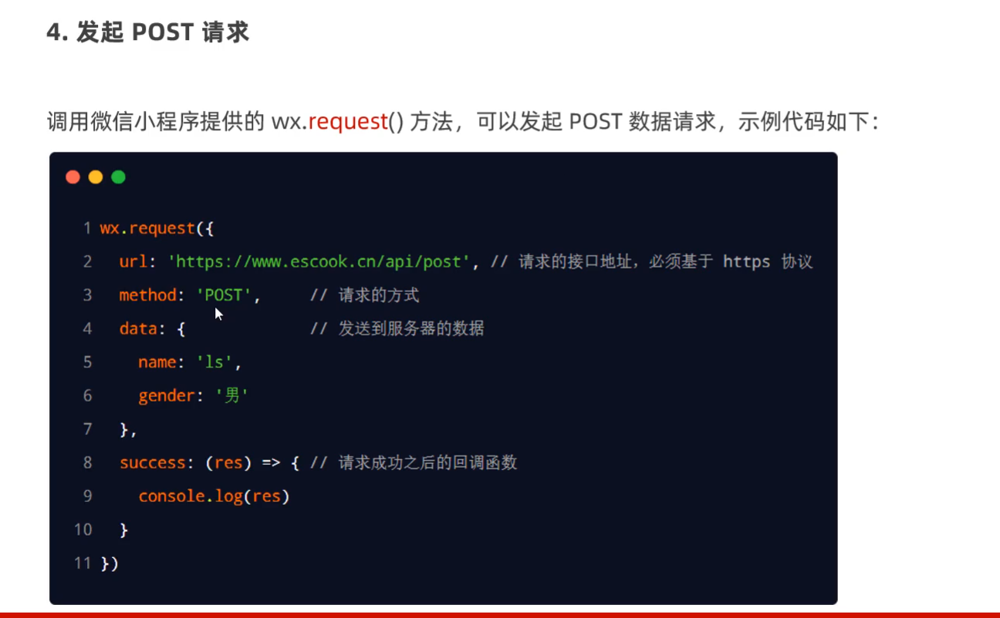
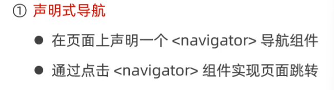
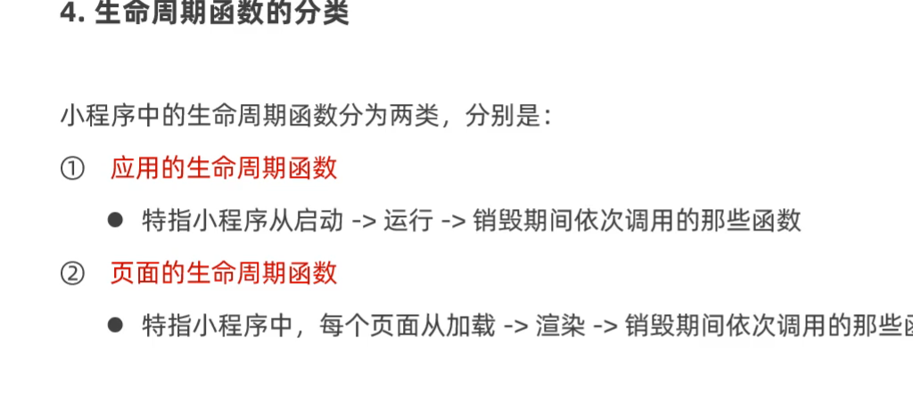
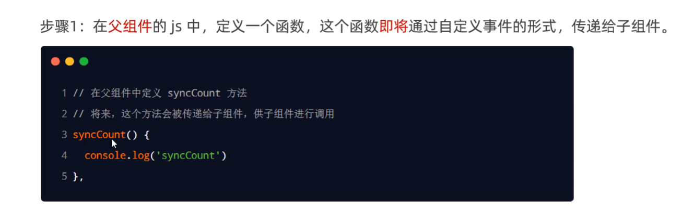
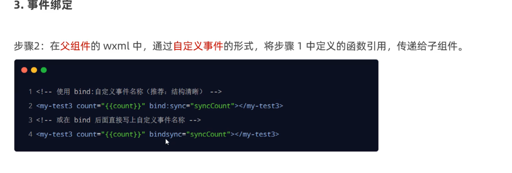
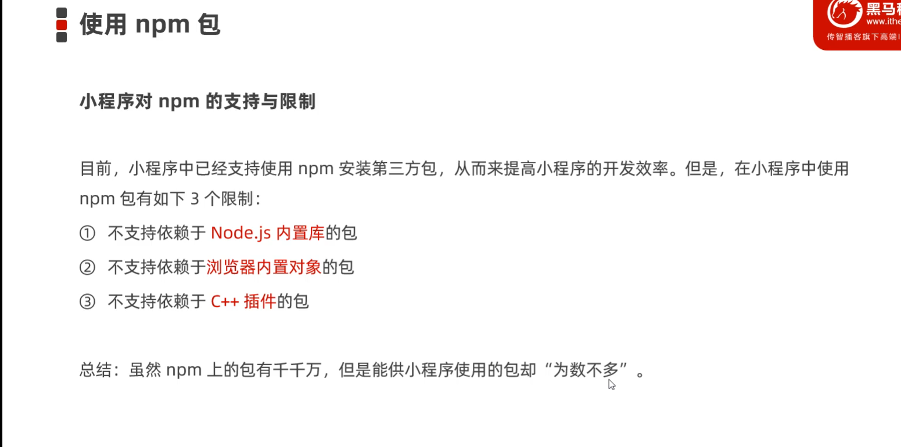

#     小程序

## 第一天

### 第一个小程序


项目解构


!


allow是将会被索引，disallow是不会被索引


### 新建一个页面


**修改项目首页**


### 什么是WXML


### wxss


### js/ts


### 宿主环境


### 小程序启动/渲染  过程


### 组件


### swiper(轮播图组件)


### 常用基础组件（text，rich-text）


text组件的selectable组件支持长按选中效果


### button

```html
<button>普通按钮</button>
<button type="warn" size="mini">小警告按钮</button>
<button type="primary" plain="{{true}}">镂空主色调按钮</button>

```


### image组件基本使用


### API小程序Api的3大类


### 协同工作


### 小程序版本


## 第二天

### 事件绑定


事件对象的属性列表


**bindtap**


### 改值

```js
 onHid(){

 console.**log**(123);

 

this.**setData**({

 count:this.data.count+=2

})
```


### **事件传参**


### bindinput


### 条件渲染


### block标签使用渲染


### hidden


### wx:for


### 手动指定索引和当前项的变量名


### wx:key的使用


### wxss


### rpx


### @import


### 全局样式


### 全局配置文件


### window节点常用配置


#### 修改标题


#### 设置导航栏背景色


#### 设置导航栏标题颜色


#### 全局开启下拉刷新


添加  "enablePullDownRefresh":true 设置为true


#### 下拉刷新窗口的背景颜色


> 增加"backgroundColor":"#efefef"


#### 下拉刷新是loding样式


#### 设置上拉触底距离


### 什么是tabBar


### tabBar的六个组成部分


### tabBar节点配置


每个tab的配置选项


### 页面配置


**常用配置项**


```json
 当前页面颜色
"navigationBarBackgroundColor": "#000000",
当前导航栏标题颜色
  "navigationBarTextStyle": "black",
当前导航栏文字内容
"navigationBarTitleText": "首页",
当前窗口背景颜色
"backgroundColor": "#ffffff",
是否开启下拉刷新
"enablePullDownRefresh":true,
页面上拉触底事件
"onReachBottomDistance": 50,
当前页面下拉loading样式
"backgroundTextStyle": "dark"
```


### 网络数据请求的限制


### 发起get请求


```js
  getInfo(){
    wx.request({
      url:'https://www.escook.cn/api/get',
      method:'GET',
      data:{
        name:'彭于晏',
        age:"20"
      },
      success:({data})=>{
        console.log(data);
        
      }
    })
  },

```


### 发送post请求




### 跳过合法域名校验


### 跨域和ajax


## 第三天

### 页面导航

**声明式导航**



**编程式导航**


### 导航到tabBar页面


跳转到非tabBar页面


### 后退导航


### 编程式导航


### 导航到非tabBar页面


### 后退导航（wx.navigateBack）


### 声明式导航传参


### 编程式导航传参


在onLoad的中接收导航参数


下拉刷新


### 监听页面下拉刷新事件


停止下拉刷新


### 监听上拉触底


### 生命周期



### 应用生命周期函数


### 页面生命周期函数


###wxs


### 内嵌wxs脚本


定义外联的wxs脚本


## 第四天


###组件 局部引用


组件和页面的区别


### 组件样式


### 修改组件样式隔离


###methods


### properties 接收


### 使用setDate修改properties


### 数据监听器


监听对象属性变化


### 纯数据字段


### 纯数据字段


###组件生命周期函数


主要的生命周期函数


### lifetimes节点


### 组件所在页面生命周期


### 插槽


### 启用多个插槽


### 父子通信


#### 属性绑定


### 事件绑定







### 获取组件实例


### behaviors（minix）


##第五天

### Vant




###css变量


### 实现小程序promise化


```sh
 npm i -s miniprogram-api-promise@1.0.4
```


### 全局数据共享


```shell
npm i --save mobx-miniprogram@4.13.2
```


```shell
npm i --save mobx-miniprogram@4.13.2 mobx-miniprogram-bindings@1.2.1
```


### 创建Mobx的Store


使用


### 将Store中的成员绑定到组件中


### 分包


### 打包原则


### 引用资源


### 独立分包


### 配置独立分包


### 分包预下载

·


## uniapp


