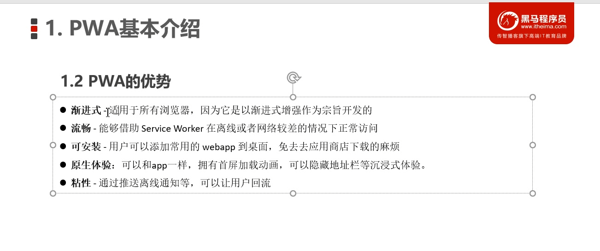
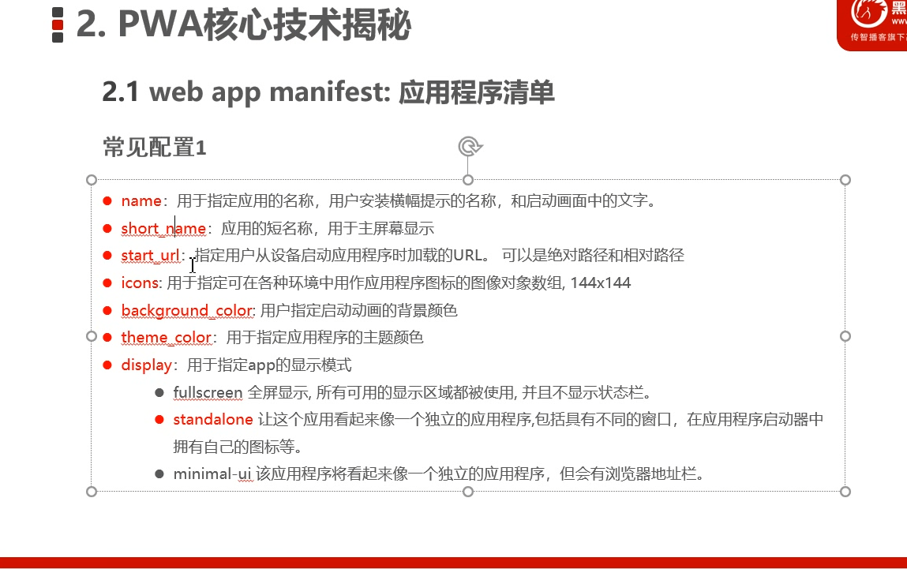
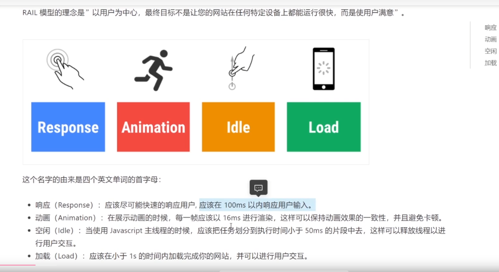
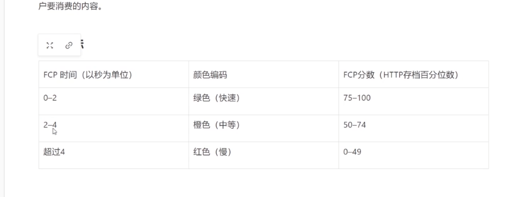
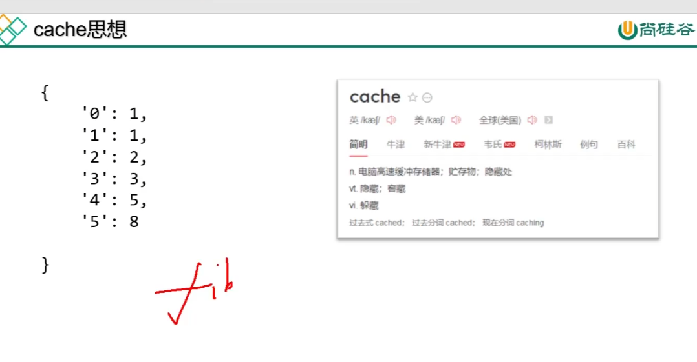

# 补充文档

**多个页面集合**

用法

```html
<a href="./home/userinfo.html" target="fm"><i

<iframe name="fm" src="./home/dashboard.html" frameborder="0"></iframe>
```

**禁止输入**

HTML：**`readonly`**

**选择`accept`类型**

**`accept`=**"image/png,image/jpge"

只要为type="file"的元素增加multiple属性，即可让该文件上传域允许同时选择多个文件。

File对象是一个JavaScript对象，JavaScript可以通过该对象获取用户浏览的所有文件的信息。File对象包含以下属性：

name：返回给File对象对应的文件的文件名，不包括文件路径部分。

type：返回该File对象对应的文件的MIME类型字符串。

size：返回该File对象对应的文件的大小。


将文件转化为路径

**URL.createObjectURL(file)**


**快速新建文件夹**

```bash
$ mkdir departments employees setting salarys social attendances approvals permission
```

快速创建命令

```bash
$ touch departments.js employees.js setting.js salarys.js salarys.js social.js attendances.js approvals.js permission.js
```

## **可测试代码设计原则**


Pwa







### RAIL




FCP




斐波那契递归


缓存思想


