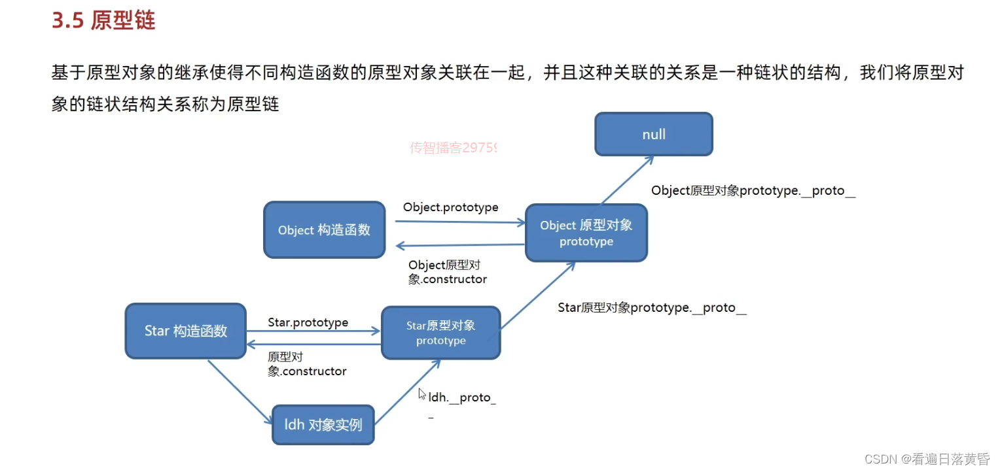
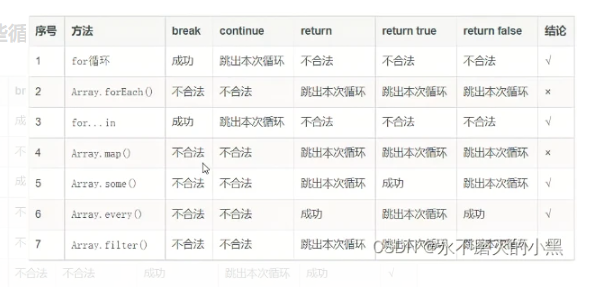

**防抖**

如果n秒内高频事件再次被触发，则重新计算时间。适用于可以多次触发但触发只生效最后一次的场景。

```js
//接一个订单，和等待时间
function debounce(fn, delay){
     let timerId = null
     return function(){
         const context = this
         //如果接到订单就再等3分钟
         if(timerId){window.clearTimeout(timerId)}
         //3分钟没有接到订单就直接配送
         timerId = setTimeout(()=>{
             fn.apply(context, arguments)
             timerId = null
         },delay)
     }
 }


const debounce = (fm,delay)=>{
    let timeId = null
    return ()=>{
        if(timerId){clearTimeout(timerId)}
        timerId = settimeout(()=>{
            return fn.apply(this,arguments)

        },delay)
    }
}


```


**节流**

节流是高频事件触发，但在n秒内只会执行一次，如果n秒内触发多次函数，只有一次生效，节流会稀释函数的执行频率


```js

function throttle(fn, delay){
     // 设置一个触发开关
     let canUse = true
     return function(){
     //如果为true，就触发技能，否则就不能触发
         if(canUse){
             fn.apply(this, arguments)
             //触发技能后，关闭开关
             canUse = false
             //在3秒后打开开关
             setTimeout(()=>canUse = true, delay)
         }
     }
 }

const throttle = (fn,delay)=>{
    let canUse = true
    return ()=>{
        if(canUse){
            fn.apply(this,arguments)
            canUse = false
            setTimeout(()=>canUse = true,delay)
        }
    }
}


```


**js数据类型有哪些**

基本数据类型：数值，字符串，布尔值，undefined，null，Symbol

引用数据类型：数组，对象 函数，Date，RegExp，`Erro`r，类


**深拷贝**

常见

- _.cloneDeep()
- jQuery.extend()
- JSON.stringify()
- 手写循环递归
- MessageChannel

```js

function deepClone(obj, hash = new WeakMap()) {
  if (obj === null) return obj; // 如果是null或者undefined我就不进行拷贝操作
  if (obj instanceof Date) return new Date(obj);
  if (obj instanceof RegExp) return new RegExp(obj);
  // 可能是对象或者普通的值  如果是函数的话是不需要深拷贝
  if (typeof obj !== "object") return obj;
  // 是对象的话就要进行深拷贝
  if (hash.get(obj)) return hash.get(obj);
  let cloneObj = new obj.constructor();
  // 找到的是所属类原型上的constructor,而原型上的 constructor指向的是当前类本身
  hash.set(obj, cloneObj);
  for (let key in obj) {
    if (obj.hasOwnProperty(key)) {
      // 实现一个递归拷贝
      cloneObj[key] = deepClone(obj[key], hash);
    }
  }
  return cloneObj;
}
```


**浅拷贝**

```js
function shallowClone(obj) {
    const newObj = {};
    for(let prop in obj) {
        if(obj.hasOwnProperty(prop)){
            newObj[prop] = obj[prop];
        }
    }
    return newObj;
}
```

assign

```
var newObj = Object.assign({}, fxObj);
```

slice()

```
const fxArrs = fxArr.slice(0)
```

concat() 

```
const fxArrs = fxArr.concat()
```

拓展运算符

```
const fxArrs = [...fxArr]
```


**区分数据类型用哪些方法**

constructor

```
console.log(arr.constructor === Array);  // true
```

 使用instanceof来判断引用类型到底属于哪种类型

```
console.log(arr instanceof Array);  // true
```


方式四：通过Object.prototype.toString.call()精准确定类型（强烈推荐）

```js
console.log(Object.prototype.toString.call(arr));  // [object Array]
```


使用typeof来判断基本数据类型

```
console.log(typeof num);  // number
```


**数组中常用的一些方法，foreach和map的区别**


join，split，push，pop，unshift，shift，filter，some，every，find，reduce

map：创建一个新的[数组](https://so.csdn.net/so/search?q=数组&spm=1001.2101.3001.7020)，其中每一个元素又调用数组中的每一个元素执行提供的函数得来；

foreach：针对每一个元素执行提供的函数；

forEach() 方法不会返回执行结果，而是undefined。

也就是说，forEach()会修改原来的数组。而map()方法会得到一个新的数组并返回。


**做数组合并用哪些方法**

concat ，扩展运算符，push， push.apply（arr1.push.apply(arr,arr2)）


**你觉得展开运算符算是深拷贝还是浅拷贝，实现深拷贝有哪些方法，你知道这些拷贝的原理吗**

展开运算符是浅拷贝，

- _.cloneDeep()
- jQuery.extend()
- JSON.stringify()
- 手写循环递归
- MessageChannel

一般是递归

**let和const用的多吗，简单讲一下，它们会用变量提升吗？如果let a=1，let a=2，会报错吗**

多，不会，会


**你能聊一下this吗？**

- 如果单独使用，this 表示全局对象。
- 在方法中，this 表示该方法所属的对象。
- 在函数中，this 表示全局对象。
- 在函数中，在严格模式下，this 是未定义的(undefined)。
- 在事件中，this 表示接收事件的元素。html


**es6中除了let和const你还用过哪些**

还有Var但是会有变量提升


**map和set有什么使用的地方吗?**

- Set 和 Map 主要的应用场景在于 数据重组（去重） 和 数据储存。


**js中的事件机制有了解过吗？**

事件流(Event Flow)指的就是「**网页元素接收事件的顺序**」。**事件流可以分成两种机制**：

- 事件捕获(Event Capturing)
- 事件冒泡(Event Bubbling)

1. 捕获阶段：事件从window对象**自上而下向目标节点**传播的阶段；
2. 目标阶段：**真正的目标节点正在处理事件**的阶段；
3. 冒泡阶段：事件从目标节点**自下而上向window对象传播**的阶段。


**讲一下promise**

Promise 是异步编程的一种解决方案，其实是一个构造函数，自己身上有all、reject、resolve这几个方法，原型上有then、catch等方法

`Promise`对象有以下两个特点：对象的状态不受外界影响，一旦状态改变，就不会再变，可以解决回调地狱的问题


**js的dom和bom对象都有哪些**

**BOM的组成**

 ** Window：窗口对象**

 ** Navigator：浏览器对象**

 ** Screen：显示器对象**

 ** History ：历史记录对象**

 ** Location：地址栏对象**

 **DOM的组成：**

 *** Document文档对象**

 Element元素对象

 Attribute属性对象**

 Text文本对象

 Comment注释对象


**原型链的顶级是谁，object上面还有没有，**

object，没有了，但是依然会往上找回返回一个null


**我现在有一个console.log（a）var a = 2 控制台打印结果是什么，如果换成let呢，打印结果是什么**

打印，undefined

换成let 浏览器抛出错误


**普通函数和箭头函数的this指向区别**

普通函数this指向window，箭头函数this指向父级，如果没有指向window

严格模式下，箭头函数，this指向window，普通函数指向undefined


**改变this指向的方法 apply,call,bind，都有什么区别**

使用call方法调用函数，同时指定被调用函数中的this值

fun.call（thisArg，arg1，arg2）

返回值就是函数的返回值，因为它就是调用的函数

```js
const obj = {age:11}
function fn (x,y){
    console.log(this);// obj
    console.log(x+y); // 2
}
// 改变this指向，让this指向obj同时传参数
fn.call(obj,1,1)
```

用`apply`方法调用函数，同时指定被调用函数中的this值

argsArray：传递的值，必须包含在`数组`里

返回值就是函数返回值，因为他时调用函数


```js
const obj = {age:11}
function fn (x,y,z,w){
    console.log(this);
    console.log(x+y+z+w);
}
// 改变this指向，让this指向obj同时传参数
fn.apply(obj,[1,2,3,4])
// 也可以用于求最大值最小值因为有返回值
let arr =[1,2,3,4,5,6,7,8,9,10]
const s = Math.max.apply(Math,arr)
console.log(s);
```


bind()方法不会调用函数，但是能改变函数内部this指向

**语法：**`fun.bind（thisArg，arg1，arg2）`

- thisArg：在fun函数运行时候指向this
- arg1，arg2：传递其他参数
- 返回由指定的`this`值和初始化参数改造的 **原函数拷贝**(新函数)
- 当我们只想改变this指向，并且不再想要调用这个函数，可以使用bind，比如改变定时器内部的`this`指向
- 返回值是个函数但是这个函数里的this是更改过的

```js
const obj = {age:11}
function fn (){
    console.log(this);
    
}
// 用bind方法不调用函数但是会生成一个返回值这个返回值里的函数this是改变了的
const fun = fn.bind(obj)
fun() // 返回一个新函数
fn()
```


**遍历对象的方法**

vue中v-for遍历对象

 Object的方法 for…in 遍历数组和对象都可以

```js
for (let item of Object.keys(obj)) {
    console.log(item)
} // 遍历返回键名

for (let item of Object.values(obj)) {
    console.log(item)
} // 遍历返回键值

for (let item of Object.entries(obj)) {
    console.log(item)
}  // 返回键值对组成的数组，如：['key', 'value']


```


**数组去重方法有哪些**

双重for循环

for循环 +findIndex

Set

```js
 function newArrFn (arr) {
      // .new Set方法，返回是一个类数组，需要结合 ...运算符，转成真实数组
      return ([...new Set(arr)])
    }
```

includes

```js
var arr = [1, 2, 3,4 ,5,6, 4, 3, 8, 1]
    // 数组去重：
    // 方法7 ：for + includes
    function newArrFn (arr) {
      // 利用includes 检查新数组是否包含原数组的每一项
      // 如果不包含，就push进去
      let newArr = []
      for(let i = 0;i<arr.length;i++){
        newArr.includes(arr[i]) ? newArr:  newArr.push(arr[i]) 
      };
      return newArr
    }
    console.log(newArrFn(arr));

```


**扁平数据结构转化为树形结构**

map

```js

let arr = [
    {id: 1, name: '部门1', pid: 0},
    {id: 2, name: '部门2', pid: 1},
    {id: 3, name: '部门3', pid: 1},
    {id: 4, name: '部门4', pid: 3},
    {id: 5, name: '部门5', pid: 4},
]
let s=  arrayToTree(arr)
console.log(s);
function arrayToTree(list) {
    let result = [];    // 结果集
    let map = {};
 
    for(let item of list) {    // 遍历一遍源数组
        map[item.id] = {...item, chilrden: []};    // 将源数组中每一个对象的id作为key，将当前对象所有属性和新增属性chilrden作为value。
  // {
  // 1:  {id: 1, name: '部门1', pid: 0, chilrden: []}
  // 2:  {id: 2, name: '部门1', pid: 1, chilrden: []}
  // 3:  {id: 3, name: '部门1', pid: 2, chilrden: []}
  // }
      }
    
    for (let item of list) {
        if (item.pid === 0) {    // 当pid为0时，添加到结果集
            let newItem = map[item.id];  //  map[item.id] =  1:  {id: 1, name: '部门1', pid: 0, chilrden: []}
            result.push(newItem);
        } else {
          // pid=1
// 例如 map[item.pid] = map[1] =  1: {id: 1, name: '部门1', pid: 0, chilrden: []}
// map[item.id] = map[2]  =  2: {id: 2, name: '部门1', pid: 1, chilrden: []}
// 结果 ： map[1].chilrden.push(map[2])

            map[item.pid].chilrden.push(map[item.id]);    
        }
    }
    return result;
  }


```


递归

```js

function test(list) {    // 这是个启动方法，需要这个方法发动技能
    let result = [];    //    结果集
    arrayToTree(list, result, 0);    // 递归启动！！！
    return result;
}
 
/**
 * @param {*} data 源数组
 * @param {*} result 将结果添加到这个数组
 * @param {*} pid 父id
 */
function arrayToTree(data, result, pid) {
    for (let item of data) {    // 每次调用此方法都重新遍历一遍源数组
        if (item.pid === pid) {    // 如果当前的pid等于传进来的父id，则
            let newItem = {...item, chilrden : []};    // 将当前对象所有属性和新增属性chilrden合并成一个新对象
            result.push(newItem);    // 将新对象添加的传进来的数组中
            arrayToTree(data, newItem.chilrden, item.id);    // 这里注意，调用递归方法时，将新对象的chilrden作为结果数组传入，下一层的结果则会添加到这一层对象的chilrden中
        }
    }

}


```

```js
自己写法

function arrayToTree(list) {
    let result = [];    // 结果集
    let map = {};
 for (let item of list){
  
  map[item.id] = {...item,chilrden:[]}

item.pid===0 ? result.push(map[item.id]) : map[item.pid].chilrden.push(map[item.id])
 }0
 return result
 
  }
```


**了解过尾递归吗？**

尾递归，即在函数尾位置调用自身（或是一个尾调用本身的其他函数等等）。尾递归也是递归的一种特殊情形。尾递归是一种特殊的尾调用，即在尾部直接调用自身的递归函数                                                                                                                                                                                      

运行的程序从当前函数调用另外一个函数时，就会为下一个函数建立一个新的栈帧，并且进入这个栈帧，这个栈帧称为当前帧。而原来的函数也有一个对应的栈帧，被称为调用帧。每一个栈帧里面都会存入当前函数的局部变量。

在引擎层面消除尾递归是一个隐式的行为，程序员写代码时可能意识不到自己写了死循环的尾递归，而出现死循环后又不会报出stack overflow的错误，难以辨别。

被尾递归改写之后的调用栈永远都是更新当前的栈帧而已，这样就完全避免了爆栈的危险。

**null与undefined区别**

null 是人为设置的， undefined 是未赋值或不存在的状态。null代表“空”，代表[空指针](https://so.csdn.net/so/search?q=空指针&spm=1001.2101.3001.7020)；undefined是定义了没有赋值


**图片懒加载原理以及怎么实现的？**

存储图片的真实路径存，初始化img的时候，src不能是真实的图片地址(会一次性发送请求)，也不可以是空地址或者坏地址，置img的默认src为一张1px*1px，很小很小的gif透明图片（所有的img都用这一张，只会发送一次请求），之所以需要是透明的，是需要透出通过`background`设置的背景图(一张loading.png，就是一个转圈圈的背景效果图，需要一个滚动事件，判断元素是否在浏览器窗口，一旦进入视口才进行加载，当滚动加载的时候，就把这张透明的1px.gif图片替换为真正的url地址（也就是data-url里保存的值），等到图片进入视口后，利用js提取data-url的真实图片地址赋值给src属性，就会去发送请求加载图片，真正实现了按需加载，

vue实现

```js
ue的图片懒加载很简单

    （1） 下载插件       npm install vue-lazyload --save 或 yarn add  vue-lazyload 

    （2） main.js    引入插件  

                           

import Vue from 'vue'
import VueLazyLoad from 'vue-lazyload'
 
Vue.use(VueLazyLoad)   
或
Vue.use(VueLazyload, {
  preLoad: 1.3, // 提前加载高度（数字 1 表示 1 屏的高度） 默认值:1.3
  error: 'dist/error.png',     // 当加载图片失败的时候
  loading: 'dist/loading.gif', // 图片加载状态下显示的图片
  attempt: 3   //  加载错误后最大尝试次数 默认值:3
})

  v-lazy="'/static/img/product/' + productshow1"   

      // productshow1为路径地址，直接将变量写在data中使用 data: () =>{productshow1:"productshow1.png" }

```


原生js ：滚动监听+scrollTop+offsetTop+innerHeight

```js
   <script>

        let imgs = document.getElementsByTagName('img')
        // 1. 一上来立即执行一次
        fn()
        // 2. 监听滚动事件
        window.onscroll = lazyload(fn, true)
        function fn() {
            // 获取视口高度和内容的偏移量
            let clietH = window.innerHeight || document.documentElement.clientHeight || document.body.clientHeight;
            var scrollTop = window.pageYOffset || document.documentElement.scrollTop || document.body.scrollTop;
            console.log(clietH, scrollTop);
            for (let i = 0; i < imgs.length; i++) {
                let x = scrollTop + clietH - imgs[i].offsetTop //当内容的偏移量+视口高度>图片距离内容顶部的偏移量时，说明图片在视口内
                if (x > 0) {
                    imgs[i].src = imgs[i].getAttribute('data-url'); //从dataurl中取出真实的图片地址赋值给url
                }
            }
        }
          // 函数节流
        function lazyload(fn, immediate) {
            let timer = null
            return function () {
                let context = this;
                if (!timer) {
                    timer = setTimeout(() => {
                        fn.apply(this)
                        timer = null
                    }, 200)
                }
            }
        }


    </script>
</body>

</html>

```


**js的原型链**




**js怎么实现继承**

 **原型链继承**

因为两个实例使用的是同一个原型对象。它们的内存空间是共享的，当一个发生变化的时候，另外一个也随之进行了变化，这就是使用原型链继承方式的一个缺点。

```js
function Parent1() {
  this.name = 'parent1'
  this.play = [1, 2, 3]
}

0 

console.log(child1)
```


**构造函数继承**

**只能继承父类的实例属性和方法，不能继承原型属性或者方法**。

```js
function Parent1() {
  this.name = 'parent1'

}

Parent1.prototype.getName = function () {
  
  return this.name
}

function Child1() {
  // 借助call方法改变this指向，从而将Parent中的属性添加至Child中
  Parent1.call(this)
  this.type = 'child1'
}

let child = new Child1()

// 正常运行
console.log(child)

// 运行报错，因为child没有getName方法
console.log(child.getName())
```


 **组合继承（前两种组合）**

这种方式结合了前两种继承方式的优缺点，结合起来的继承，代码如下

```js
function Parent3() {
  this.name = 'parent3'
  this.play = [1, 2, 3]
}

Parent3.prototype.getName = function () {
  return this.name
}

function Child3() {
  // 第二次调用Parent
  Parent3.call(this)
  this.type = 'child3'
}

// 第一次调用Parent
Child3.prototype = new Parent3()

// 手动挂上构造器，指向自己的构造函数
Child3.prototype.constructor = Child3

let c1 = new Child3()
let c2 = new Child3()
c1.play.push(4)
console.log(c1.play, c2.play) // 不互相影响
console.log(c1.getName()) // 正常输出'parent3'
console.log(c2.getName()) // 正常输出'parent3'

```


**原型式继承**

，**多个实例的引用类型属性指向相同的内存，存在篡改的可能**

```js
let parent4 = {
  name: 'parent4',
  friends: ['p1', 'p2', 'p3'],
  getName: function () {
    return this.name
  },
}

let person = Object.create(parent4)

person.name = 'Tom'
person.friends.push('jerry')

let person2 = Object.create(parent4)
person2.friends.push('lucy')

console.log(person.name)
console.log(person.name === person.getName())
console.log(person2.name)
console.log(person.friends)
console.log(person2.friends)
```


 **第五种：寄生式继承**

优缺点和原型式继承一样，但是对于普通对象的继承方式来说，寄生式继承相比于原型式继承，还是在父类基础上添加了更多的方法。

```js
let parent5 = {
  name: 'parent5',
  friends: ['p1', 'p2', 'p3'],
  getName: function () {
    return this.name
  },
}

function clone(original) {
  let clone = Object.create(original)
  clone.getFriends = function () {
    return this.friends
  }
  return clone
}

let person = clone(parent5)

console.log(person.getName())
console.log(person.getFriends())
```


 **第六种：寄生组合式继承**

结合第四种中提及的继承方式，解决普通对象的继承问题的 Object.create 方法，我们在前面这几种继承方式的优缺点基础上进行改造，得出了寄生组合式的继承方式，这也是所有继承方式里面相对最优的继承方式

```js
function Parent6() {
  this.name = 'parent6'
  this.play = [1, 2, 3]
}
Parent6.prototype.getName = function () {
  return this.name
}

function Child6() {
  Parent6.call(this)
  this.friends = 'child5'
}

function clone(parent, child) {
  child.prototype = Object.create(parent.prototype)
  child.prototype.constructor = child
}

clone(Parent6, Child6)

Child6.prototype.getFriends = function () {
  return this.friends
}

let person = new Child6()
console.log(person)
console.log(person.getName())
console.log(person.getFriends())
```


**事件流三个阶段**

捕获阶段，目标，冒泡阶段

**箭头函数和普通函数的区别**

箭头函数省略了function，箭头函数指向其上级作用域，没有则指向window，普通函数指向window，严格模式下，箭头函数依然指向上级作用域，普通函数指向undefined


**改变this指向的方法**

apply，call，bind，


websoket有用过吗？说一下其应用场景？

WebSocket是HTML5下一种新的协议（websocket协议本质上是一个基于tcp的协议）

它实现了浏览器与服务器全双工通信，能更好的节省服务器资源和带宽并达到实时通讯的目的

Websocket是一个持久化的协议

1. websocket是一种全新的协议，不属于http无状态协议，协议名为"ws"


**cookie、localstorage和sessionstorage的区别？**

**一、存储的时间有效期不同**

1、cookie的有效期是可以设置的，默认的情况下是关闭浏览器后失效

2、sessionStorage的有效期是仅保持在当前页面，关闭当前会话页或者浏览器后就会失效

3、localStorage的有效期是在不进行手动删除的情况下是一直有效的

**二、存储的大小不同**

1、cookie的存储是4kb左右，存储量较小，一般页面最多存储20条左右信息

2、localStorage和sessionStorage的存储容量是5Mb(官方介绍，可能和浏览器有部分差异性)

**三、与服务端的通信**

1、cookie会参与到与服务端的通信中，一般会携带在http请求的头部中，例如一些关键密匙验证等。

2、localStorage和sessionStorage是单纯的前端存储，不参与与服务端的通信

**四、读写操作的便捷程度**

1、cookie的相关操作，cookie操作起来较为繁琐，并且部分数据不可以读取操作

<1>、cookie的创建（修改和创建相同，创建同样名称会覆盖之前的）

**五、对于浏览器的支持**

1、cookie出现的时间较早，目前见到的浏览器都支持

2、localStorage和sessionStorage出现的时间较晚，对于版本较低的浏览器不支持(比如IE8版本以下的都不支持)


相关操作

```js
// cookie
//JavaScript 中，创建 cookie 如下所示：
document.cookie="username=John Doe";
//您还可以为 cookie 添加一个过期时间（以 UTC 或 GMT 时间）。默认情况下，cookie 在浏览器关闭时删除：
document.cookie="username=John Doe; expires=Thu, 18 Dec 2043 12:00:00 GMT";
//您可以使用 path 参数告诉浏览器 cookie 的路径。默认情况下，cookie 属于当前页面。
document.cookie="username=John Doe; expires=Thu, 18 Dec 2043 12:00:00 GMT; path=/";
<2>、cookie的读取

var x = document.cookie;
<3>、cookie的删除

//删除 cookie 非常简单。您只需要设置 expires 参数为以前的时间即可，如下所示，设置为 Thu, 01 Jan 1970 00:00:00 GMT:
document.cookie = "username=; expires=Thu, 01 Jan 1970 00:00:00 GMT";
//2、sessionStorage的相关操作

<1>、存储一条数据

sessionStorage.setItem('数据名', '数据值');
<2>、读取一条数据

let data = sessionStorage.getItem('数据名');
<3>、清除一条数据

sessionStorage.removeItem('数据名');
<4>、移除所有数据

sessionStorage.clear();

//3、localStorage的相关操作

<1>、存储一条数据

localStorage.setItem('数据名', '数据值');
<2>、读取一条数据

let data = localStorage.getItem('数据名');
<3>、清除一条数据

localStorage.removeItem('数据名');
<4>、移除所有数据

localStorage.clear();
—

```


**说一下link和@import的区别？**

1、link属于html标签，而@import是css提供的。
2、页面被加载时，link会同时被加载，而@import引用的css会等到页面被加载完再加载的。
3、兼容性问题：@import只在IE5以上才能识别，而link是html标签，无兼容性问题。
4、权重问题:@import的权重要高于link。
5、DOM操作:DOM可以操作link中的样式，而不可以操作@import中的样式。


**怎么理解js是单线程的？**

作为浏览器脚本语言，JavaScript的主要用途是与用户互动，以及操作DOM。这决定了它只能是单线程，否则会带来很复杂的同步问题。比如，假定JavaScript同时有两个线程，一个线程在某个DOM节点上添加内容，另一个线程删除了这个节点，这时浏览器应该以哪个线程为准？

了利用多核CPU的计算能力，HTML5提出Web Worker标准，允许JavaScript脚本创建多个线程，但是子线程完
全受主线程控制，且不得操作DOM


**浏览器默认最小字体是多少？如何实现更小的字体？**

最小是12px

使用缩放transform:scale()

使用SVG 矢量图设置text
优点： 1px-12px任意字号均可设置，可对设计界面进行对齐调整


**什么是闭包？有哪些优缺点？**

内层函数访问外层函数的变量

闭包就是能够读取其他函数内部变量的函数，说白了闭包就是个函数，只不过是处于其他函数内部而已。

好处：可以读取其他函数内部的变量，并将其一直保存在内存中。

坏处：可能会造成[内存泄漏](https://so.csdn.net/so/search?q=内存泄漏&spm=1001.2101.3001.7020)或溢出。


**怎么理解垃圾回收机制？**

JS中最常见的垃圾回收方式是**标记清除**。

- **标记**：从根节点遍历为每个可以访问到的对象都打上一个标记，表示该对象可达。
- **清除**：在没有可用分块时，对堆内存遍历，若没有被标记为可达对象就将其回收。
- **优点**：实现简单。
  **缺点**：a 内存过于碎片化。
     b 内存分配速度慢。
  **解决方法**：标记-整理法

还有一个**引用计数** 方式

引用计数法就是追踪每个变量被引用的次数，当引用数为0将可以被回收掉。

优点：当引用数为0时会被立即回收
缺点：a 计数器的增减处理频繁，会导致空间的使用效率降低。
   b 循环引用无法收回，导致内存泄漏。
  若有一函数Person中a引用了b，b引用了a。每次调用函数Person，它们的引用计数都不为0，则永远不能被回收。


**说一下promise.all的应用场景？如果出现报错，会直接返回错误还是怎样？**

多个接口有强关联是可以使用all同时调用，或是减少http请求时同时调用者第一个传递的 promise（指 reject）失败时，返回 promise。但是当其中任何一个被拒绝的话。主Promise.all([..])就会立即被拒绝，并丢弃来自其他所有promis的全部结果。


**数组里面套数组嵌套很深怎么转换成为一个数组**

```js
let arr1 = [1,2,[3,[4]]
let arr2 = arr1.toString().split(',');  // ["1", "2", "3", "4"]
let arr3 = arr1.join().split(',');   // ["1", "2", "3", "4"]]
let arr2_dealWith = arr2.map(item => Number(item))
arr2_dealWith // [1, 2, 3, 4]
 
let arr3_detailWith = arr3.map(item => Number(item))
arr3_detailWith //  [1, 2, 3, 4]


```

ES6提供了flat()方法

该方法返回一个新数组，不会更改原数组。

该方法默认只会“拉平”一层，如果想要“拉平”多层的嵌套数组，可以将flat()方法的参数写成一个整数，表示想要拉平的层

数，默认为1。

**注：**如果有空位，flat()方法会跳过空位,这样可以延伸出，**flat()不仅能拉平数组，还能去除数组的空位这一能力**

```js

let array_1 = [1, 2, 3, [4, 5], 6];
let array_1_result = array_1.flat();
array_1_result // [1, 2, 3, 4, 5, 6]


let array_2 = [1, 2, 3, [[4], 5], 6];
let array_2_result = array_2.flat(2); //表示拉平两层
array_2_result // [1, 2, 3, 4, 5, 6]

```

提供了用**Infinity**关键字作

为参数->此时不管有多少层嵌套，都可以转成一维数组

```js
let array_3 = [1, 2, 3, [[4, [10]], 5], 6];
let array_3_result = array_3.flat(Infinity); 
array_3_result //  [1, 2, 3, 4, 10, 5, 6]
```

**如何将字符串转为一个数组，常用的数组方法有哪些**

split() 方法

该split方法无法正确处理采用两个代码单元（如表情符号）的字符。下面是一个例子

展开运算符

```js
const text = "abc????";
const chars = [ ...text ];
console.log(chars);
//["a", "b", "c", "????"]
```


解构赋值

```js
const text = "abc????";
const [ ...chars ] = text;
console.log(chars);
//["a", "b", "c", "????"]
```

Array.from

```js
const text = "abc????";
const chars = Array.from(text);
console.log(chars);
//["a", "b", "c", "????"]
```


**中断数组遍历的操作**



break，continue，return，抛出异常


**回调地狱**

存在异步任务的代码，不能保证能按照顺序执行，码中的回调函数套回调函数，居然套了3层，这种回调函数中嵌套回调函数的情况就叫做回调地狱。

Promise是js中的一个原生对象，是一种异步编程的解决方案，可以替换掉传统的回调函数解决方案。

Promise构造函数接收一个函数作为参数，我们需要处理的异步任务就卸载该函数体内，该函数的两个参数是resolve，reject。异步任务执行成功时调用resolve函数返回结果，反之调用reject。
Promise对象的then方法用来接收处理成功时响应的数据，catch方法用来接收处理失败时相应的数据。
Promise的链式编程可以保证代码的执行顺序，前提是每一次在than做完处理后，一定要return一个Promise对象，这样才能在下一次then时接收到数据。
async/await

**for in和for of的区别**

`for in` 适用于遍历对象的属性，它遍历的是对象的键名（或索引）。

`for of` 适用于遍历可迭代对象（如数组、字符串、Set 等）的值，它遍历的是对象的值。

**es6新增语法**

let const定义变量   ` `  模板字符串

[立即执行函数](https://so.csdn.net/so/search?q=立即执行函数&spm=1001.2101.3001.7020)  数组/对象的解析

[箭头函数](https://so.csdn.net/so/search?q=箭头函数&spm=1001.2101.3001.7020)   this指向  promise 

async await 

**var、let、const的区别**

var声明变量可以重复声明，而let不可以重复声明
var是不受限于块级的，而let是受限于块级
var会与window相映射（会挂一个属性），而let不与window相映射
var可以在声明的上面访问变量，而let有暂存死区，在声明的上面访问变量会报错
const声明之后必须赋值，否则会报错
const定义不可变的量，改变了就会报错
const和let一样不会与window相映射、支持块级作用域、在声明的上面访问变量会报错

**es5和es6的区别**

）let声明变量和const声明常量，两个都有块级作用域ES5中是没有块级作用域的，并且var有变量提升，在es6中，使用的变量一定要进行声明
2）箭头函数ES6中的函数定义不再使用关键字function()，而是利用了()=>来进行定义
3）模板字符串模板字符串是增强版的字符串，用反引号（`）标识，可以当作普通字符串使用，也可以用来定义多行字符串
4）解构赋值ES6 允许按照一定模式，从数组和对象中提取值，对变量进行赋值
5）... 展开运算符可以将数组或对象里面的值展开；还可以将多个值收集为一个变量


**js的事件执行机制** 

- 所有同步任务都在主线程上的栈中执行。
- 主线程之外，还存在一个“任务队列”（task queue）。主要异步任务有了运行结果，就在“任务队列”之中放置一个事件。
- 一旦“栈”中所有同步任务执行完毕，系统就会读取“任务队列”，选择出需要首先执行的任务（由浏览器决定，并不按序

宏任务和微任务：
宏任务： 整个script代码、setTimeout、 setInterval、requestAnimationFrame（请求动画）, I/O；
微任务： process.nextTick（node）、Promise, Object.observe, MutationObserver
先同步 ，再取出第一个宏任务执行 所有的相关微任务总会在下一个宏任务之前全部执行完毕 如果遇见 就 先微后宏

**js的this指向问题说一下**  

在js中，this的意思为“这个;当前”，是一个指针型变量，它动态指向当前函数的运行环境

**普通函数：关于this，谁调用就指向谁，没有调用者，就指向全局对象window。**

**[箭头函数](https://so.csdn.net/so/search?q=箭头函数&spm=1001.2101.3001.7020)：箭头函数的this指向于函数作用域所用的对象。**,如果没有父级作用域就指向window

[箭头函数](https://so.csdn.net/so/search?q=箭头函数&spm=1001.2101.3001.7020)：箭头函数的this指向于函数作用域所用的对象。


**做数组合并用哪些方法**

push 

concat

et arr2 = arr.concat(arr);

arr1.push.apply(arr,arr2)；

let arr3=[…arr1,…arr2];