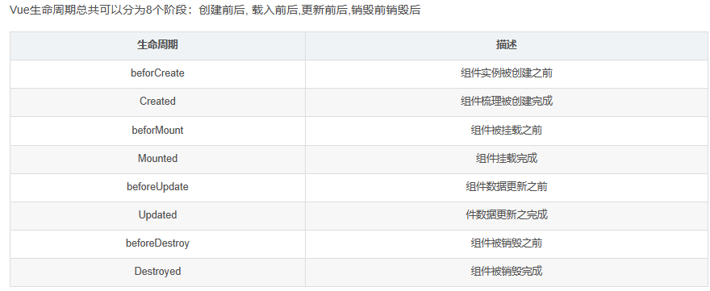
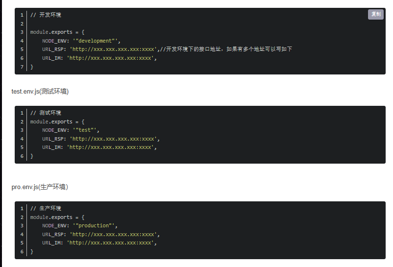
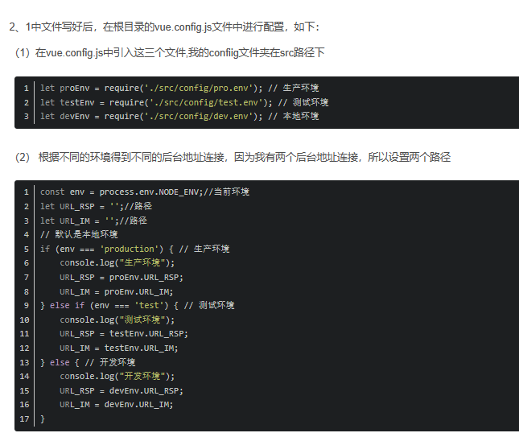
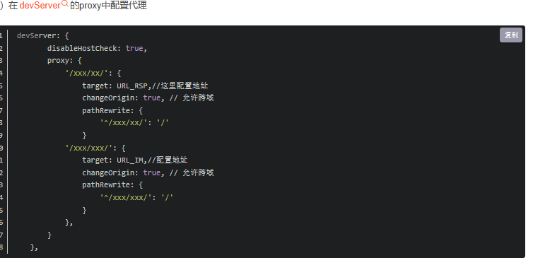
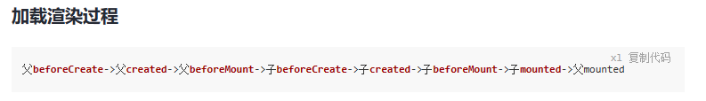
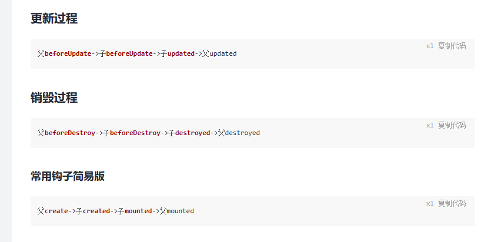
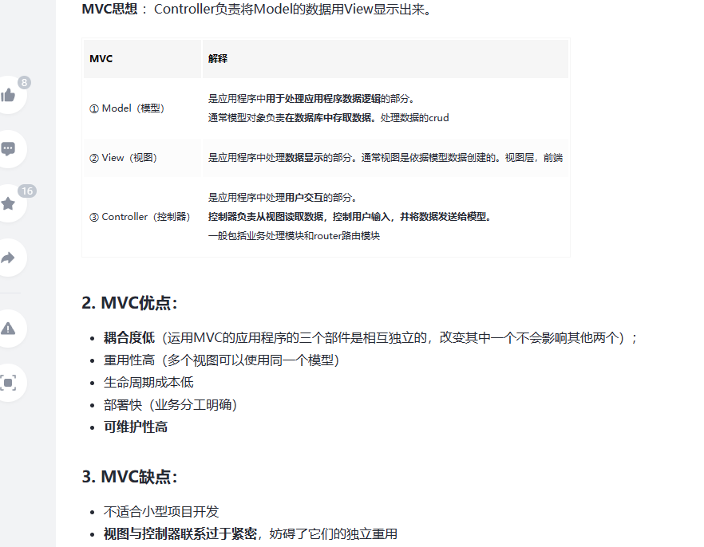
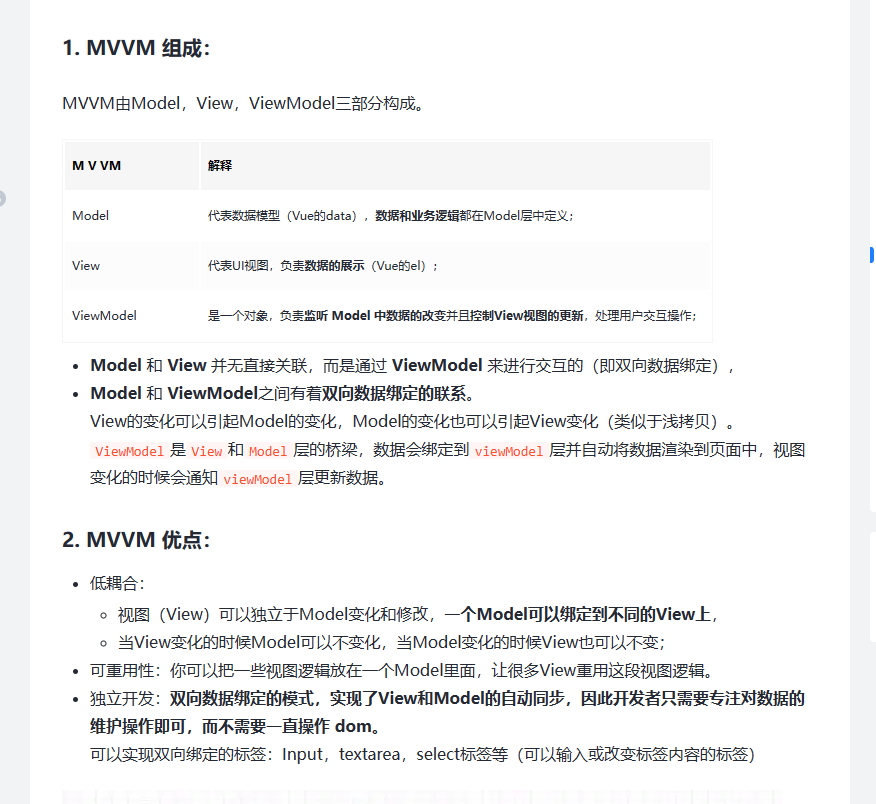
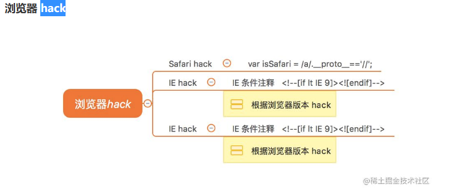

**webpack使用**

webpack是一种模块加载器兼打包工具，它能把各种资源，例如JS（含JSX）、coffee、样式（含less/sass）、图片等都作为模块来使用和处理。

安装webpack

配置webpack

自定义打包的入口和出口

将ES6语法转成ES5语法


**vuex里面的actions和mutations的区别，在页面中你是怎么使用vuex里面的state或者actions，mutations**

actions则负责进行异步操作，state数据的修改只能通过mutations，并且mutations必须是同步的


**vuex里面数据储存时效性**

页面关闭或者刷新时


**vue2实现数据响应有去了解过吗？**

有，Object.**defineProperties**，对象新增的属性没有响应式，**数组的部分操作没有响应式**

rray.js中重写了数组的push、pop、shift、unshift、splice、sort、reverse七种方法，重写方法在实现时除了将数组方法名对应的原始方法调用一遍并将执行结果返回外，还通过执行ob.dep.notify()将当前数组的变更通知给其订阅者，这样当使用重写后方法改变数组后，数组订阅者会将这边变化更新到页面中。
首先获取到这个数组的Observer。如果有新的值，就调用observeArray对新的值进行监听，然后调用notify，通知render watcher，执行update

vue通过`原型拦截`的方式重写了数组的7个方法

核心：arrayMethods 首先继承了 Array，然后对数组中所有能改变数组自身的方法，如 push、pop 等这些方法进行重写。重写后的方法会先执行它们本身原有的逻辑，并对能增加数组长度的 3 个方法 push、unshift、splice 方法做了判断，获取到插入的值，然后把新添加的值变成一个响应式对象，并且再调用 ob.dep.notify() 手动触发依赖通知


**vue中的路由模式你知道有哪些吗？**

 **hash模式**

hash模式（vue-router默认模式URL后面带#）使用URL的hash值来作为路由，支持所有浏览器 缺点：只能改变#后面的来实现路由跳转。

 **history模式**

history模式（通过mode: 'history’来改变为history模式）HTML5 （BOM）History API 和服务器配置 缺点：怕刷新如果后端没有处理这个情况的时候前端刷新就是实实在在的请求服务器这样消耗的时间很多还很慢


**组件通信的几种方式，你能讲一下吗**

props,emit

$parent,$children

$ref

provide/[inject](https://so.csdn.net/so/search?q=inject&spm=1001.2101.3001.7020)

EventBus 事件总线 （任意两个组件通讯）

用 $emit去监听，用$on去触发，注意需要$off来取消监听，否则可能会造成内存泄漏。

 $attrs、$listener

 Vuex 状态管理器

 localStorage/sessionStorage

**插槽分为几种**

- [匿名插槽](https://blog.csdn.net/weixin_49900638/article/details/108422530?ops_request_misc=%7B%22request%5Fid%22%3A%22167869175016800213083255%22%2C%22scm%22%3A%2220140713.130102334..%22%7D&request_id=167869175016800213083255&biz_id=0&utm_medium=distribute.pc_search_result.none-task-blog-2~all~sobaiduend~default-1-108422530-null-null.142^v73^insert_down3,201^v4^add_ask,239^v2^insert_chatgpt&utm_term=插槽分为几种&spm=1018.2226.3001.4187#_3)

- [具名插槽](https://blog.csdn.net/weixin_49900638/article/details/108422530?ops_request_misc=%7B%22request%5Fid%22%3A%22167869175016800213083255%22%2C%22scm%22%3A%2220140713.130102334..%22%7D&request_id=167869175016800213083255&biz_id=0&utm_medium=distribute.pc_search_result.none-task-blog-2~all~sobaiduend~default-1-108422530-null-null.142^v73^insert_down3,201^v4^add_ask,239^v2^insert_chatgpt&utm_term=插槽分为几种&spm=1018.2226.3001.4187#_73)

- [作用域插槽](https://blog.csdn.net/weixin_49900638/article/details/108422530?ops_request_misc=%7B%22request%5Fid%22%3A%22167869175016800213083255%22%2C%22scm%22%3A%2220140713.130102334..%22%7D&request_id=167869175016800213083255&biz_id=0&utm_medium=distribute.pc_search_result.none-task-blog-2~all~sobaiduend~default-1-108422530-null-null.142^v73^insert_down3,201^v4^add_ask,239^v2^insert_chatgpt&utm_term=插槽分为几种&spm=1018.2226.3001.4187#_110)

  

**聊一下组件封装的思路，要注意哪些**

- 易用性
- 拓展性
- 可维护性
- 可重用性


**生命周期**



**生命周期中created和mounted有什么区别，我在created中去获取dom应该怎么操作呢**

created是在组件实例一旦创建完成的时候立刻调用，这时候页面dom节点并未生成mounted是在页面dom节点渲染完毕之后就立刻执行的触发时机上created是比mounted要更早的两者相同点：都能拿到实例对象的属性和方法讨论这个问题本质就是触发的时机，this.$nextTick()


**vue和react本质上的区别有没有了解过**

**React与Vue的相同点**
（1）都支持服务器渲染；

（2）都是数据驱动视图；

在以前，我们需要频繁操作DOM实现页面效果。而Vue和React就隐藏了DOM的频繁操作，采用数据驱动视图的方式，只需要关注数据的变化。

（3）都遵循组件化思想；
React和Vue都遵循组件化思想，它们把注意力放在UI层，将页面分成一一些细块，也就是组件，组件之间组合嵌套就形成最后的网页界面。

（4）都使用虚拟DOM；

（5）都有状态管理；
（1）框架本质不同；

**不同点**

Vue本质是MVVM框架，是由MVC发展来的；
React是前端组件框架，是由后端组件演化而来的。

（2）数据流不同；

Vue实现双向绑定，在vue1.0中有两种方法可以实现双向绑定，父子组件之间的props以及组件与DOM直接的v-model。vue2去掉了第一种双向绑定方法，通过v-model实现数据双向绑定。

React一直不支持双向绑定，提倡的是单向数据流（onChange/setState）。

（3）监听数据变化的实现原理不同；

Vue通过getter，setter以及一些函数的劫持，能精确知道数据的变化。
React是通过比较引用方式（diff）进行的，当应用的状态改变时，全部组件都会重新渲染。

（4）组件写法差异；

React推荐的做法是JSX + inline style, 也就是把 HTML 和 CSS 全都写进 JavaScript 中；
Vue 推荐的做法是 template 的单文件组件格式，即 html,css,JS 写在同一个文件(vue也支持JSX写法)

（5）渲染过程不同。

Vue可以更快地计算出Virtual DOM的差异，这是由于它在渲染过程中，会跟踪每一个组件的依赖关系，不需要重新渲染整个组件树。

React在应用的状态被改变时，全部子组件都会重新渲染。通过shouldComponentUpdate这个生命周期方法可以进行控制。

（6）在state上的不同；

**vue3有没有了解过，setup函数是写在哪个钩子当中的，**

setup函数是处于 生命周期函数 beforeCreate 和 Created 两个钩子函数之间的函数，将steup替换 也就说在 setup函数中是无法 使用 data 和 methods 中的数据和方法的

　　2、setup函数是 Composition API（组合API）的入口

　　3、在setup函数中定义的变量和方法最后都是需要 return 出去的 不然无法再模板中使用

**vue中你都用过哪些组件传值，父子组件有哪些 兄弟之间有哪些，**

**父子组件：**

1. props
2. $emit/v-on
3. attrs/listeners
4. ref (http://t.csdn.cn/AGOIR)

**兄弟组件**

1. EventBus
2. Vuex
3. $parent


**一说$nextTice的运行原理和应用场景，**

在下次DOM更新循环结束之后执行延迟回调。在修改数据之后立即使用这个方法，获取更新后的DOM。

果想要在修改数据后立刻得到更新后的DOM结构，可以使用Vue.nextTick()

第一个参数为：回调函数（可以获取最近的DOM结构）
第二个参数为：执行函数上下文

原理：

1. 把回调函数放入callbacks等待执行
2. 将执行函数放到微任务或者宏任务中
3. 事件循环到了微任务或者宏任务，执行函数依次执行callbacks中的回调


**vue中你都在哪里发网络请求**

Created，因为在dom渲染前获取数据可以避免内容出现闪动


**element ui的缓存有了解吗，可以谈一下**

keep-alive实现缓存


**keep-alive里面的缓存怎么储存的？**

`<KeepAlive>` 是一个内置组件，它的功能是在多个组件间动态切换时缓存被移除的组件实例。

- 当一个组件实例从 DOM 上移除但因为被 `<KeepAlive>` 缓存而仍作为组件树的一部分时，它将变为**不活跃**状态而不是被卸载。当一个组件实例作为缓存树的一部分插入到 DOM 中时，它将重新**被激活**。
- 一个持续存在的组件可以通过 [`onActivated()`](https://cn.vuejs.org/api/composition-api-lifecycle.html#onactivated) 和 [`onDeactivated()`](https://cn.vuejs.org/api/composition-api-lifecycle.html#ondeactivated) 注册相应的两个状态的生命周期钩子：
- `onActivated` 在组件挂载时也会调用，并且 `onDeactivated` 在组件卸载时也会调用

**v-model实现原理**

- v-bind:绑定响应式数据
- 触发oninput 事件并传递数据


**自定义指令怎么做的，里面属性是什么**

```js
//Vue.directive(指令名，配置对象)
Vue.directive('border', {
  //钩子，指令所在元素被插入到页面节点中触发，此时可以操作dom
    el：dom节点
    bindin：传过来的值
  inserted(el，binding) {
    el.style.border = '10px red solid'
  }
})
```


**vuex方法，具体谈一下每个的使用**

state是存放数据的，getters计算属性，可派发一些状态 actions则负责进行异步操作，state数据的修改只能通过mutations，并且mutations必须是同步的

**vue.mixins了解，怎么使用**

、局部混入和全局混入，局部创建mixin.js文件，在需要的组件或者页面引入

**vuex和本地存储区别什么的**

vuex的储存是页面关闭时失效，本地储存用户清除时失效

**vue中怎么判断当前环境是什么环境，具体命令是什么？**

首先在config文件夹下创建三个文件dev.env.js(开发环境)、test.env.js(测试环境)、pro.env.js(生产环境）。









**axios二次封装是怎么做的**

```js
import store from '@/store'
import axios from 'axios'
import { Message } from 'element-ui'
import { getTimeStamp } from '@/utils/auth'
import router from '@/router'
const service = axios.create({
  baseURL: process.env.VUE_APP_BASE_API,
  timeout: 5000
})
// 请求拦截器
service.interceptors.request.use(config => {
  // config是请求的配置信息
// 注入token
  if (store.getters.token) {
    // 主动检测 判断token是否过期过期-现在大于1小时则过期
    if ((+new Date() - getTimeStamp()) / 1000 * 3600) {
      store.dispatch('user/logout')
      router.push('/login')
      return Promise.reject(new Error('登录超时'))
    }
    config.headers['Authorization'] = `Bearer ${store.getters.token}`
  }
  // 必须要返回的
  return config
}, error => {
  // if(){}
  return Promise.reject(error)
})
// 响应拦截器
service.interceptors.response.use(response => {
  const { success, message, data } = response.data
  if (success) {
    return data
  } else {
    Message.error(message) // 提示错误消息
    return Promise.reject(new Error(message))
  }
}, error => {
  if (error.response && error.response.data && error.response.data.code === 10002) {
    store.dispatch('user/logout')
    router.push('/login')
    Promise.reject(new Error('登录超时'))
  } else {
    if (!navigator.onLine || error.message === 'timeout of 5000ms exceeded') {
      Message.error('连接失败，请检查网络后重试') // 提示错误消息
      return
    } else {
      Message.error(error.message) // 提示错误消息
      return Promise.reject(error) // 返回执行错误，让当前执行链跳出成功进入catch
    }
  }
})

export default service
```


**常用的钩子函数，什么时候会用到，具体展开说一下**

 beforeCreate

在实例初始化之后，但又未完全创建之前,执行它时，data和methods中的数据都还未初始化

使用场景:可以在此时加一些loading效果，在created时进行移除


created 实例创建后，一般用于发送网络请求，


mounted el实例挂载后，

使用场景:一般我们的第一个业务逻辑会在这里开始，当需要操作DOM的时候执行，可以配合$nextTick 使用进行单一事件对数据的更新后更新DOM


**vue的缓存机制**

keep-alive


**路由有几种模式，有什么区别**

分别是哈希模式和history模式

哈希：不包含[http请求头](https://so.csdn.net/so/search?q=http请求头&spm=1001.2101.3001.7020)，不重载页面

History：前后端url地址不一样报错，需要配合后端

原理：利⽤html5新增的两个特性⽅法,分别是psuhState和replaceState来完成的


**在vue里面是怎么使用自定指令的？怎么实现在组件中使用的？自定义指令有哪几种**

- 局部自定义指令：只在组件内有效
- 全局自定义指令：所有组件都有效

，比如防抖、节流、懒加载、输入框自动聚焦等等

**Vue2.x自定义指令钩子函数**
bind：只会调用一次，指令 第一次 绑定到元素时会调用

inserted：被绑定元素插入父节点时调用 。

update：元素第一次绑定不会触发，绑定的值发生更新触发，可能发生在其子节点更新之前。

componentUpdated：指令所在组件的 VNode 及其子 VNode 全部更新后调用。

unbind：只调用一次，指令与元素解绑时调用。

bind与update区别

**相同点：**

- dom插入都会调用，bind在inserted之前

**异同点：**

- bind 时父节点为 null

- inserted 时父节点存在

- bind是在dom树绘制前调用，inserted在dom树绘制后调用

  

**路由守卫你了解吗**

路由守卫分为：全局守卫，组件守卫，路由独享

**路由守卫参数：**

to：目标路由对象

from：即将要离开的路由对象

next()：放行

**.全局守卫：所有的路由切换都会执行，一般写在路由配置文件中**

[beforeEach](https://so.csdn.net/so/search?q=beforeEach&spm=1001.2101.3001.7020) 前置守卫

affterEach 后置守卫

beforeResolve 解析守卫

**组件路由守卫**

beforeRouterEnter 进入组件之前触发,在Created前面

beforeRouterUpdated 路由更新但是内容不会改变

beforeRouterLeave 离开之前触发,在beforeDestory之前触发

**路由独享守卫：一般写在路由配置中**

beforeEnter 读取路由的信息

**了解vue.use吗**

编写插件后注册使用

1. Vue.use参数为函数（插件为函数）时，函数的参数是Vue对象
2. Vue.use参数为对象（插件为对象）时，它提供的install方法中参数是Vue对象


**vue数据响应式原理**

 首先我们需要通过Object.defineProperty()方法把数据(data)设置为getter和setter的访问形式，这样我们就可以在数据被修改时在setter方法设置监视修改页面信息，也就是说每当数据被修改，就会触发对应的set方法，然后我们可以在set方法中去调用操作dom的方法。

 此外，如果页面有input用v-model绑定数据，我们需要在这种绑定了data的input元素上添加监听，添加input事件监听，每当input事件被触发时，就修改对应的data。


**双向绑定原理**

发布订阅模式，

监听到数据变化进行劫持或代理，然后进行依赖收集，

然后触发布者与订阅者

方法1.Object.defineProperty
Vue通过设定对象属性的 setter/getter 方法来监听数据的变化，通过getter进行依赖收集，而每个setter方法就是一个观察者，在数据变更的时候通知订阅者更新视图。

方法2.Proxy
Proxy 是 JavaScript 2015 的一个新特性。 Proxy 的代理是针对整个对象的，而不是对象的某个属性，因此不同于 Object.defineProperty 的必须遍历对象每个属性， Proxy 只需要做一层代理就可以监听同级结构下的所有属性变化，当然对于深层结构，递归还是需要进行的。此外 Proxy支持代理数组的变化。

**vue 前置守卫怎么配置**

 router.beforeEach(to,from,next)// 从哪来，到哪去，放行


**vuex怎么持久化数据，**

利用浏览器的本地存储localStorage和sessionStorage

利用vue-presistedstate插件


**vue-router如何添加动态路由？**

router.addRoutes(routes)


**v2、v3 v-model区别**

`v-model`即可以作用于表单元素，又可作用于自定义组件，无论是哪一种情况（vue2, vue3），它都是一个**语法糖**，最终会生成一个**属性**和一个**事件**

- vue3 默prop与event为：`modelValue`和`update:modelValue`；vue2 中则是：`value`和`input`；
- vue3 中直接通过 v-model 后面参数`v-model:msg`来指定属性名，并且`支持绑定多个 v-model`；而 vue2 中通过子组件的`model 属性中的prop值和event值`来指定属性名和事件名

**什么是单页面应用？为什么单页面应用SEO效果差？**

从字面上来理解：
单页面应用（SPA--------single page application），一个web项目只有一个页面（即一个HTML文件）；一个项目的所有页面的所有内容被分成了很多的小块（即组件），可以重复利用的，可以任意调整的组件，每个组件就是一个独立的部分（包括html，css和javascript代码）。

从使用的过程来理解：
单页面应用指一个系统只加载一次资源，然后下面的操作交互、数据交互是通过router、ajax等来进行，页面并没有刷新，页面只在最开始前刷新一次。

而单页应用则是一次性把web应用的所有代码（HTML，JavaScript和CSS）全部请求过来，有时候考虑到首屏加载太慢会按需加载。这样一来，以后用户的每一个动作都不会重新加载页面（即不用再问服务器要页面的HTML，css和js代码），取而代之的是利用 JavaScript 动态的变换HTML的内容（这不需要和服务器交互，除非数据是动态，那么只需要问服务器要数据即可）。

为什么单页面应用SEO效果差

单页应用实际是把视图（View）渲染从Server交给浏览器，Server只提供JSON格式数据，视图和内容都是通过本地JavaScript来组织和渲染。而搜索搜索引擎抓取的内容，需要有完整的HTML和内容（搜索引擎只认识html里的内容，不认识js的内容）单页应用架构的站点，并不能很好的支持搜索，会导致单页应用做出来的网页在百度和谷歌上的排名差。

**$nextnick的原理以及使用场景**

定义：在下次 DOM 更新循环结束之后执行延迟回调。在修改数据之后立即使用这个方法，获取更新后的 DOM。

所以就衍生出了这个获取更新后的DOM的Vue方法。所以放在Vue.nextTick()回调函数中的执行的应该是会对DOM进行操作的 js代码；

理解：nextTick()，是将回调函数延迟在下一次dom更新数据后调用，简单的理解是：当数据更新了，在dom中渲染后，自动执行该函数，

原因是，Vue是异步执行dom更新的，一旦观察到数据变化，Vue就会开启一个队列，然后把在同一个事件循环 (event loop) 当中观察到数据变化的 watcher 推送进这个队列。如果这个watcher被触发多次，只会被推送到队列一次。这种缓冲行为可以有效的去掉重复数据造成的不必要的计算和DOm操作。而在下一个事件循环时，Vue会清空队列，并进行必要的DOM更新。

当你设置 vm.someData = 'new value'，DOM 并不会马上更新，而是在异步队列被清除，也就是下一个事件循环开始时执行更新时才会进行必要的DOM更新。如果此时你想要根据更新的 DOM 状态去做某些事情，就会出现问题。。为了在数据变化之后等待 Vue 完成更新 DOM ，可以在数据变化之后立即使用 Vue.nextTick(callback) 。这样回调函数在 DOM 更新完成后就会调用。


**异步组件时如何异步加载的**

- 异步组件采用`defineAsyncComponent`方法来创建，需要传入一个返回值为Promise的加载函数
- 创建异步组件的的方式可以有两种方式：Promise、对象


**父子组件生命周期按什么顺序执行**

在单一组件中，钩子的执行顺序是beforeCreate-> created -> mounted->... ->destroyed，





**vue2跟vue3区别**

 生命周期

对于生命周期来说，整体上变化不大，只是大部分生命周期钩子名称上 + “on”，功能上是类似的。不过有一点需要注意，Vue3 在组合式API（Composition API，下面展开）中使用生命周期钩子时需要先引入，而 Vue2 在选项API（Options API）中可以直接调用生命周期钩子，


多根节点

支持多个根节点，也就是 fragment。即以下多根节点的写法是被允许的

  Composition API

Vue2 是选项API（Options API），一个逻辑会散乱在文件不同位置（data、props、computed、watch、生命周期钩子等），导致代码的可读性变差。当需要修改某个逻辑时，需要上下来回跳转文件位置。

Vue3 组合式API（Composition API）则很好地解决了这个问题，可将同一逻辑的内容写到一起，增强了代码的可读性、内聚性，其还提供了较为完美的逻辑复用性方案。

异步组件

Teleport

Vue3 提供 Teleport 组件可将部分 DOM 移动到 Vue app 之外的位置。比如项目中常见的 Dialog 弹窗


 响应式原理

Vue2 响应式原理基础是 Object.defineProperty；Vue3 响应式原理基础是 Proxy。


**v-if和v-for的优先级**

v-if优先级更高因此v-if和v-for不能一起写


**created这个周期里操作dom元素怎么做？ （nextTick）**


**可不可以在beforecreate中发起请求，为什么不可以，你有没有在里面发起过请求，**  

控制台会报错误.vue在beforeCreate时期是获取不到data及methods里面的数据及方法的，不过还是有办法可以去获取到的，我们可以采用异步的方式，使用`this.$nextTick`或`setTimeout`


**vue2中的副作用**

副作用函数指的是会产生副作用的函数，比如下面代码

```javascript
 全局变量
let val = 1
function effect() {
    val = 2 // 修改全局变量，产生副作用
}
1
```


**mixin中定义的属性和组件中重复了会怎么样**

1.对于created，mounted 等生命周期函数 mixin文件中的代码先执行，组件中的后执行
2.对于data中定义的字段，组件中定义组件覆盖mixin中同名字段
3.对于 method中的同名方法，组件内的同名方法覆盖mixin中的方法


**mixin的生命周期和组件生命周期的执行顺序？ 具体讲下**

 mixin[生命周期](https://so.csdn.net/so/search?q=生命周期&spm=1001.2101.3001.7020)总在组件生命周期之前执行

```
mixin的beforeCreate > 
父beforeCreate > 
mixin的created > 
父created > 
mixin的beforeMount > 
父beforeMount > 
子beforeCreate > 
子created > 
子beforeMount > 
子mounted > 
mixin的mounted >
父mounted
```


**用过动态组件么 ？ component还有其他的属性么**

动态组件则是绑定`:is` 


**watch和computed的区别**

computed支持缓存，相依赖的数据发生改变才会重新计算；watch不支持缓存，只要监听的数据变化就会触发相应操作

computed不支持异步，当computed内有异步操作时是无法监听数据变化的；watch支持异步操作

computed属性的属性值是一函数，函数返回值为属性的属性值，computed中每个属性都可以设置set与get方法。watch监听的数据必须是data中声明过或父组件传递过来的props中的数据，当数据变化时，触发监听器


**导航守卫怎么阻止用户跳转?** 

在**beforeEach**做判断，如果是符合判断或者是白名单则放行，否则拦截


**俩个v-for,都把key绑定到index,会有什么问题**


**mvvm和mvc的区别**

- MVVM 和 MVC都是一种设计思想。

- MVVM 与 MVC 最大的

  区别

  就是：它实现了

  View和Model的自动同步

  - 当Model属性改变时，不用手动操作Dom元素去改变View的显示。
  - 而改变属性后，该属性对应View的显示会自动改变








**父子组件传值的时候能直接修改传过来的值吗？**

不能，传值，vue遵循单向数据流


**传过来的如果是对象或者数组能修改吗？**


父组件向子组件传数组或者对象时，子组件修改传过来的数组或者对象时，父组件的数据也相应的修改。 **JavaScript 中对象和数组是通过引用传入的，所以对于一个数组或对象类型的 prop 来说，在子组件中改变这个对象或数组本身将会影响到父组件的状态**


**vue2的缺陷**

Vue2的响应式，并不是真正意义上的代理，而是基于Object.defineProperty()实现的，它只是对某个属性进行拦截，所以有很多缺陷，比如删除数据就无法监听，需要其他API辅助才可以，并且，Option API在组织代码较多的组件中使用不易维护，所有的methods、computed都在一个对象里配置，代码量多了之后就不易开发维护。


**vue-loader是做什么的？**

vue-loader 会解析文件，提取出每个语言块，如果有必要会通过其他 loader 处理，最后将他 们组装成一个 commonjs 模块；module.exports 出一个 vue.js 组件对象


**data为什么用的是函数而不是对象**

`vue`组件可能会有很多个实例，采用函数返回一个全新`data`形式，使每个实例对象的数据不会受到其他实例对象数据的污染，

- 根实例对象`data`可以是对象也可以是函数（根实例是单例），不会产生数据污染情况
- 组件实例对象`data`必须为函数，目的是为了防止多个组件实例对象之间共用一个`data`，产生数据污染。采用函数的形式，`initData`时会将其作为工厂函数都会返回全新`data`对象


**keepalive一个组件缓存，另一个组件不缓存怎么实现？**

v-if去做判断，或者是， <keep-alive :include=['A']> // 定义要缓存的组件

 <keep-alive :exclude=['A']> // 定义要不缓存的组件

**promise在什么时候执行catch**

有几种状态，什么时候会进入catch？

1）pending：在过程中，没有结果，不会触发then和catch
2）resolved：已经解决，触发then
3）rejected：已经拒绝，触发catch

如果[Promise](https://so.csdn.net/so/search?q=Promise&spm=1001.2101.3001.7020)抛出错误，then中没有处理就会报错


**vue的修饰符有哪些**

1. 事件修饰符 - 处理 DOM 事件细节

2. 按键修饰符 - 为 v-on 在监听键盘事件时添加按键修饰符

3. 系统修饰键 - 实现仅在按下相应按键时才触发鼠标或键盘事件的监听器。

4. 鼠标按钮修饰符 - 限制处理函数仅响应特定的鼠标按键

5. 表单修饰符 - v-model增强的修饰符


**vue3理解多少，说一说ref，reactive的区别**

1. ref和reactive区别:
     如果在template里使用的是ref类型的数据, 那么Vue会自动帮我们添加.value
     如果在template里使用的是reactive类型的数据, 那么Vue不会自动帮我们添加.value

ref数据响应式监听。ref 函数传入一个值作为参数，一般传入基本数据类型，返回一个基于该值的响应式Ref对象，该对象中的值一旦被改变和访问，都会被跟踪到，就像我们改写后的示例代码一样，通过修改 count.value 的值，可以触发模板的重新渲染，显示最新的值

reactive是用来定义更加复杂的数据类型，但是定义后里面的变量取出来就不在是响应式Ref对象数据了

ref支持所有类型 ，**reactive支持引用类型** Array objeact Map set


**修饰符 prevent 和 stop 的作用**

1. prevent：阻止默认事件（常用）；
2. stop：阻止事件冒泡（常用）
3. once：事件只触发一次（常用）；
4. capture：使用事件的捕获模式；
5. self：只有event.target是当前操作的元素时才触发事件


**自定义事件怎么封装的，用在什么地方**

自定义事件包含事件名，事件回调等，定义好之后去给组件使用。也是一种组件间的通信方式，适用于子组件==>父组件。这里我们通过传值去讲述自定义事件如何使用。

***\**\*是一种组件间通信的方式，\*\**\**\**\*适用于子组件==>父组件\*\**\***

***\**\*2.、使用场景：\*\**\**\**\*A是父组件，B是子组件，B想给A传递数据，那么就要在A中给B绑定自定义事件（事件的回调在A中）\*\**\***


**vue-router 有哪些 api**

1. 1.增加全局的导航守卫 参考导航守卫。
   
2. ​	router.beforeEach(guard)

3. ​	router.beforeResolve(guard) (2.5.0+): 此时异步组件已经加载完成

4. ​	router.afterEach(hook)

   动态的导航到一个新 URL。参考编程式导航。
   

   	router.push(location, onComplete?, onAbort?)
   	router.replace(location, onComplete?, onAbort?)
   	router.go(n)
   	router.back()
   	router.forward()

   四.router-link

   router-link是一个组件，它默认会被渲染成一个带有链接的a标签 

   注意：被**选中**的router-link将自动添加一个class属性值.**router-link-active**,


**响应拦截器，**

```js
import store from '@/store'
import axios from 'axios'
import { Message } from 'element-ui'
import { getTimeStamp } from '@/utils/auth'
import router from '@/router'
const service = axios.create({
  baseURL: process.env.VUE_APP_BASE_API,
  timeout: 5000
})
// 请求拦截器
service.interceptors.request.use(config => {
  // config是请求的配置信息
// 注入token
  if (store.getters.token) {
    // 主动检测 判断token是否过期过期-现在大于1小时则过期
    if ((+new Date() - getTimeStamp()) / 1000 > 3600) {
      store.dispatch('user/logout')
      router.push('/login')
      return Promise.reject(new Error('登录超时'))
    }
    config.headers['Authorization'] = `Bearer ${store.getters.token}`
  }
  // 必须要返回的
  return config
}, error => {
  // if(){}
  return Promise.reject(error)
})
// 响应拦截器
service.interceptors.response.use(response => {
  const { success, message, data } = response.data
  if (success) {
    return data
  } else {
    Message.error(message) // 提示错误消息
    return Promise.reject(new Error(message))
  }
}, error => {
  if (error.response && error.response.data && error.response.data.code === 10002) {
    store.dispatch('user/logout')
    router.push('/login')
    Promise.reject(new Error('登录超时'))
  } else {
    if (!navigator.onLine || error.message === 'timeout of 5000ms exceeded') {
      Message.error('连接失败，请检查网络后重试') // 提示错误消息
      return
    } else {
      Message.error(error.message) // 提示错误消息
      return Promise.reject(error) // 返回执行错误，让当前执行链跳出成功进入catch
    }
  }
})

export default service
```


**如何拿到image标签src属性  (vue跟原生两种方式)**

原原生直接获取dom元素，

v-bind


**路由的传参方式**

- params传参
- 路由属性配置传参
- query传参

（1）params传参

只能用 name，不能用 path。

地址栏不显示参数名称 id，但是有参数的值。

（2）query传参

name 和 path 都能用。用 path 的时候，提供的 path 值必须是相对于根路径的相对路径，而不是相对于父路由的相对路径，否则无法成功访问。

地址栏显示参数格式为?id=0&code=1


**浏览器兼容**

不同浏览器的默认样式存在差异，可以使用 `Normalize.css` 抹平这些差异。当然，你也可以定制属于自己业务的 `reset.css`

（1）根据兼容需求选择技术框架/库(如  `jquery 1.x.x` )。
（2）根据兼容需求选择兼容工具： `html5shiv` 、 `Respond.js` 、 `CSS Reset` 、 `normalize.css` 、 `Modernizr.js` 、 `postcss` 。
（3）条件注释、 `CSS Hack` 、 `js` 能力检测做一些修补。
`Hack` ： `CSS` 中， `Hack` 是指一种兼容 `CSS` 在不同浏览器中正确显示的技巧方法，修补 `bug` 的方法
`Filter` ：表示过滤器的意思，它是一种对特定的浏览器或浏览器组显示或隐藏规则或声明的方法。本质上讲， `Filter` 是 `hack` 方法中的一种。


渐进增强和优雅降级
（1）**渐进增强**：针对低版本浏览器进行构建页面，保证最基本的功能，然后再针对高级浏览器进行效果、交互等改进和追加功能达到更好的用户体验。
（2）**优雅降级**：一开始就构建完整的功能，然后再针对低版本浏览器进行兼容。


#### `addEventListener` 与 `attachEvent` 区别

`attachEvent` ——兼容：IE7、IE8；不兼容firefox、chrome、IE9、IE10、IE11、safari、opera。
`addEventListener`——兼容：firefox、chrome、IE、safari、opera；不兼容IE7、IE8


Ie条件注释

 *<!--[if IE 8]> ie8 <![endif]-->*  *<!--[if IE 9]> 骚气的 ie9 浏览器 <![endif]-->*




**说一下v3的Composition属性**


**pinia与vuex的区别？**

1）pinia它没有mutation,他只有state，getters，action【同步、异步】使用他来修改state数据
 （2）pinia他默认也是存入内存中，如果需要使用本地存储，在配置上比vuex麻烦一点

 （3）pinia语法上比vuex更容易理解和使用，灵活。
 （4）pinia没有modules配置，没一个独立的仓库都是definStore生成出来的

 （5）pinia state是一个对象返回一个对象和组件的data是一样的语法


**CDN优化和为什么CDN能实现性能优化**

什么是[CDN](https://so.csdn.net/so/search?q=CDN&spm=1001.2101.3001.7020) ？

CDN（Content Delivery Network，**内容分发网络**）是指一种通过互联网互相连接的电脑网络系统，利用最靠近每位用户的服务器，更快、更可靠地将音乐、图片、视频、应用程序及其他文件发送给用户，来提供高性能、可扩展性及低成本的网络内容传递给用户


**分发服务系统**
最基本的工作单元就是Cache设备，cache（边缘cache）负责直接响应最终用户的访问请求，把缓存在本地的内容快速地提供给用户。同时cache还负责与源站点进行内容同步，把更新的内容以及本地没有的内容从源站点获取并保存在本地。Cache设备的数量、规模、总服务能力是衡量一个CDN系统服务能力的最基本的指标。


**负载均衡系统**
主要功能是负责对所有发起服务请求的用户进行访问调度，确定提供给用户的最终实际访问地址。两级调度体系分为全局负载均衡（GSLB）和本地负载均衡（SLB）。全局负载均衡主要根据用户就近性原则，通过对每个服务节点进行“最优”判断，确定向用户提供服务的cache的物理位置。本地负载均衡主要负责节点内部的设备负载均衡


**运营管理系统**
分为运营管理和网络管理子系统，负责处理业务层面的与外界系统交互所必须的收集、整理、交付工作，包含客户管理、产品管理、计费管理、统计分析等功能。


**CDN有什么作用** 
CDN一般会用来托管Web资源（包括文本、图片和脚本等），可供下载的资源（媒体文件、软件、文档等），应用程序（门户网站等）。使用CDN来加速这些资源的访问。

（1）在性能方面，引入CDN的作用在于：

用户收到的内容来自最近的数据中心，延迟更低，内容加载更快
部分资源请求分配给了CDN，减少了服务器的负载
（2）在安全方面，CDN有助于防御DDoS、MITM等网络攻击：

针对DDoS：通过监控分析异常流量，限制其请求频率

针对MITM：从源服务器到 CDN 节点到 ISP（Internet Service Provider），全链路 HTTPS 通信


**CDN的原理是什么 ？**

CDN和DNS有着密不可分的联系，先来看一下DNS的解析域名过程，我们以浏览器输入www.test.com为例，

（1） 检查浏览器缓存
（2）检查操作系统缓存，常见的如hosts文件
（3）检查路由器缓存
（4）如果前几步都没没找到，会向ISP(网络服务提供商)的LDNS服务器查询
（5）如果LDNS服务器没找到，会向根域名服务器(Root Server)请求解析，分为以下几步：

根服务器返回顶级域名(TLD)服务器如.com，.cn，.org等的地址，该例子中会返回.com的地址
接着向顶级域名服务器发送请求，然后会返回次级域名(SLD)服务器的地址，本例子会返回.test的地址
接着向次级域名服务器发送请求，然后会返回通过域名查询到的目标IP，本例子会返回www.test.com的地址
Local DNS Server会缓存结果，并返回给用户，缓存在系统中
下面就来看一下CDN的工作原理：

（1）用户在未使用CDN缓存资源的过程：

浏览器通过DNS对域名进行解析（就是上面的DNS解析过程），依次得到此域名对应的IP地址
浏览器根据得到的IP地址，向域名的服务主机发送数据请求
服务器向浏览器返回响应数据
（2）用户在使用CDN缓存资源的过程：

对于点击的数据的URL，经过本地DNS系统的解析，发现该URL对应的是一个CDN专用的DNS服务器，DNS系统就会将域名解析权交给CNAME指向的CDN专用的DNS服务器。
CND专用DNS服务器将CND的全局负载均衡设备IP地址返回给用户
用户向CDN的全局负载均衡设备发起数据请求
CDN的全局负载均衡设备根据用户的IP地址，以及用户请求的内容URL，选择一台用户所属区域的区域负载均衡设备，告诉用户向这台设备发起请求
区域负载均衡设备选择一台合适的缓存服务器来提供服务，将该缓存服务器的IP地址返回给全局负载均衡设备
全局负载均衡设备吧服务器的IP地址返回给用户
用户向该缓存服务器发起请求，缓存服务器响应用户的请求，将用户所需内容发送至用户终端。

