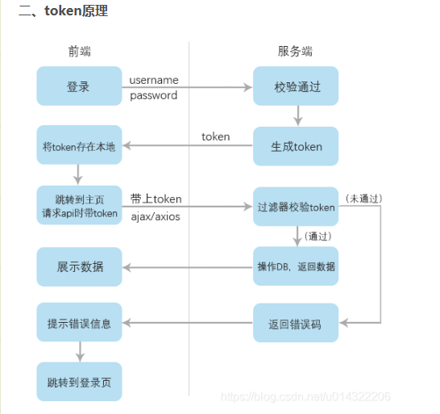
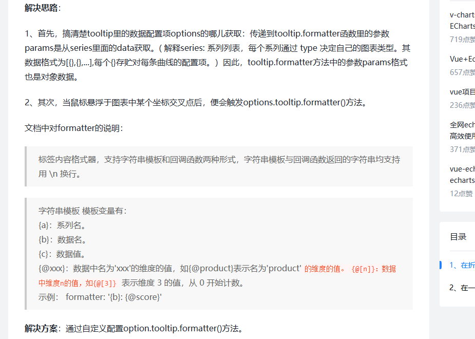
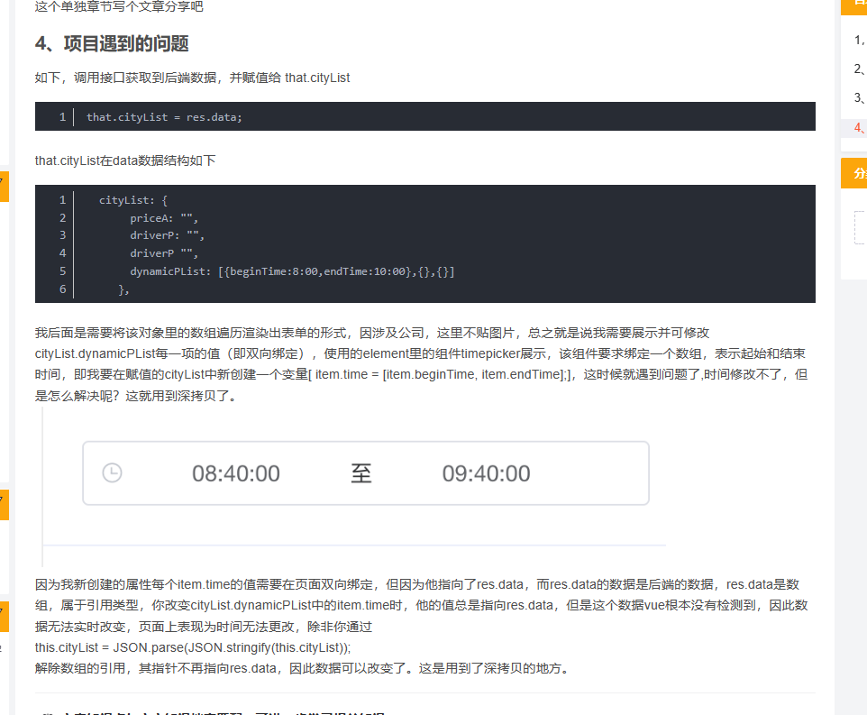
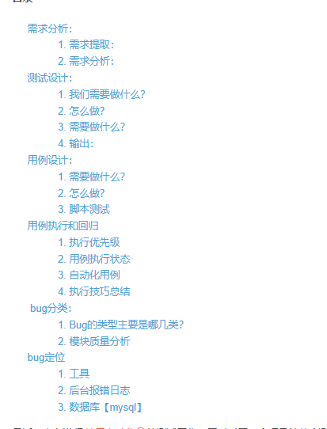
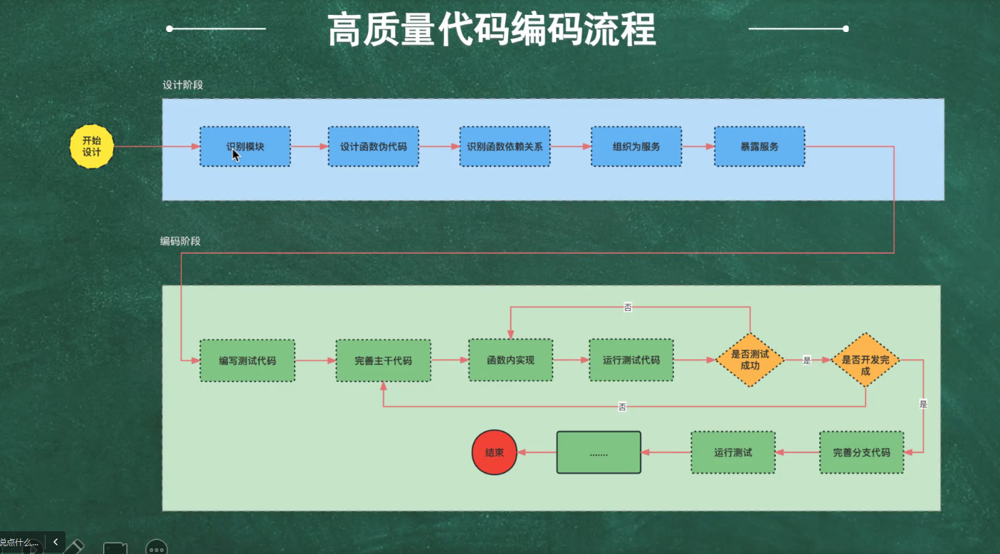
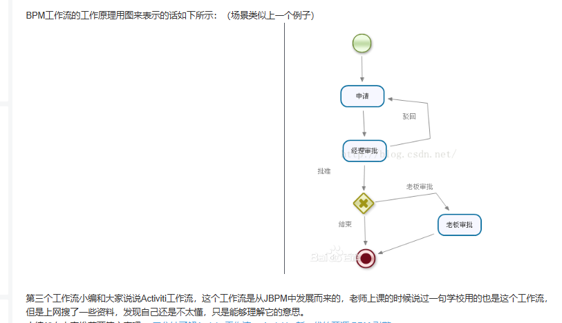
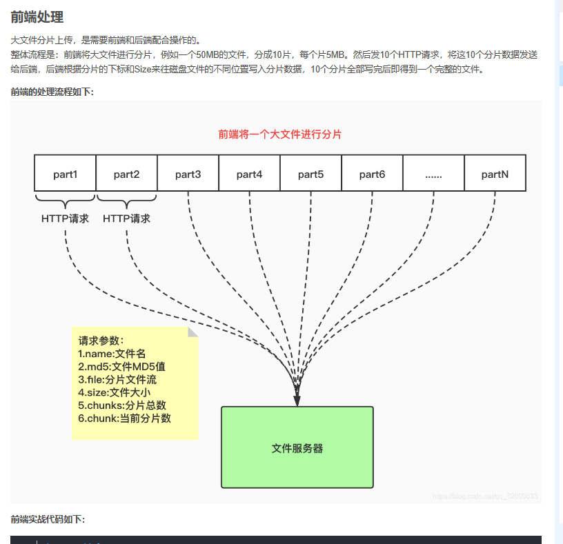

**权限实现**


**登录权限控制**

> 登录访问权限控制是对用户的校验。在用户登录成功之后，后台将返回一个token，之后前端每次进行接口请求的时候，都要带上这个token。后台拿到这个token后进行判断，如果此token确实存在并且没有过期，则可以通过访问。如果token不存在或后台判断已过期，则会跳转到登录页面，要求用户重新登录获取token。

**菜单的页面访问权限**

实现页面访问权限又可分为以下两种方案：

- 方案一、初始化即挂载全部路由，每次路由跳转前做校验
- 方案二、只挂载当前用户拥有的路由，如果用户通过URL进行强制访问，则会直接进入404，相当于从源头上做了控制

**项目中的菜单权限控制**

- 1.权限涉及到的meta属性
  - noRequireAuth: true 无需权限直接挂载
  - manageFree: true 不在操作权限树中展示
- 2.router.beforeEach()拦截路由的钩子
  - 不需要权限的路由直接放行。meta内noRequireAuth和manageFree不受权限控制
  - 进入路由前，从后端请求获取需要展示的菜单。后端根据token判断当前用户权限，返回对应菜单。前端递归对比确定最终要显示的菜单列表
- 3.router.addRoutes()
  - 通过router.addRoutes()动态添加所有符合权限的路由


1.每个模块对应有四种权限，查询(get)，添加(post)，更新(put)，删除(delete)

2.利用十进制和二进制来表示当前模块所拥有的权限。1111(15)，转换后的二进制与权限的关系表示：从右至左数(1代表拥有该权限，0代表不拥有)，第一位代表查询，第二位代表添加，第三位代表更新，第四位代表删除。如eg：二进制1111(15)，代表用于查询，添加，更新，删除四种权限。

1. 判断对应模块没有此权限时，移除当前按钮dom元素。


**接口访问权限控制**


最后再加上请求控制作为最后一道防线，路由可能配置失误，按钮可能忘了加权限，这种时候请求控制可以用来兜底，越权请求将在前端被拦截。

前后端约定接口采用RESTful风格，同样对应四种权限，包括查询（get），添加（post），更新（put），删除（delete）。对于查询操作，正常如果参数只有一个，应该用get请求，如果有多个参数，需要改为post请求，但是需要在url后面添加/query以告诉服务端当前进行的是查询操作，用于和正常的添加(post)请求区分。同样的是，删除用户时如果有多个参数，DELETE请求同样改为POST请求，在后面添加/delete用于和正常的删除（delete）操作进行区分。


**token处理与登录状态保持**



① 用户首次登录，将输入的账号和密码提交给服务器

② 服务器对输入内容进行校验，若账号和密码匹配则验证通过，登录成功，并生成一个token值，将其保存到数据库，并返回给客户端

③ 客户端拿到返回的token值将其保存在本地（如cookie/local storage），作为公共参数，以后每次请求服务器时都携带该token（放在响应头里），提交给服务器进行校验

④ 服务器接收到请求后，首先验证是否携带token，若携带则取出请求头里的token值与数据库存储的token进行匹配校验，若token值相同则登录成功，且当前正处于登录状态，此时正常返回数据，让app显示数据；若不存在或两个值不一致，则说明原来的登录已经失效，此时返回错误状态码，提示用户跳转至登录界面重新登录

⑤ 注意：用户每进行一次登录，登录成功后服务器都会更新一个token新值返回给客户端


**你在项目中遇到的问题，简单聊一下**

**项目需求**：在折线图上，鼠标悬停后，提示框除了展示横纵坐标相关数据外，还需额外展示其余相关数据, 如下图所示。




**你项目中有没有什么亮点**

如何防止重复提交

一般使用的是防抖和节流，节流函数通过控制每次时间执行的时间间隔，控制短时间多次执行方法。防抖函数是推迟每次事件执行的时间减少不必要的查询。但是网络慢的时候，还是会重复提交，没有显示状态，用户不知道有没有真的提交。所以就给按钮添加一个加载状态，查了发现el-button自带了loading属性，传参的时候传一个submit函数，是一个Promise,promise状态改变的时候把loading状态改成false。然后点击按钮会有加载动画，加载的时候，按钮是禁用的。


 **16.vue项目中用v-for 循环本地图片， 图片不显示**

**需要把图片放到static文件夹，或者用requires动态引入文件**


 **实现从详情页返回列表页保存上次加载的数据和自动还原上次的浏览位置。**

vue2中提供了keep-alive。keep-alive是Vue提供的一个抽象组件，用来对组件进行缓存，从而节省性能，由于是一个抽象组件，所以在v页面渲染完毕后不会被渲染成一个DOM元素，当组件在keep-alive内被切换时组件的**activated、deactivated**这两个生命周期钩子函数会被执行

被包裹在keep-alive中的组件的状态将会被保留，例如我们将某个列表类组件内容滑动到第100条位置，那么我们在切换到一个组件后再次切换回到该组件，该组件的位置状态依旧会保持在第100条列表处。如果要每次进入组件时页面初始位置都是顶部，可以用路由提供的基础功能scrollBehavior


**项目中遇到对数据的复制，对于数组的复制或者对象的复制，怎么实现**

浅层数据用...扩展运算符，深层用深拷贝


**项目中哪些场景会用到深拷贝和深拷贝**




**一般在项目中遇到数字精度是怎么处理的**

**使用toFixed**

**化整数运算**


**你在项目中除了使用$nextTick  vue实例，还使用哪些vue实例**

[vm.$set](https://blog.csdn.net/Lushengshi/article/details/126463905?ops_request_misc=%7B%22request%5Fid%22%3A%22167991081616800211594011%22%2C%22scm%22%3A%2220140713.130102334..%22%7D&request_id=167991081616800211594011&biz_id=0&utm_medium=distribute.pc_search_result.none-task-blog-2~all~sobaiduend~default-4-126463905-null-null.142^v76^insert_down38,201^v4^add_ask,239^v2^insert_chatgpt&utm_term=vue实例&spm=1018.2226.3001.4187#t2)

 vm.$delete

 watch

once

**vue的搭建是谁做的**

、build：构建脚本目录

　　　　1）build.js  ==> 生产环境构建脚本；

　　　　2）check-versions.js  ==> 检查npm，node.js版本；

　　　　3）utils.js  ==> 构建相关工具方法；

　　　　4）vue-loader.conf.js  ==> 配置了css加载器以及编译css之后自动添加前缀；

　　　　5）webpack.base.conf.js  ==> webpack基本配置；

　　　　6）webpack.dev.conf.js  ==> webpack开发环境配置；

　　　　7）webpack.prod.conf.js  ==> webpack生产环境配置；

　　2、config：项目配置

　　　　1）dev.env.js  ==> 开发环境变量；

　　　　2）index.js  ==> 项目配置文件；

　　　　3）prod.env.js  ==> 生产环境变量；

　　3、node_modules：npm 加载的项目依赖模块

　　4、src：这里是我们要开发的目录，基本上要做的事情都在这个目录里。里面包含了几个目录及文件：

　　　　1）assets：资源目录，放置一些图片或者公共js、公共css。这里的资源会被webpack构建；

　　　　2）components：组件目录，我们写的组件就放在这个目录里面；

　　　　3）router：前端路由，我们需要配置的路由路径写在index.js里面；

　　　　4）App.vue：根组件；

　　　　5）main.js：入口js文件；

　　5、static：静态资源目录，如图片、字体等。不会被webpack构建

　　6、index.html：首页入口文件，可以添加一些 meta 信息等

　　7、package.json：npm包配置文件，定义了项目的npm脚本，依赖包等信息

　　8、README.md：项目的说明文档，markdown 格式

　　9、.xxxx文件：这些是一些配置文件，包括语法配置，git配置等


**什么是跨域 跨域问题你怎么解决的，都有哪几种方式**

**由于浏览器同源策略的限制，要求当前页面和服务端必须同源，也就是协议、域名和端口号必须一致**。

如果协议、域名和端口号中有其中一个不一致，则浏览器视为跨域，进行拦截。

- **JSONP**

  **jsonp的原理就是利用了script标签不受浏览器同源策略的限制**，然后和后端一起配合来[解决跨域问题](https://so.csdn.net/so/search?q=解决跨域问题&spm=1001.2101.3001.7020)的。**jsonp的优点就是兼容性好，可以解决主流浏览器的跨域问题，缺点是仅支持GET请求，不安全，可能遭受xss攻击。**

- CORS

cors是跨域资源共享，是一种基于 HTTP 头的机制，该机制通过允许服务器标示除了它自己以外的其它 origin（域，协议和端口），使得浏览器允许这些 origin 访问加载自己的资源。服务端设置了Access-Control-Allow-Origin就开启了CORS，所以这种方式只要后端实现了CORS，就解决跨域问题，前端不需要配置。


- 搭建Node代理服务器

因为[同源策略](https://so.csdn.net/so/search?q=同源策略&spm=1001.2101.3001.7020)是浏览器限制的，所以**服务端请求服务器是不受浏览器同源策略的限制的**，因此我们可以搭建一个自己的node服务器来代理访问服务器。


- Nginx反向代理

**nginx通过反向代理解决跨域也是利用了服务器请求服务器不受浏览器同源策略的限制实现的。**

**nginx反向代理方式和node中间件代理方式的原理其实差不多，都是利用了服务器和服务器之间通信不受浏览器的同源策略的限制**，但是node代理方式相对复杂一些，还要自己搭建一个node服务器，而用nginx只需要修改nginx.conf配置文件即可解决跨域问题。

- postMessage

**window.postMessage()** 方法可以安全地实现跨源通信，此方法一种受控机制来规避此限制，只要正确的使用，这种方法就很安全。

主要的用途是实现多窗口，多文档之间通信


- Websocket

使用Websocket也可以解决跨域问题，因为WebSocket本身不存在跨域问题，所以我们可以利用webSocket来进行非同源之间的通信，

WebSocket 规范定义了一个在 Web 浏览器和服务器之间建立“套接字”连接的 API。 简单来说：客户端和服务器之间存在持久连接，双方可以随时开始发送数据。


**你日常工作中使用git如果先拉后推，此时本地如果更改了数据的话，是会冲突报错的，你是怎么解决这个报错的**

1. 确定冲突文件：在终端使用 `git status` 命令可以列出所有未提交的修改，包括冲突文件。可以使用 `git diff` 命令来查看冲突的具体内容。
2. 手动合并冲突：打开冲突的文件，手动合并冲突。冲突的部分一般会有注释提示，包括本地修改、远程修改以及冲突部分的内容。根据实际情况修改冲突文件，保存并退出。
3. 执行 `git add` 命令：合并完成后，使用 `git add` 命令将冲突的文件标记为已解决。
4. 提交解决方案：执行 `git commit` 命令提交解决方案。
5. 推送代码：执行 `git push` 命令将本地修改推送到远程仓库


**一个项目的整体流程是什么样的**







**若果产品功能逻辑有问题如何解决**

找产品经理，测试，协商


**盒子居中方法**

、绝对定位居中（最常用、好用）
2、负[margin](https://so.csdn.net/so/search?q=margin&spm=1001.2101.3001.7020)居中（传统方法）
3、margin固定宽高居中
4、[flex](https://so.csdn.net/so/search?q=flex&spm=1001.2101.3001.7020)居中
5、transform居中
6、table-cell居中
7、不确定宽高居中（绝对定位百分数）


**项目中的优化有哪些？**

v-if和v-show区分使用场景

(v-if是真正的条件渲染，切换过程中是销毁和重建的，v-show就相当于CSS中的display属性切换)

computed和watch区分使用场景

(computed是计算属性，依赖的属性值发生改变，下一次获取computed的值才会重新计算它的值，watch更多地是观察，)

长列表性能优化

有时候我们的组件是纯粹的数据展示，不会有改变，就不需要Vue劫持我们的数据。可以通过Object.freeze方法冻结一个对象，一旦被冻结的对象就不再被修改了

事件的销毁

Vue组件销毁时，自动清理它与其他实例的连接，但仅限于组件本身事件，如果在JS内使用addEventListense等方法不会自动销毁，我们需要在组件中手动移除这些事件的监听，避免内存泄漏。

图片资源的懒加载

图片过多的页面，为了加速页面加载速度，我们可以等滚动到可视区域再去加载。在项目中可以使用vue-lazyload。然后在vue文件中将img标签的src改为v-lazy，图片的显示方式更改为懒加载显示


路由懒加载(实现方式在(3.路由Vuex中))

Vue是单页面应用，会有很多路由引入，这样webpack打包之后的文件很大，当加载资源过多时，页面会出现白屏的现象，所以我们可以把不同路由对应的组件分割成不同的代码块，在路由被访问的时候才加载对应的组件。

第三个插件按需引入

借助babel-plugin-component。按需引入需要的组件，达到减少项目体积的目的。

优化无限列表性能

如果存在非常长或者无限滚动的列表，需要采用窗口化的技术来优化性能，只需要渲染少部分区域的内容，减少重新渲染组件和创建dom节点的时间

服务端渲染SSR/预渲染

渲染的优点：

更好的SEO

更快的内容到达时间(首屏加载更快)


**路由懒加载。图片懒加载、cdn怎么做的，图片懒加载插件**

 推荐方式-ES6的import()

const 组件名 = () => import('组件路径')

上方偏移量(scrollTop)+视口高度(innerHeight)>图片距离内容顶部的偏移量(offsetTop)

 intersectionObserve ，兼容性不好

**es6写法有哪些，项目中用过吗**

用过，箭头函数，解构，扩展运算符,


**webpack中基本配置，常见命令**

```js
// configuration导出输入智能提示
const {configuration} = require('webpack')
// 引入配置路径
const path = require('path')

// 配置html模板
const htmlWebpackPlugin  = require('html-webpack-plugin')

// 配置解析
const { VueLoaderPlugin } = require('vue-loader/dist/index');

//配置CleanWebpackPlugin每次打包都会将dist文件夹删除重新创建
const { CleanWebpackPlugin } = require('clean-webpack-plugin')
 
// 引入美化webpack样式文件
const FriendlyErrorsWebpackPlugin = require("friendly-errors-webpack-plugin");


// 使用注解的方式做智能提示
/**
 * @type {configuration}
 */

const config = {
// 指定环境 开发环境或生产环境
  mode:'development',
// 配置moudel
  module:{
    rules:[
      // 解析vue
      {
      test:/\.vue$/,
      use:'vue-loader'
    },
    {
      test: /\.css$/, //解析css
      use: ["style-loader", "css-loader"],
  },

  {
    test: /\.less$/, //解析 less
    use: ["style-loader", "css-loader", "less-loader"],
},
{
  test: /\.ts$/,  //解析ts
  loader: "ts-loader",
  options: {
      configFile: path.resolve(process.cwd(), 'tsconfig.json'),
      appendTsSuffixTo: [/\.vue$/]
  },
}
  ]
  },

  //entry 入口文件
entry:'./src/main.ts',
// output出口文件
output:{
  // 打完包之后的文件名
filename:'[hash].js',
// 输出的位置
path:path.resolve(__dirname,'dist')
},

// 配置 @ 路径
resolve:{
  alias:{
    // 配置@路径
'@':path.resolve(__dirname,'src')
  },
  // 配置识别后缀
  extensions:['.vue','.ts','.js']
},
// 去掉没有用的提示
stats:'errors-only',
// 修改默认端口
devServer:{
  port:9001,
  // 跨域代理
  proxy: {
    // '/api'
  },
// 热更新
  hot: true,
  // 是否打开网页
  open: true,
  //指定地址
hots
},

plugins:[ 
  // 配置html模板
  new htmlWebpackPlugin ({
  template : './public/index.html'
}),
// 注册解析
new VueLoaderPlugin(),
// 注册 CleanWebpackPlugin
new CleanWebpackPlugin(),
// 配置美化webpack文件
new FriendlyErrorsWebpackPlugin({
  compilationSuccessInfo:{ //美化样式
    messages:['You application is running here http://localhost:8080']
}

})

],
// CDN引入
externals:{
  // 配置vuevue就不会打到包内
vue:"Vue"
}

}
// webpack.config.js基于node运行遵循com.js规范
module.exports = config
```


## webpack 核心概念

### Entry 

入口起点(entry point)指示 webpack 应该使用哪个模块,来作为构建其内部依赖图的开始。

进入入口起点后,webpack 会找出有哪些模块和库是入口起点（直接和间接）依赖的。

每个依赖项随即被处理,最后输出到称之为 bundles 的文件中。

### Output 

output 属性告诉 webpack 在哪里输出它所创建的 bundles,以及如何命名这些文件,默认值为 ./dist。

基本上,整个应用程序结构,都会被编译到你指定的输出路径的文件夹中。

### Module 

模块,在 Webpack 里一切皆模块,一个模块对应着一个文件。Webpack 会从配置的 Entry 开始递归找出所有依赖的模块。

### Chunk

代码块,一个 Chunk 由多个模块组合而成,用于代码合并与分割。

### Loader

loader 让 webpack 能够去处理那些非 JavaScript 文件（webpack 自身只理解 JavaScript）。

loader 可以将所有类型的文件转换为 webpack 能够处理的有效模块,然后你就可以利用 webpack 的打包能力,对它们进行处理。

本质上,webpack loader 将所有类型的文件,转换为应用程序的依赖图（和最终的 bundle）可以直接引用的模块。

 Plugin

loader 被用于转换某些类型的模块,而插件则可以用于执行范围更广的任务。

插件的范围包括,从打包优化和压缩,一直到重新定义环境中的变量。插件接口功能极其强大,可以用来处理各种各样的任务。


## webpack 构建流程

Webpack 的运行流程是一个串行的过程,从启动到结束会依次执行以下流程 :

1. 初始化参数：从配置文件和 Shell 语句中读取与合并参数,得出最终的参数。
2. 开始编译：用上一步得到的参数初始化 Compiler 对象,加载所有配置的插件,执行对象的 run 方法开始执行编译。
3. 确定入口：根据配置中的 entry 找出所有的入口文件。
4. 编译模块：从入口文件出发,调用所有配置的 Loader 对模块进行翻译,再找出该模块依赖的模块,再递归本步骤直到所有入口依赖的文件都经过了本步骤的处理。
5. 完成模块编译：在经过第 4 步使用 Loader 翻译完所有模块后,得到了每个模块被翻译后的最终内容以及它们之间的依赖关系。
6. 输出资源：根据入口和模块之间的依赖关系,组装成一个个包含多个模块的 Chunk,再把每个 Chunk 转换成一个单独的文件加入到输出列表,这步是可以修改输出内容的最后机会。
7. 输出完成：在确定好输出内容后,根据配置确定输出的路径和文件名,把文件内容写入到文件系统。

在以上过程中,Webpack 会在特定的时间点广播出特定的事件,插件在监听到感兴趣的事件后会执行特定的逻辑,并且插件可以调用 Webpack 提供的 API 改变 Webpack 的运行结果。


**怎么在项目中添加环境配置**

开发环境加载 .env 和 .env.development 
生成环境加载 .env 和 .env.production 


**ajax有哪几种请求方式，get和post请求有什么不同**

1.Get请求参数是包含在URL中的，而Post请求数据是通过body传输的。
 2.Get请求对发送内容有大小限制，但是post没有。
 3.Get请求只接受Ascll编码，但是post没有限制。
 4.Get请求只支持URL编码，而post支持多种编码方式。
 5.Get请求会被浏览器缓存，但是Post不会。
 6.Get和Post都是明文传输，但是Get直接将请求参数暴露在URL中，不适合传输敏感信息。
 7.一般Get发送一次请求会生成一个TCP数据包，但是Post会生成两个，即header和body。具体实施是这样的：Get发请求时会将Header和参数一起发送过去；但是post会先发送header


## **nginx**

全局块：配置影响全局，包括运行 nginx 的用户组，进程存放，日志，配置文件等
events：配置影响 nginx 服务器与客户端的网络连接，包括进程最大连接数，数据驱动模型，序列化等
http：配置代理，缓存，日志，第三方模块等，可嵌套多个 server
server：配置虚拟主机的参数
location：配置请求路由，页面处理

```js
#全局配置------------------------------------------------------------------------]()

...              

#events 配置--------------------------------------------------------------------

events {
   ...
}

#http 配置----------------------------------------------------------------------

http
{

	#http 全局配置

​    ...

    #server 全局配置

​    server
​    { 

    	#server全局配置

​        ...       

        #location配置

​        location [PATTERN]   
​        {
​            ...
​        }
​    }
}


```

惊群现象：一个网路连接到来，多个睡眠的进程被同时叫醒，但只有一个进程能获得链接，这样会影响系统性能。

### 全局配置


```js
#全局配置-------------------------------------------------------------
#指定nginx运行的用户及用户组,默认为nobody
#user  nobody nobody;

#开启线程数，最大值可设逻辑CPU核数
#worker_processes  1; 

#定位全局错误日志文件，级别以notice显示，还有debug,info,warn,error,crit模式，debug输出最多，crir输出最少，根据实际环境而定
#error_log  logs/error.log;
#error_log  logs/error.log  notice;
#error_log  logs/error.log  info;

#指定进程id的存储文件位置
#pid        logs/nginx.pid;

#指定一个nginx进程打开的最多文件描述符数目，受系统进程的最大打开文件数量限制
#worker_rlimit_nofile 65535

#envents 配置----------------------------------------------------------
events {
    ...
}

#http 配置-------------------------------------------------------------
http {
    ...
}

```

### events 配置

```js
events {
    #设置工作模式为epoll,除此之外还有select,poll,kqueue,rtsig和/dev/poll模式
    use epoll;
    #定义每个进程的最大连接数,受系统进程的最大打开文件数量限制
    worker_connections  1024;
}

```


http配置

```js
http {
    #主模块指令，实现对配置文件所包含的文件的设定，可以减少主配置文件的复杂度
    include       mime.types;
    
    #核心模块指令，默认设置为二进制流，也就是当文件类型未定义时使用这种方式
    default_type  application/octet-stream;
    
    #下面代码为日志格式的设定，main为日志格式的名称，可自行设置，后面引用
	log_format  main  '$remote_addr - $remote_user [$time_local] "$request" '
	                  '$status $body_bytes_sent "$http_referer" '
	                  '"$http_user_agent" "$http_x_forwarded_for"';
	#引用日志main格式
	access_log  logs/access.log  main;

    #设置允许客户端请求的最大的单个文件字节数
    client_max_body_size 20M;
    #指定来自客户端请求头的headebuffer大小
    client_header_buffer_size  32k;
    #指定连接请求试图写入缓存文件的目录路径
    client_body_temp_path /dev/shm/client_body_temp;
    #指定客户端请求中较大的消息头的缓存最大数量和大小，目前设置为4个32KB
    large client_header_buffers 4 32k;

    #开启高效文件传输模式
    sendfile        on;
    #开启防止网络阻塞
    tcp_nopush     on;
    #开启防止网络阻塞
    tcp_nodelay    on;

    #设置客户端连接保存活动的超时时间
    #keepalive_timeout  0; # 无限时间
    keepalive_timeout  65;

    #设置客户端请求读取header超时时间
    client_header_timeout 10;
    #设置客户端请求body读取超时时间
    client_body_timeout 10;

    #HttpGZip模块配置
    #开启gzip压缩
    gzip  on;
    #设置允许压缩的页面最小字节数
    gzip_min_length 1k;
    #申请4个单位为16K的内存作为压缩结果流缓存
    gzip_buffers 4 16k;
    #设置识别http协议的版本，默认为1.1
    gzip_http_version 1.1;
    #指定gzip压缩比，1-9数字越小，压缩比越小，速度越快
    gzip_comp_level 2;
    #指定压缩的类型
    gzip_types text/plain application/x-javascript text/css application/xml;
    #让前端的缓存服务器进过gzip压缩的页面
    gzip_vary on; 
    
    # server配置
    server {
        
    }    
}

```


### server 配置

```js
server {
    #单连接请求上限次数
    keepalive_requests 120; 
    #监听端口
    listen       88;
    #监听地址，可以是ip，最好是域名
    server_name  111.222.333.123;
    #server_name  www.123.com;
    #设置访问的语言编码
    charset utf-8;
    #设置虚拟主机访问日志的存放路径及日志的格式为main
    access_log  /www/wwwlogs/111.222.333.123.log main; #响应日志
    error_log  /www/wwwlogs/111.222.333.123.log main; #错误日志
    
    #PHP-INFO-START  PHP引用配置，可以注释或修改
    include enable-php-74.conf;
    #PHP-INFO-END
    
    #REWRITE-START URL重写规则引用
    include /www/server/panel/vhost/rewrite/111.222.333.123.conf;
    #REWRITE-END
    
    #设置主机基本信息
    #请求的url过滤，正则匹配，~为区分大小写，~*为不区分大小写。
    location  ~*^.+$ {
    	#根目录
        root html;  
        #设置默认页
        index  index.html index.htm;
        #拒绝的ip,黑名单
        deny 127.0.0.1;  
        #允许的ip，白名单
        allow 172.18.5.54; 
    } 
    
    #禁止访问的文件或目录
    location ~ ^/(\.user.ini|\.htaccess|\.git|\.svn|\.project|LICENSE|README.md)
    {
        return 404;
    }
    
    #SSL证书验证目录相关设置
    location ~ \.well-known{
        allow all;
    }
    
	#图片资源配置
    location ~ .*\.(gif|jpg|jpeg|png|bmp|swf)$
    {
        expires      30d;
        error_log /dev/null;
        access_log off;
    }
    
    #网站js与css资源配置
    location ~ .*\.(js|css)?$
    {
        expires      12h;
        error_log /dev/null;
        access_log off; 
    }
    
    #访问异常页面配置
    error_page  404              /404.html;
    error_page  500 502 503 504  /50x.html;
    location = /50x.html {
		root   html;
	}
}

```


**v-if、v-show区别**

if会销毁元素，删除 当前dom节点，show只是css隐藏


**用到的布局方式**


**你的审批块用到工作流了吗**



**你了解工作流吗**

直白一点工作流就是封装好的一种框架，我们利用这种框架来解决需要多个人或者多个部门协同完成的某项工作。工作流框架有许多都是开源的，我们可以尽情的拿来学习、研究最终运用到我们的系统中。

工作流其实就是一套定义好的工作框架，所有的流程都按照工作的框架走


**最近项目你的团队组成大概是什么样子的**


**大文件分片上传是怎么实现的？**




**如何解决首屏加载慢的问题**

一般首屏加载速度慢得原因可能如下几点：

1.网络延时问题，

2.资源文件体积是否过大，

3.资源是否重复发送请求去加载了

4.加载脚本的时候，渲染内容堵塞了

常见的SPA优化方式解决方案

1.减小入口文件体积，

常用的是路由懒加载，把不同路由对应的组件分割成不同的代码块，待路由被请求的时候会单独打包路由，使得入口文件变小，加载速度大大增加

2.静态资源本地缓存，

后端返回资源问题：

- 采用`HTTP`缓存，设置`Cache-Control`，`Last-Modified`，`Etag`等响应头
- 采用`Service Worker`离线缓存


3.UI框架按需引入，

使用的时候引入 然后再Vue.use（）

4.图片资源的压缩，

使用GZip压缩

首先下载插件 然后再vue.config.js里面引入，然后webpack配置

5.组件重复打包，

6.开启GZip打包，

7.开启SSR

8.去除loading


 **axios+vuex+token+登录+路由这一块具体是怎么结合做的？**


**reduce和map你是怎么用的**


**打包完了以后，配置没有任何问题，图片加载不出来，是什么原因？具体分析？**

在项目中使用图片，图片一般保存在[static](https://so.csdn.net/so/search?q=static&spm=1001.2101.3001.7020)，或者assets目录的img里，而获取图片可以使用绝对路径或者相对路径，虽然在本地使用哪种方式没有影响，但由于vue的打包问题，如果采用绝对路径，打包至线上会导致无法正常显示图片，

，当然这不是我们想要的结果，所以我们要通过将绝对路径改为相对路径的方式来解决这个问题

**build文件配置--utils.js**

```js
/* 打包配置,解决打包后 static 中文件引入错误 */
if (options.extract) {
    return ExtractTextPlugin.extract({
      use: loaders,
      fallback: 'vue-style-loader',
      publicPath:"../../"            //(默认没有)添加这一句后就可解决图片加载不出的问题(static中文件引用错误)
    })
  } else {
    return ['vue-style-loader'].concat(loaders)
  }
}

```


**.关于首页加载白屏问题以及图片加载异常**

1、修改一下 config/index.js 中bulid模块导出的路径。因为index.html里边的内容都是通过script标签引入的，而你的路径不对，打开肯定是空白的。先看一下默认的路径。
    assetsPublicPath默认的是  ‘/’  也就是根目录。而我们的index.html和static在同一级目录下面。  所以要改为  ‘./ ’


**如果后端返回大量的数据你要如何去处理** 

分页加载

**延迟加载**

虽然后端一次返回这么多数据，但用户的屏幕只能同时显示有限的数据。所以我们可以采用延迟加载的策略，根据用户的滚动位置动态渲染数据。

要获取用户的滚动位置，我们可以在列表末尾添加一个空节点空白。每当视口出现空白时，就意味着用户已经滚动到网页底部，这意味着我们需要继续渲染数据。


**自定义指令实现按钮权限怎么做的**


**最后说一下项目里遇到的难点如何解决的**


